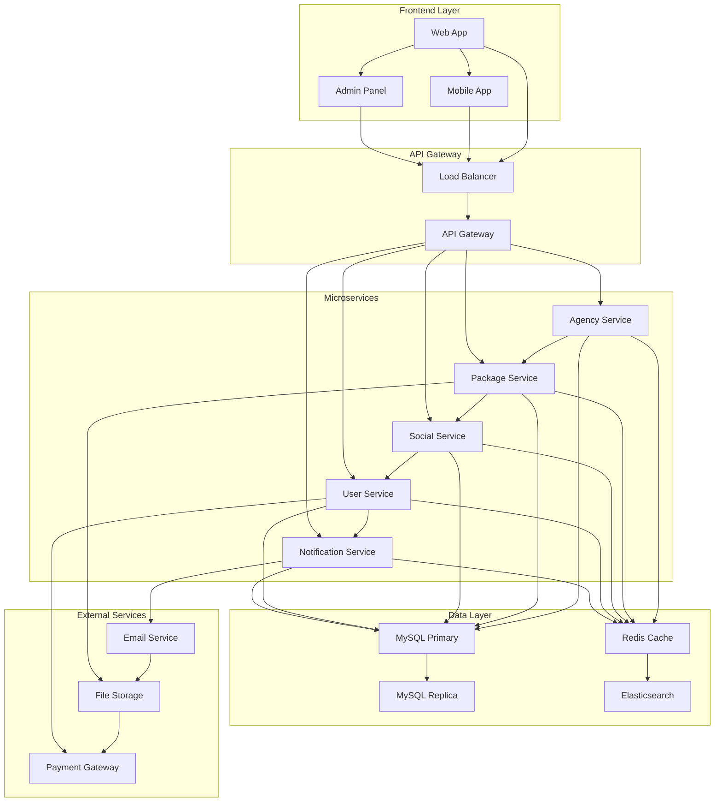
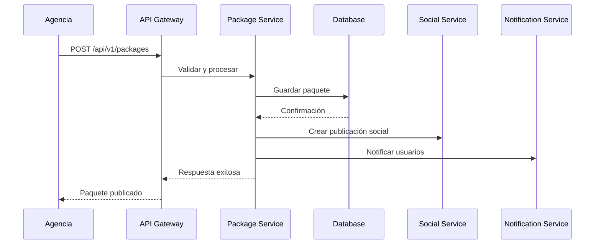
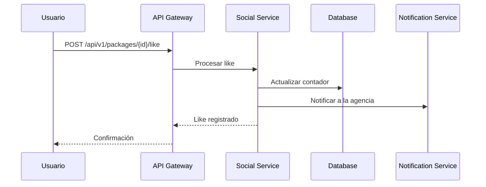

# Arquitectura del Sistema - Facebook de Agencias

## 🏗️ Visión General de la Arquitectura

El sistema "Facebook de Agencias" está diseñado como una plataforma social moderna que conecta agencias de viajes con usuarios finales, proporcionando un entorno interactivo para la publicación, descubrimiento y evaluación de paquetes turísticos.

## 🎯 Principios de Diseño

### 1. **Arquitectura de Microservicios**
- Separación clara de responsabilidades
- Escalabilidad independiente de componentes
- Tolerancia a fallos mejorada

### 2. **API-First Design**
- Todas las funcionalidades expuestas vía API REST
- Documentación completa de endpoints
- Versionado de API para compatibilidad

### 3. **Responsive y Mobile-First**
- Diseño adaptativo para todos los dispositivos
- Optimización para móviles
- Progressive Web App (PWA) capabilities

## 🏛️ Arquitectura de Alto Nivel



## 🔧 Componentes Principales

### 1. **Frontend (Cliente)**

#### **Web Application**
- **Tecnología**: HTML5, CSS3, JavaScript ES6+
- **Framework**: Vanilla JS con módulos ES6
- **Estilos**: CSS Grid, Flexbox, CSS Variables
- **Iconos**: Font Awesome 6.4.0
- **Fuentes**: Google Fonts (Poppins, Playfair Display)

#### **Estructura de Componentes**
```
frontend/
├── components/
│   ├── header/
│   ├── hero/
│   ├── packages/
│   ├── social-feed/
│   ├── forms/
│   └── modals/
├── pages/
│   ├── index.html
│   ├── packages.html
│   ├── dashboard.html
│   └── details-package.html
├── styles/
│   ├── style.css
│   ├── components.css
│   ├── responsive.css
│   └── auth.css
└── scripts/
    ├── main.js
    ├── api.js
    ├── auth.js
    └── forms.js
```

### 2. **Backend (Servidor)**

#### **API REST (Laravel)**
- **Framework**: Laravel 10+
- **PHP**: 8.1+
- **Autenticación**: Laravel Sanctum
- **Validación**: Form Requests
- **Documentación**: OpenAPI 3.0

#### **Estructura de Módulos**
```
backend/
├── app/
│   ├── Http/Controllers/
│   │   ├── AgencyController.php
│   │   ├── PackageController.php
│   │   ├── SocialController.php
│   │   └── UserController.php
│   ├── Models/
│   │   ├── Agency.php
│   │   ├── Package.php
│   │   ├── User.php
│   │   └── Review.php
│   ├── Services/
│   │   ├── PackageService.php
│   │   ├── SocialService.php
│   │   └── NotificationService.php
│   └── Repositories/
│       ├── AgencyRepository.php
│       └── PackageRepository.php
├── database/
│   ├── migrations/
│   └── seeders/
└── routes/
    ├── api.php
    └── web.php
```

### 3. **Base de Datos**

#### **MySQL 8.0**
- **Motor**: InnoDB
- **Charset**: utf8mb4_unicode_ci
- **Replicación**: Master-Slave
- **Backup**: Automático diario

#### **Redis Cache**
- **Uso**: Cache de sesiones y datos frecuentes
- **TTL**: Configurable por tipo de dato
- **Clustering**: Para alta disponibilidad

## 🔄 Flujo de Datos

### 1. **Flujo de Publicación de Paquete**



### 2. **Flujo de Interacción Social**



## 🛡️ Seguridad

### 1. **Autenticación y Autorización**
- **JWT Tokens** para autenticación stateless
- **OAuth 2.0** para integración con terceros
- **Rate Limiting** para prevenir abuso
- **CORS** configurado para dominios específicos

### 2. **Validación de Datos**
- **Sanitización** de inputs del usuario
- **Validación** en frontend y backend
- **Escape** de datos para prevenir XSS
- **Prepared Statements** para prevenir SQL Injection

### 3. **Protección de Archivos**
- **Upload seguro** con validación de tipos
- **Escaneo de malware** en archivos subidos
- **CDN** para distribución segura de assets

## 📊 Escalabilidad

### 1. **Horizontal Scaling**
- **Load Balancer** para distribución de carga
- **Microservicios** independientes
- **Database Sharding** por agencia
- **CDN** para contenido estático

### 2. **Caching Strategy**
- **Redis** para cache de sesiones
- **Memcached** para cache de consultas
- **Browser Cache** para assets estáticos
- **CDN Cache** para imágenes y videos

### 3. **Monitoring y Logging**
- **Application Performance Monitoring (APM)**
- **Log aggregation** con ELK Stack
- **Métricas** en tiempo real
- **Alertas** automáticas

## 🔧 Configuración de Entorno

### 1. **Desarrollo**
```bash
# Variables de entorno
APP_ENV=local
APP_DEBUG=true
DB_CONNECTION=mysql
CACHE_DRIVER=redis
QUEUE_CONNECTION=sync
```

### 2. **Producción**
```bash
# Variables de entorno
APP_ENV=production
APP_DEBUG=false
DB_CONNECTION=mysql
CACHE_DRIVER=redis
QUEUE_CONNECTION=redis
```

## 📈 Métricas de Rendimiento

### 1. **Objetivos de Rendimiento**
- **Tiempo de respuesta API**: < 200ms
- **Tiempo de carga página**: < 3 segundos
- **Disponibilidad**: 99.9%
- **Throughput**: 1000 requests/segundo

### 2. **Monitoreo Continuo**
- **Uptime monitoring**
- **Performance metrics**
- **Error tracking**
- **User experience metrics**

## 🚀 Roadmap Técnico

### **Fase 1** (Actual)
- ✅ Arquitectura base
- ✅ API REST básica
- ✅ Frontend responsivo
- ✅ Autenticación básica

### **Fase 2** (Próximos 3 meses)
- 🔄 Sistema de notificaciones
- 🔄 Cache avanzado
- 🔄 Optimización de consultas
- 🔄 Testing automatizado

### **Fase 3** (6 meses)
- 📋 Microservicios completos
- 📋 Mobile app nativa
- 📋 Analytics avanzados
- 📋 Machine Learning para recomendaciones

---

**Documento actualizado**: 19 de Septiembre de 2025  
**Versión**: 1.0.0  
**Autor**: Equipo de Desarrollo
