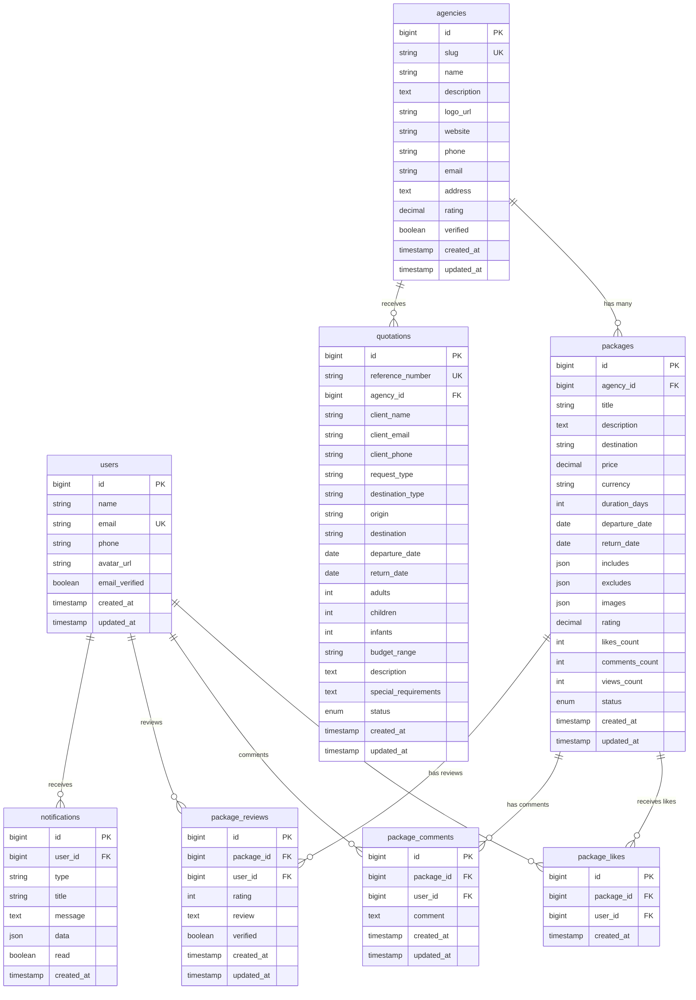

# Base de Datos - Facebook de Agencias

## 🗄️ Visión General

La base de datos del sistema "Facebook de Agencias" está diseñada para soportar una plataforma social robusta que maneja agencias de viajes, paquetes turísticos, interacciones sociales y usuarios. Utiliza MySQL 8.0 como motor principal con optimizaciones para alto rendimiento.

## 🏗️ Arquitectura de Base de Datos

### **Motor de Base de Datos**
- **MySQL 8.0** - Motor principal
- **InnoDB** - Motor de almacenamiento
- **utf8mb4_unicode_ci** - Collation para soporte completo de Unicode
- **Replicación Master-Slave** - Para alta disponibilidad

### **Características Técnicas**
- **Charset**: utf8mb4 (soporte completo UTF-8)
- **Engine**: InnoDB (transacciones ACID)
- **Indexación**: Optimizada para consultas frecuentes
- **Particionamiento**: Por fechas en tablas grandes
- **Backup**: Automático diario con retención de 30 días

## 📊 Diagrama de Entidad-Relación



## 📋 Estructura de Tablas

### 1. **Tabla: agencies**

```sql
CREATE TABLE agencies (
    id BIGINT UNSIGNED AUTO_INCREMENT PRIMARY KEY,
    slug VARCHAR(100) NOT NULL UNIQUE,
    name VARCHAR(255) NOT NULL,
    description TEXT,
    logo_url VARCHAR(500),
    website VARCHAR(255),
    phone VARCHAR(20),
    email VARCHAR(255) NOT NULL,
    address TEXT,
    rating DECIMAL(3,2) DEFAULT 0.00,
    total_packages INT UNSIGNED DEFAULT 0,
    total_likes INT UNSIGNED DEFAULT 0,
    total_reviews INT UNSIGNED DEFAULT 0,
    verified BOOLEAN DEFAULT FALSE,
    active BOOLEAN DEFAULT TRUE,
    created_at TIMESTAMP DEFAULT CURRENT_TIMESTAMP,
    updated_at TIMESTAMP DEFAULT CURRENT_TIMESTAMP ON UPDATE CURRENT_TIMESTAMP,
    
    INDEX idx_slug (slug),
    INDEX idx_verified (verified),
    INDEX idx_active (active),
    INDEX idx_rating (rating),
    INDEX idx_created_at (created_at)
) ENGINE=InnoDB DEFAULT CHARSET=utf8mb4 COLLATE=utf8mb4_unicode_ci;
```

### 2. **Tabla: users**

```sql
CREATE TABLE users (
    id BIGINT UNSIGNED AUTO_INCREMENT PRIMARY KEY,
    name VARCHAR(255) NOT NULL,
    email VARCHAR(255) NOT NULL UNIQUE,
    phone VARCHAR(20),
    avatar_url VARCHAR(500),
    email_verified_at TIMESTAMP NULL,
    password VARCHAR(255),
    remember_token VARCHAR(100),
    last_login_at TIMESTAMP NULL,
    preferences JSON,
    created_at TIMESTAMP DEFAULT CURRENT_TIMESTAMP,
    updated_at TIMESTAMP DEFAULT CURRENT_TIMESTAMP ON UPDATE CURRENT_TIMESTAMP,
    
    INDEX idx_email (email),
    INDEX idx_email_verified (email_verified_at),
    INDEX idx_created_at (created_at)
) ENGINE=InnoDB DEFAULT CHARSET=utf8mb4 COLLATE=utf8mb4_unicode_ci;
```

### 3. **Tabla: packages**

```sql
CREATE TABLE packages (
    id BIGINT UNSIGNED AUTO_INCREMENT PRIMARY KEY,
    agency_id BIGINT UNSIGNED NOT NULL,
    title VARCHAR(255) NOT NULL,
    description TEXT,
    destination VARCHAR(255) NOT NULL,
    price DECIMAL(12,2) NOT NULL,
    currency VARCHAR(3) DEFAULT 'COP',
    duration_days INT UNSIGNED,
    departure_date DATE,
    return_date DATE,
    includes JSON,
    excludes JSON,
    images JSON,
    rating DECIMAL(3,2) DEFAULT 0.00,
    likes_count INT UNSIGNED DEFAULT 0,
    comments_count INT UNSIGNED DEFAULT 0,
    views_count INT UNSIGNED DEFAULT 0,
    status ENUM('draft', 'active', 'inactive', 'archived') DEFAULT 'draft',
    featured BOOLEAN DEFAULT FALSE,
    created_at TIMESTAMP DEFAULT CURRENT_TIMESTAMP,
    updated_at TIMESTAMP DEFAULT CURRENT_TIMESTAMP ON UPDATE CURRENT_TIMESTAMP,
    
    FOREIGN KEY (agency_id) REFERENCES agencies(id) ON DELETE CASCADE,
    INDEX idx_agency_id (agency_id),
    INDEX idx_destination (destination),
    INDEX idx_price (price),
    INDEX idx_departure_date (departure_date),
    INDEX idx_status (status),
    INDEX idx_featured (featured),
    INDEX idx_rating (rating),
    INDEX idx_created_at (created_at),
    FULLTEXT idx_search (title, description, destination)
) ENGINE=InnoDB DEFAULT CHARSET=utf8mb4 COLLATE=utf8mb4_unicode_ci;
```

### 4. **Tabla: package_likes**

```sql
CREATE TABLE package_likes (
    id BIGINT UNSIGNED AUTO_INCREMENT PRIMARY KEY,
    package_id BIGINT UNSIGNED NOT NULL,
    user_id BIGINT UNSIGNED NOT NULL,
    created_at TIMESTAMP DEFAULT CURRENT_TIMESTAMP,
    
    FOREIGN KEY (package_id) REFERENCES packages(id) ON DELETE CASCADE,
    FOREIGN KEY (user_id) REFERENCES users(id) ON DELETE CASCADE,
    UNIQUE KEY unique_like (package_id, user_id),
    INDEX idx_package_id (package_id),
    INDEX idx_user_id (user_id),
    INDEX idx_created_at (created_at)
) ENGINE=InnoDB DEFAULT CHARSET=utf8mb4 COLLATE=utf8mb4_unicode_ci;
```

### 5. **Tabla: package_comments**

```sql
CREATE TABLE package_comments (
    id BIGINT UNSIGNED AUTO_INCREMENT PRIMARY KEY,
    package_id BIGINT UNSIGNED NOT NULL,
    user_id BIGINT UNSIGNED NOT NULL,
    comment TEXT NOT NULL,
    parent_id BIGINT UNSIGNED NULL,
    likes_count INT UNSIGNED DEFAULT 0,
    created_at TIMESTAMP DEFAULT CURRENT_TIMESTAMP,
    updated_at TIMESTAMP DEFAULT CURRENT_TIMESTAMP ON UPDATE CURRENT_TIMESTAMP,
    
    FOREIGN KEY (package_id) REFERENCES packages(id) ON DELETE CASCADE,
    FOREIGN KEY (user_id) REFERENCES users(id) ON DELETE CASCADE,
    FOREIGN KEY (parent_id) REFERENCES package_comments(id) ON DELETE CASCADE,
    INDEX idx_package_id (package_id),
    INDEX idx_user_id (user_id),
    INDEX idx_parent_id (parent_id),
    INDEX idx_created_at (created_at)
) ENGINE=InnoDB DEFAULT CHARSET=utf8mb4 COLLATE=utf8mb4_unicode_ci;
```

### 6. **Tabla: package_reviews**

```sql
CREATE TABLE package_reviews (
    id BIGINT UNSIGNED AUTO_INCREMENT PRIMARY KEY,
    package_id BIGINT UNSIGNED NOT NULL,
    user_id BIGINT UNSIGNED NOT NULL,
    rating INT UNSIGNED NOT NULL CHECK (rating >= 1 AND rating <= 5),
    review TEXT,
    verified BOOLEAN DEFAULT FALSE,
    helpful_count INT UNSIGNED DEFAULT 0,
    created_at TIMESTAMP DEFAULT CURRENT_TIMESTAMP,
    updated_at TIMESTAMP DEFAULT CURRENT_TIMESTAMP ON UPDATE CURRENT_TIMESTAMP,
    
    FOREIGN KEY (package_id) REFERENCES packages(id) ON DELETE CASCADE,
    FOREIGN KEY (user_id) REFERENCES users(id) ON DELETE CASCADE,
    UNIQUE KEY unique_review (package_id, user_id),
    INDEX idx_package_id (package_id),
    INDEX idx_user_id (user_id),
    INDEX idx_rating (rating),
    INDEX idx_verified (verified),
    INDEX idx_created_at (created_at)
) ENGINE=InnoDB DEFAULT CHARSET=utf8mb4 COLLATE=utf8mb4_unicode_ci;
```

### 7. **Tabla: quotations**

```sql
CREATE TABLE quotations (
    id BIGINT UNSIGNED AUTO_INCREMENT PRIMARY KEY,
    reference_number VARCHAR(50) NOT NULL UNIQUE,
    agency_id BIGINT UNSIGNED NOT NULL,
    client_name VARCHAR(255) NOT NULL,
    client_email VARCHAR(255) NOT NULL,
    client_phone VARCHAR(20),
    request_type ENUM('tiquete_aereo', 'hotel', 'paquete_completo', 'traslado', 'seguro_viaje', 'plan_turistico') NOT NULL,
    destination_type ENUM('nacional', 'internacional') NOT NULL,
    origin VARCHAR(255) NOT NULL,
    destination VARCHAR(255) NOT NULL,
    departure_date DATE NOT NULL,
    return_date DATE,
    adults INT UNSIGNED NOT NULL DEFAULT 1,
    children INT UNSIGNED DEFAULT 0,
    infants INT UNSIGNED DEFAULT 0,
    budget_range VARCHAR(50),
    description TEXT,
    special_requirements TEXT,
    status ENUM('pending', 'processing', 'quoted', 'accepted', 'rejected', 'cancelled') DEFAULT 'pending',
    quoted_price DECIMAL(12,2),
    quoted_currency VARCHAR(3) DEFAULT 'COP',
    notes TEXT,
    created_at TIMESTAMP DEFAULT CURRENT_TIMESTAMP,
    updated_at TIMESTAMP DEFAULT CURRENT_TIMESTAMP ON UPDATE CURRENT_TIMESTAMP,
    
    FOREIGN KEY (agency_id) REFERENCES agencies(id) ON DELETE CASCADE,
    INDEX idx_agency_id (agency_id),
    INDEX idx_reference_number (reference_number),
    INDEX idx_client_email (client_email),
    INDEX idx_status (status),
    INDEX idx_created_at (created_at),
    INDEX idx_departure_date (departure_date)
) ENGINE=InnoDB DEFAULT CHARSET=utf8mb4 COLLATE=utf8mb4_unicode_ci;
```

### 8. **Tabla: notifications**

```sql
CREATE TABLE notifications (
    id BIGINT UNSIGNED AUTO_INCREMENT PRIMARY KEY,
    user_id BIGINT UNSIGNED NOT NULL,
    type VARCHAR(50) NOT NULL,
    title VARCHAR(255) NOT NULL,
    message TEXT NOT NULL,
    data JSON,
    read_at TIMESTAMP NULL,
    created_at TIMESTAMP DEFAULT CURRENT_TIMESTAMP,
    
    FOREIGN KEY (user_id) REFERENCES users(id) ON DELETE CASCADE,
    INDEX idx_user_id (user_id),
    INDEX idx_type (type),
    INDEX idx_read_at (read_at),
    INDEX idx_created_at (created_at)
) ENGINE=InnoDB DEFAULT CHARSET=utf8mb4 COLLATE=utf8mb4_unicode_ci;
```

### 9. **Tabla: user_favorites**

```sql
CREATE TABLE user_favorites (
    id BIGINT UNSIGNED AUTO_INCREMENT PRIMARY KEY,
    user_id BIGINT UNSIGNED NOT NULL,
    package_id BIGINT UNSIGNED NOT NULL,
    created_at TIMESTAMP DEFAULT CURRENT_TIMESTAMP,
    
    FOREIGN KEY (user_id) REFERENCES users(id) ON DELETE CASCADE,
    FOREIGN KEY (package_id) REFERENCES packages(id) ON DELETE CASCADE,
    UNIQUE KEY unique_favorite (user_id, package_id),
    INDEX idx_user_id (user_id),
    INDEX idx_package_id (package_id)
) ENGINE=InnoDB DEFAULT CHARSET=utf8mb4 COLLATE=utf8mb4_unicode_ci;
```

### 10. **Tabla: package_reports**

```sql
CREATE TABLE package_reports (
    id BIGINT UNSIGNED AUTO_INCREMENT PRIMARY KEY,
    package_id BIGINT UNSIGNED NOT NULL,
    user_id BIGINT UNSIGNED NOT NULL,
    reason ENUM('informacion_falsa', 'precio_incorrecto', 'contenido_inapropiado', 'spam', 'otro') NOT NULL,
    description TEXT,
    status ENUM('pending', 'reviewed', 'resolved', 'dismissed') DEFAULT 'pending',
    admin_notes TEXT,
    created_at TIMESTAMP DEFAULT CURRENT_TIMESTAMP,
    updated_at TIMESTAMP DEFAULT CURRENT_TIMESTAMP ON UPDATE CURRENT_TIMESTAMP,
    
    FOREIGN KEY (package_id) REFERENCES packages(id) ON DELETE CASCADE,
    FOREIGN KEY (user_id) REFERENCES users(id) ON DELETE CASCADE,
    INDEX idx_package_id (package_id),
    INDEX idx_user_id (user_id),
    INDEX idx_status (status),
    INDEX idx_created_at (created_at)
) ENGINE=InnoDB DEFAULT CHARSET=utf8mb4 COLLATE=utf8mb4_unicode_ci;
```

## 🔍 Índices y Optimizaciones

### **Índices Compuestos**

```sql
-- Para búsquedas de paquetes por agencia y estado
CREATE INDEX idx_agency_status ON packages(agency_id, status);

-- Para búsquedas de paquetes por destino y precio
CREATE INDEX idx_destination_price ON packages(destination, price);

-- Para búsquedas de paquetes por fechas
CREATE INDEX idx_departure_return ON packages(departure_date, return_date);

-- Para estadísticas de agencias
CREATE INDEX idx_agency_rating ON agencies(verified, rating, total_packages);
```

### **Índices de Texto Completo**

```sql
-- Búsqueda de texto en paquetes
CREATE FULLTEXT INDEX idx_package_search ON packages(title, description, destination);

-- Búsqueda de texto en comentarios
CREATE FULLTEXT INDEX idx_comment_search ON package_comments(comment);
```

## 🔄 Triggers y Procedimientos

### **Trigger para Actualizar Contadores**

```sql
DELIMITER //

-- Trigger para actualizar contador de likes
CREATE TRIGGER update_package_likes_count
AFTER INSERT ON package_likes
FOR EACH ROW
BEGIN
    UPDATE packages 
    SET likes_count = likes_count + 1 
    WHERE id = NEW.package_id;
END//

CREATE TRIGGER update_package_likes_count_delete
AFTER DELETE ON package_likes
FOR EACH ROW
BEGIN
    UPDATE packages 
    SET likes_count = likes_count - 1 
    WHERE id = OLD.package_id;
END//

-- Trigger para actualizar contador de comentarios
CREATE TRIGGER update_package_comments_count
AFTER INSERT ON package_comments
FOR EACH ROW
BEGIN
    UPDATE packages 
    SET comments_count = comments_count + 1 
    WHERE id = NEW.package_id;
END//

CREATE TRIGGER update_package_comments_count_delete
AFTER DELETE ON package_comments
FOR EACH ROW
BEGIN
    UPDATE packages 
    SET comments_count = comments_count - 1 
    WHERE id = OLD.package_id;
END//

-- Trigger para actualizar rating promedio
CREATE TRIGGER update_package_rating
AFTER INSERT ON package_reviews
FOR EACH ROW
BEGIN
    UPDATE packages p
    SET rating = (
        SELECT AVG(rating) 
        FROM package_reviews 
        WHERE package_id = NEW.package_id
    )
    WHERE p.id = NEW.package_id;
END//

DELIMITER ;
```

### **Procedimiento para Estadísticas de Agencia**

```sql
DELIMITER //

CREATE PROCEDURE GetAgencyStats(IN agency_id BIGINT)
BEGIN
    SELECT 
        a.name,
        a.rating,
        COUNT(p.id) as total_packages,
        SUM(p.likes_count) as total_likes,
        SUM(p.comments_count) as total_comments,
        SUM(p.views_count) as total_views,
        AVG(p.rating) as avg_package_rating,
        COUNT(DISTINCT pr.user_id) as unique_reviewers
    FROM agencies a
    LEFT JOIN packages p ON a.id = p.agency_id AND p.status = 'active'
    LEFT JOIN package_reviews pr ON p.id = pr.package_id
    WHERE a.id = agency_id
    GROUP BY a.id, a.name, a.rating;
END//

DELIMITER ;
```

## 📊 Vistas Útiles

### **Vista de Paquetes con Estadísticas**

```sql
CREATE VIEW v_packages_with_stats AS
SELECT 
    p.*,
    a.name as agency_name,
    a.slug as agency_slug,
    a.verified as agency_verified,
    COALESCE(pr.avg_rating, 0) as calculated_rating,
    COALESCE(pr.total_reviews, 0) as total_reviews
FROM packages p
JOIN agencies a ON p.agency_id = a.id
LEFT JOIN (
    SELECT 
        package_id,
        AVG(rating) as avg_rating,
        COUNT(*) as total_reviews
    FROM package_reviews
    GROUP BY package_id
) pr ON p.id = pr.package_id;
```

### **Vista de Agencias con Estadísticas**

```sql
CREATE VIEW v_agencies_with_stats AS
SELECT 
    a.*,
    COUNT(p.id) as active_packages,
    SUM(p.likes_count) as total_likes,
    SUM(p.comments_count) as total_comments,
    AVG(p.rating) as avg_package_rating
FROM agencies a
LEFT JOIN packages p ON a.id = p.agency_id AND p.status = 'active'
GROUP BY a.id;
```

## 🔧 Configuración de MySQL

### **my.cnf Optimizado**

```ini
[mysqld]
# Configuración básica
default-storage-engine = InnoDB
character-set-server = utf8mb4
collation-server = utf8mb4_unicode_ci

# Configuración de memoria
innodb_buffer_pool_size = 1G
innodb_log_file_size = 256M
innodb_log_buffer_size = 16M
innodb_flush_log_at_trx_commit = 2

# Configuración de consultas
query_cache_type = 1
query_cache_size = 64M
query_cache_limit = 2M

# Configuración de conexiones
max_connections = 200
max_connect_errors = 1000
wait_timeout = 600
interactive_timeout = 600

# Configuración de logs
slow_query_log = 1
slow_query_log_file = /var/log/mysql/slow.log
long_query_time = 2

# Configuración de seguridad
sql_mode = STRICT_TRANS_TABLES,NO_ZERO_DATE,NO_ZERO_IN_DATE,ERROR_FOR_DIVISION_BY_ZERO
```

## 📈 Monitoreo y Mantenimiento

### **Consultas de Monitoreo**

```sql
-- Paquetes más populares
SELECT 
    p.title,
    a.name as agency,
    p.likes_count,
    p.comments_count,
    p.views_count
FROM packages p
JOIN agencies a ON p.agency_id = a.id
WHERE p.status = 'active'
ORDER BY p.likes_count DESC
LIMIT 10;

-- Agencias con mejor rendimiento
SELECT 
    a.name,
    a.rating,
    COUNT(p.id) as total_packages,
    SUM(p.likes_count) as total_likes,
    AVG(p.rating) as avg_package_rating
FROM agencies a
LEFT JOIN packages p ON a.id = p.agency_id AND p.status = 'active'
GROUP BY a.id, a.name, a.rating
ORDER BY a.rating DESC, total_likes DESC;

-- Estadísticas de uso por mes
SELECT 
    DATE_FORMAT(created_at, '%Y-%m') as month,
    COUNT(*) as packages_created,
    SUM(likes_count) as total_likes,
    SUM(comments_count) as total_comments
FROM packages
WHERE created_at >= DATE_SUB(NOW(), INTERVAL 12 MONTH)
GROUP BY DATE_FORMAT(created_at, '%Y-%m')
ORDER BY month;
```

### **Tareas de Mantenimiento**

```sql
-- Limpiar notificaciones antiguas (ejecutar semanalmente)
DELETE FROM notifications 
WHERE created_at < DATE_SUB(NOW(), INTERVAL 30 DAY) 
AND read_at IS NOT NULL;

-- Optimizar tablas (ejecutar mensualmente)
OPTIMIZE TABLE packages, package_likes, package_comments, package_reviews;

-- Actualizar estadísticas de tablas
ANALYZE TABLE agencies, packages, users, package_likes, package_comments;
```

## 🔒 Seguridad de Base de Datos

### **Usuarios y Permisos**

```sql
-- Usuario para la aplicación
CREATE USER 'facebook_agencias_app'@'%' IDENTIFIED BY 'secure_password_here';
GRANT SELECT, INSERT, UPDATE, DELETE ON facebook_agencias.* TO 'facebook_agencias_app'@'%';

-- Usuario para backups
CREATE USER 'facebook_agencias_backup'@'localhost' IDENTIFIED BY 'backup_password_here';
GRANT SELECT, LOCK TABLES ON facebook_agencias.* TO 'facebook_agencias_backup'@'localhost';

-- Usuario para reportes (solo lectura)
CREATE USER 'facebook_agencias_reports'@'%' IDENTIFIED BY 'reports_password_here';
GRANT SELECT ON facebook_agencias.* TO 'facebook_agencias_reports'@'%';
```

### **Encriptación de Datos Sensibles**

```sql
-- Encriptar datos sensibles en cotizaciones
ALTER TABLE quotations 
ADD COLUMN client_email_encrypted VARBINARY(255),
ADD COLUMN client_phone_encrypted VARBINARY(255);

-- Función para encriptar
DELIMITER //
CREATE FUNCTION encrypt_data(data TEXT) 
RETURNS VARBINARY(255)
READS SQL DATA
DETERMINISTIC
BEGIN
    RETURN AES_ENCRYPT(data, 'encryption_key_here');
END//
DELIMITER ;
```

---

**Documento actualizado**: 19 de Septiembre de 2025  
**Versión Base de Datos**: 1.0.0  
**Próxima actualización**: Optimizaciones de rendimiento y particionamiento
