# Despliegue y Producción - Facebook de Agencias

## 🚀 Visión General del Despliegue

Este documento describe los procesos completos de despliegue, configuración y mantenimiento del sistema "Facebook de Agencias" en diferentes entornos, desde desarrollo hasta producción.

## 🏗️ Arquitectura de Despliegue

### **Entornos del Sistema**

```mermaid
graph TB
    subgraph "Desarrollo"
        A[Developer Machine] --> B[Local Docker]
        B --> C[MySQL Local]
        B --> D[Redis Local]
    end
    
    subgraph "Staging"
        E[GitHub Actions] --> F[Staging Server]
        F --> G[MySQL Staging]
        F --> H[Redis Staging]
    end
    
    subgraph "Producción"
        I[GitHub Actions] --> J[Load Balancer]
        J --> K[App Server 1]
        J --> L[App Server 2]
        K --> M[MySQL Master]
        L --> M
        K --> N[MySQL Replica]
        L --> N
        K --> O[Redis Cluster]
        L --> O
        K --> P[AWS S3]
        L --> P
    end
```



## 🐳 Configuración con Docker

### **Docker Compose para Desarrollo**

```yaml
# docker-compose.yml
version: '3.8'

services:
  app:
    build:
      context: .
      dockerfile: Dockerfile
    container_name: facebook-agencias-app
    ports:
      - "8000:8000"
    volumes:
      - .:/var/www/html
      - ./storage:/var/www/html/storage
    environment:
      - APP_ENV=local
      - APP_DEBUG=true
      - DB_HOST=mysql
      - REDIS_HOST=redis
    depends_on:
      - mysql
      - redis
    networks:
      - facebook-agencias-network

  mysql:
    image: mysql:8.0
    container_name: facebook-agencias-mysql
    ports:
      - "3306:3306"
    environment:
      MYSQL_ROOT_PASSWORD: root_password
      MYSQL_DATABASE: facebook_agencias
      MYSQL_USER: app_user
      MYSQL_PASSWORD: app_password
    volumes:
      - mysql_data:/var/lib/mysql
      - ./database/init:/docker-entrypoint-initdb.d
    networks:
      - facebook-agencias-network

  redis:
    image: redis:7-alpine
    container_name: facebook-agencias-redis
    ports:
      - "6379:6379"
    volumes:
      - redis_data:/data
    networks:
      - facebook-agencias-network

  nginx:
    image: nginx:alpine
    container_name: facebook-agencias-nginx
    ports:
      - "80:80"
      - "443:443"
    volumes:
      - ./nginx/nginx.conf:/etc/nginx/nginx.conf
      - ./nginx/sites:/etc/nginx/sites-available
      - ./ssl:/etc/nginx/ssl
    depends_on:
      - app
    networks:
      - facebook-agencias-network

volumes:
  mysql_data:
  redis_data:

networks:
  facebook-agencias-network:
    driver: bridge
```

### **Dockerfile para la Aplicación**

```dockerfile
# Dockerfile
FROM php:8.1-fpm-alpine

# Instalar dependencias del sistema
RUN apk add --no-cache \
    nginx \
    mysql-client \
    redis \
    git \
    curl \
    libpng-dev \
    libxml2-dev \
    zip \
    unzip \
    oniguruma-dev \
    libzip-dev

# Instalar extensiones de PHP
RUN docker-php-ext-install \
    pdo_mysql \
    mbstring \
    xml \
    ctype \
    json \
    bcmath \
    zip \
    gd

# Instalar Composer
COPY --from=composer:latest /usr/bin/composer /usr/bin/composer

# Configurar directorio de trabajo
WORKDIR /var/www/html

# Copiar archivos de la aplicación
COPY . .

# Instalar dependencias
RUN composer install --no-dev --optimize-autoloader

# Configurar permisos
RUN chown -R www-data:www-data /var/www/html \
    && chmod -R 755 /var/www/html/storage

# Exponer puerto
EXPOSE 8000

# Comando de inicio
CMD ["php", "artisan", "serve", "--host=0.0.0.0", "--port=8000"]
```

## ⚙️ Configuración de Servidores

### **Configuración de Nginx**

```nginx
# nginx/sites-available/facebook-agencias.conf
server {
    listen 80;
    server_name api.facebookdeagencias.com;
    return 301 https://$server_name$request_uri;
}

server {
    listen 443 ssl http2;
    server_name api.facebookdeagencias.com;
    root /var/www/html/public;
    index index.php;

    # SSL Configuration
    ssl_certificate /etc/nginx/ssl/cert.pem;
    ssl_certificate_key /etc/nginx/ssl/key.pem;
    ssl_protocols TLSv1.2 TLSv1.3;
    ssl_ciphers ECDHE-RSA-AES256-GCM-SHA512:DHE-RSA-AES256-GCM-SHA512;
    ssl_prefer_server_ciphers off;

    # Security Headers
    add_header X-Frame-Options "SAMEORIGIN" always;
    add_header X-XSS-Protection "1; mode=block" always;
    add_header X-Content-Type-Options "nosniff" always;
    add_header Referrer-Policy "no-referrer-when-downgrade" always;
    add_header Content-Security-Policy "default-src 'self' http: https: data: blob: 'unsafe-inline'" always;

    # Gzip Compression
    gzip on;
    gzip_vary on;
    gzip_min_length 1024;
    gzip_proxied expired no-cache no-store private must-revalidate auth;
    gzip_types text/plain text/css text/xml text/javascript application/x-javascript application/xml+rss;

    # Rate Limiting
    limit_req_zone $binary_remote_addr zone=api:10m rate=10r/s;
    limit_req zone=api burst=20 nodelay;

    location / {
        try_files $uri $uri/ /index.php?$query_string;
    }

    location ~ \.php$ {
        fastcgi_pass app:9000;
        fastcgi_index index.php;
        fastcgi_param SCRIPT_FILENAME $realpath_root$fastcgi_script_name;
        include fastcgi_params;
        
        # Timeouts
        fastcgi_connect_timeout 60s;
        fastcgi_send_timeout 60s;
        fastcgi_read_timeout 60s;
    }

    # Static files caching
    location ~* \.(jpg|jpeg|png|gif|ico|css|js|woff|woff2|ttf|svg)$ {
        expires 1y;
        add_header Cache-Control "public, immutable";
    }

    # API specific configuration
    location /api/ {
        limit_req zone=api burst=20 nodelay;
        
        # CORS headers
        add_header Access-Control-Allow-Origin "*" always;
        add_header Access-Control-Allow-Methods "GET, POST, PUT, DELETE, OPTIONS" always;
        add_header Access-Control-Allow-Headers "DNT,User-Agent,X-Requested-With,If-Modified-Since,Cache-Control,Content-Type,Range,Authorization" always;
        
        if ($request_method = 'OPTIONS') {
            add_header Access-Control-Allow-Origin "*";
            add_header Access-Control-Allow-Methods "GET, POST, PUT, DELETE, OPTIONS";
            add_header Access-Control-Allow-Headers "DNT,User-Agent,X-Requested-With,If-Modified-Since,Cache-Control,Content-Type,Range,Authorization";
            add_header Access-Control-Max-Age 1728000;
            add_header Content-Type 'text/plain; charset=utf-8';
            add_header Content-Length 0;
            return 204;
        }
    }
}
```

### **Configuración de PHP-FPM**

```ini
; php-fpm.conf
[global]
pid = /var/run/php-fpm.pid
error_log = /var/log/php-fpm.log
log_level = notice

[www]
user = www-data
group = www-data
listen = 9000
listen.owner = www-data
listen.group = www-data
listen.mode = 0660

pm = dynamic
pm.max_children = 50
pm.start_servers = 5
pm.min_spare_servers = 5
pm.max_spare_servers = 35
pm.max_requests = 1000

; Performance tuning
request_terminate_timeout = 300
request_slowlog_timeout = 10
slowlog = /var/log/php-fpm-slow.log

; Security
security.limit_extensions = .php
```

## 🔧 Variables de Entorno

### **Archivo .env para Producción**

```bash
# .env.production
APP_NAME="Facebook de Agencias"
APP_ENV=production
APP_KEY=base64:your-app-key-here
APP_DEBUG=false
APP_URL=https://api.facebookdeagencias.com

# Base de datos
DB_CONNECTION=mysql
DB_HOST=mysql-master.internal
DB_PORT=3306
DB_DATABASE=facebook_agencias
DB_USERNAME=app_user
DB_PASSWORD=secure_database_password

# Cache
CACHE_DRIVER=redis
REDIS_HOST=redis-cluster.internal
REDIS_PASSWORD=secure_redis_password
REDIS_PORT=6379

# Sesiones
SESSION_DRIVER=redis
SESSION_LIFETIME=120

# Cola de trabajos
QUEUE_CONNECTION=redis

# Mail
MAIL_MAILER=smtp
MAIL_HOST=smtp.mailgun.org
MAIL_PORT=587
MAIL_USERNAME=your-mailgun-username
MAIL_PASSWORD=your-mailgun-password
MAIL_ENCRYPTION=tls
MAIL_FROM_ADDRESS=noreply@facebookdeagencias.com
MAIL_FROM_NAME="Facebook de Agencias"

# Storage
FILESYSTEM_DISK=s3
AWS_ACCESS_KEY_ID=your-aws-access-key
AWS_SECRET_ACCESS_KEY=your-aws-secret-key
AWS_DEFAULT_REGION=us-east-1
AWS_BUCKET=facebook-agencias-storage

# Logging
LOG_CHANNEL=stack
LOG_DEPRECATIONS_CHANNEL=null
LOG_LEVEL=error

# Monitoring
SENTRY_LARAVEL_DSN=your-sentry-dsn
NEW_RELIC_LICENSE_KEY=your-newrelic-key

# API Rate Limiting
API_RATE_LIMIT=1000
API_RATE_LIMIT_WINDOW=3600

# Security
BCRYPT_ROUNDS=12
JWT_SECRET=your-jwt-secret
JWT_TTL=60
```

## 🚀 Proceso de Despliegue

### **GitHub Actions CI/CD**

```yaml
# .github/workflows/deploy.yml
name: Deploy to Production

on:
  push:
    branches: [main]
  pull_request:
    branches: [main]

jobs:
  test:
    runs-on: ubuntu-latest
    
    services:
      mysql:
        image: mysql:8.0
        env:
          MYSQL_ROOT_PASSWORD: password
          MYSQL_DATABASE: facebook_agencias_test
        ports:
          - 3306:3306
        options: --health-cmd="mysqladmin ping" --health-interval=10s --health-timeout=5s --health-retries=3
      
      redis:
        image: redis:7-alpine
        ports:
          - 6379:6379
        options: --health-cmd="redis-cli ping" --health-interval=10s --health-timeout=5s --health-retries=3

    steps:
    - uses: actions/checkout@v3
    
    - name: Setup PHP
      uses: shivammathur/setup-php@v2
      with:
        php-version: '8.1'
        extensions: mbstring, dom, fileinfo, mysql, redis, gd
        coverage: xdebug
    
    - name: Install dependencies
      run: composer install --no-progress --prefer-dist --optimize-autoloader
    
    - name: Copy .env
      run: php -r "file_exists('.env') || copy('.env.example', '.env');"
    
    - name: Generate key
      run: php artisan key:generate
    
    - name: Directory Permissions
      run: chmod -R 777 storage bootstrap/cache
    
    - name: Create Database
      run: |
        mysql --host 127.0.0.1 --port 3306 -uroot -ppassword -e "CREATE DATABASE IF NOT EXISTS facebook_agencias_test;"
    
    - name: Execute tests
      run: php artisan test --env=testing
    
    - name: Upload coverage to Codecov
      uses: codecov/codecov-action@v3

  deploy-staging:
    needs: test
    runs-on: ubuntu-latest
    if: github.ref == 'refs/heads/develop'
    
    steps:
    - uses: actions/checkout@v3
    
    - name: Deploy to Staging
      uses: appleboy/ssh-action@v0.1.5
      with:
        host: ${{ secrets.STAGING_HOST }}
        username: ${{ secrets.STAGING_USER }}
        key: ${{ secrets.STAGING_SSH_KEY }}
        script: |
          cd /var/www/facebook-agencias
          git pull origin develop
          composer install --no-dev --optimize-autoloader
          php artisan migrate --force
          php artisan config:cache
          php artisan route:cache
          php artisan view:cache
          sudo systemctl reload nginx
          sudo systemctl reload php8.1-fpm

  deploy-production:
    needs: test
    runs-on: ubuntu-latest
    if: github.ref == 'refs/heads/main'
    
    steps:
    - uses: actions/checkout@v3
    
    - name: Deploy to Production
      uses: appleboy/ssh-action@v0.1.5
      with:
        host: ${{ secrets.PROD_HOST }}
        username: ${{ secrets.PROD_USER }}
        key: ${{ secrets.PROD_SSH_KEY }}
        script: |
          cd /var/www/facebook-agencias
          git pull origin main
          composer install --no-dev --optimize-autoloader
          php artisan migrate --force
          php artisan config:cache
          php artisan route:cache
          php artisan view:cache
          php artisan queue:restart
          sudo systemctl reload nginx
          sudo systemctl reload php8.1-fpm
          
    - name: Notify Slack
      uses: 8398a7/action-slack@v3
      with:
        status: ${{ job.status }}
        channel: '#deployments'
        webhook_url: ${{ secrets.SLACK_WEBHOOK }}
```

### **Script de Despliegue Manual**

```bash
#!/bin/bash
# deploy.sh

set -e

echo "🚀 Iniciando despliegue de Facebook de Agencias..."

# Variables
APP_DIR="/var/www/facebook-agencias"
BACKUP_DIR="/var/backups/facebook-agencias"
DATE=$(date +%Y%m%d_%H%M%S)

# Crear backup
echo "📦 Creando backup..."
mkdir -p $BACKUP_DIR
tar -czf "$BACKUP_DIR/backup_$DATE.tar.gz" -C $APP_DIR .

# Ir al directorio de la aplicación
cd $APP_DIR

# Actualizar código
echo "📥 Actualizando código..."
git fetch origin
git reset --hard origin/main

# Instalar dependencias
echo "📦 Instalando dependencias..."
composer install --no-dev --optimize-autoloader

# Ejecutar migraciones
echo "🗄️ Ejecutando migraciones..."
php artisan migrate --force

# Limpiar y cachear
echo "🧹 Limpiando y cacheando..."
php artisan config:cache
php artisan route:cache
php artisan view:cache
php artisan queue:restart

# Actualizar permisos
echo "🔐 Actualizando permisos..."
chown -R www-data:www-data storage bootstrap/cache
chmod -R 775 storage bootstrap/cache

# Recargar servicios
echo "🔄 Recargando servicios..."
sudo systemctl reload nginx
sudo systemctl reload php8.1-fpm

# Verificar estado
echo "✅ Verificando estado..."
curl -f http://localhost/api/health || exit 1

echo "🎉 Despliegue completado exitosamente!"
```

## 📊 Monitoreo y Logging

### **Configuración de Logs**

```php
// config/logging.php
'channels' => [
    'stack' => [
        'driver' => 'stack',
        'channels' => ['single', 'slack'],
        'ignore_exceptions' => false,
    ],

    'single' => [
        'driver' => 'single',
        'path' => storage_path('logs/laravel.log'),
        'level' => env('LOG_LEVEL', 'debug'),
    ],

    'slack' => [
        'driver' => 'slack',
        'url' => env('LOG_SLACK_WEBHOOK_URL'),
        'username' => 'Laravel Log',
        'emoji' => ':boom:',
        'level' => env('LOG_LEVEL', 'critical'),
    ],

    'papertrail' => [
        'driver' => 'monolog',
        'level' => env('LOG_LEVEL', 'debug'),
        'handler' => SyslogUdpHandler::class,
        'handler_with' => [
            'host' => env('PAPERTRAIL_URL'),
            'port' => env('PAPERTRAIL_PORT'),
        ],
    ],
],
```

### **Health Check Endpoint**

```php
// routes/api.php
Route::get('/health', function () {
    $checks = [
        'database' => DB::connection()->getPdo() ? 'ok' : 'error',
        'redis' => Redis::ping() ? 'ok' : 'error',
        'storage' => Storage::disk('local')->exists('test') ? 'ok' : 'error',
    ];
    
    $status = in_array('error', $checks) ? 500 : 200;
    
    return response()->json([
        'status' => $status === 200 ? 'healthy' : 'unhealthy',
        'checks' => $checks,
        'timestamp' => now()->toISOString(),
    ], $status);
});
```

## 🔒 Seguridad en Producción

### **Configuración de Firewall**

```bash
# ufw configuration
sudo ufw default deny incoming
sudo ufw default allow outgoing
sudo ufw allow ssh
sudo ufw allow 80/tcp
sudo ufw allow 443/tcp
sudo ufw enable
```

### **Configuración de SSL con Let's Encrypt**

```bash
# Instalar Certbot
sudo apt update
sudo apt install certbot python3-certbot-nginx

# Obtener certificado
sudo certbot --nginx -d api.facebookdeagencias.com

# Renovación automática
echo "0 12 * * * /usr/bin/certbot renew --quiet" | sudo crontab -
```

### **Configuración de Backup**

```bash
#!/bin/bash
# backup.sh

# Configuración
DB_NAME="facebook_agencias"
DB_USER="backup_user"
DB_PASS="backup_password"
BACKUP_DIR="/var/backups/mysql"
S3_BUCKET="facebook-agencias-backups"
DATE=$(date +%Y%m%d_%H%M%S)

# Crear directorio de backup
mkdir -p $BACKUP_DIR

# Backup de base de datos
mysqldump -u$DB_USER -p$DB_PASS $DB_NAME | gzip > $BACKUP_DIR/db_$DATE.sql.gz

# Backup de archivos
tar -czf $BACKUP_DIR/files_$DATE.tar.gz /var/www/facebook-agencias/storage

# Subir a S3
aws s3 cp $BACKUP_DIR/db_$DATE.sql.gz s3://$S3_BUCKET/database/
aws s3 cp $BACKUP_DIR/files_$DATE.tar.gz s3://$S3_BUCKET/files/

# Limpiar backups locales (mantener últimos 7 días)
find $BACKUP_DIR -name "*.gz" -mtime +7 -delete

echo "Backup completado: $DATE"
```

## 📈 Escalabilidad

### **Configuración de Load Balancer**

```nginx
# nginx/load-balancer.conf
upstream app_servers {
    least_conn;
    server app1.internal:8000 weight=1 max_fails=3 fail_timeout=30s;
    server app2.internal:8000 weight=1 max_fails=3 fail_timeout=30s;
    server app3.internal:8000 weight=1 max_fails=3 fail_timeout=30s;
}

server {
    listen 80;
    server_name api.facebookdeagencias.com;
    
    location / {
        proxy_pass http://app_servers;
        proxy_set_header Host $host;
        proxy_set_header X-Real-IP $remote_addr;
        proxy_set_header X-Forwarded-For $proxy_add_x_forwarded_for;
        proxy_set_header X-Forwarded-Proto $scheme;
        
        # Timeouts
        proxy_connect_timeout 60s;
        proxy_send_timeout 60s;
        proxy_read_timeout 60s;
    }
}
```

### **Configuración de Redis Cluster**

```yaml
# redis-cluster.yml
version: '3.8'
services:
  redis-node-1:
    image: redis:7-alpine
    command: redis-server --port 7000 --cluster-enabled yes --cluster-config-file nodes.conf --cluster-node-timeout 5000 --appendonly yes
    ports:
      - "7000:7000"
    volumes:
      - redis-data-1:/data

  redis-node-2:
    image: redis:7-alpine
    command: redis-server --port 7001 --cluster-enabled yes --cluster-config-file nodes.conf --cluster-node-timeout 5000 --appendonly yes
    ports:
      - "7001:7001"
    volumes:
      - redis-data-2:/data

  redis-node-3:
    image: redis:7-alpine
    command: redis-server --port 7002 --cluster-enabled yes --cluster-config-file nodes.conf --cluster-node-timeout 5000 --appendonly yes
    ports:
      - "7002:7002"
    volumes:
      - redis-data-3:/data

volumes:
  redis-data-1:
  redis-data-2:
  redis-data-3:
```

## 🚨 Plan de Recuperación ante Desastres

### **Checklist de Recuperación**

```bash
#!/bin/bash
# disaster-recovery.sh

echo "🚨 Iniciando proceso de recuperación ante desastres..."

# 1. Verificar estado de servicios
echo "1. Verificando servicios..."
systemctl status nginx mysql redis

# 2. Restaurar base de datos desde backup
echo "2. Restaurando base de datos..."
LATEST_BACKUP=$(aws s3 ls s3://facebook-agencias-backups/database/ | sort | tail -n 1 | awk '{print $4}')
aws s3 cp s3://facebook-agencias-backups/database/$LATEST_BACKUP /tmp/
gunzip /tmp/$LATEST_BACKUP
mysql -u root -p facebook_agencias < /tmp/${LATEST_BACKUP%.gz}

# 3. Restaurar archivos
echo "3. Restaurando archivos..."
LATEST_FILES=$(aws s3 ls s3://facebook-agencias-backups/files/ | sort | tail -n 1 | awk '{print $4}')
aws s3 cp s3://facebook-agencias-backups/files/$LATEST_FILES /tmp/
tar -xzf /tmp/$LATEST_FILES -C /

# 4. Reiniciar servicios
echo "4. Reiniciando servicios..."
systemctl restart nginx mysql redis php8.1-fpm

# 5. Verificar funcionalidad
echo "5. Verificando funcionalidad..."
curl -f http://localhost/api/health

echo "✅ Recuperación completada!"
```

---

**Documento actualizado**: 19 de Septiembre de 2025  
**Versión Despliegue**: 1.0.0  
**Próxima actualización**: Kubernetes y microservicios
