# Seguridad y Autenticación - Facebook de Agencias

## 🔒 Visión General de Seguridad

La seguridad es una prioridad fundamental en la plataforma "Facebook de Agencias". Este documento describe las medidas de seguridad implementadas, protocolos de autenticación, y mejores prácticas para mantener la integridad y confidencialidad de los datos.

## 🛡️ Arquitectura de Seguridad

### **Principios de Seguridad**

1. **Defensa en Profundidad** - Múltiples capas de seguridad
2. **Principio de Menor Privilegio** - Acceso mínimo necesario
3. **Cifrado End-to-End** - Datos protegidos en tránsito y reposo
4. **Monitoreo Continuo** - Detección proactiva de amenazas
5. **Respuesta Rápida** - Protocolos de respuesta a incidentes

### **Capas de Seguridad**

```mermaid
graph TB
    subgraph "Capa de Aplicación"
        A[Autenticación JWT] --> B[Autorización RBAC]
        B --> C[Validación de Datos]
        C --> D[Rate Limiting]
    end
    
    subgraph "Capa de Red"
        E[Firewall] --> F[Load Balancer]
        F --> G[WAF]
        G --> H[SSL/TLS]
    end
    
    subgraph "Capa de Datos"
        I[Cifrado en Reposo] --> J[Backup Encriptado]
        J --> K[Auditoría de Accesos]
        K --> L[Enmascaramiento de Datos]
    end
    
    subgraph "Capa de Infraestructura"
        M[Contenedores Seguros] --> N[Secrets Management]
        N --> O[Monitoreo de Seguridad]
        O --> P[Respuesta a Incidentes]
    end
```



## 🔐 Sistema de Autenticación

### **JWT (JSON Web Tokens)**

```javascript
// Configuración JWT
const jwtConfig = {
    algorithm: 'HS256',
    expiresIn: '1h',
    issuer: 'facebook-de-agencias',
    audience: 'agencies-api'
};

// Generación de token
const generateToken = (user) => {
    const payload = {
        sub: user.id,
        email: user.email,
        role: user.role,
        agency_id: user.agency_id,
        iat: Math.floor(Date.now() / 1000),
        exp: Math.floor(Date.now() / 1000) + (60 * 60) // 1 hora
    };
    
    return jwt.sign(payload, process.env.JWT_SECRET, jwtConfig);
};

// Verificación de token
const verifyToken = (token) => {
    try {
        return jwt.verify(token, process.env.JWT_SECRET, jwtConfig);
    } catch (error) {
        throw new Error('Token inválido');
    }
};
```

### **OAuth 2.0 para Agencias**

```javascript
// Configuración OAuth 2.0
const oauthConfig = {
    authorizationURL: 'https://api.facebookdeagencias.com/oauth/authorize',
    tokenURL: 'https://api.facebookdeagencias.com/oauth/token',
    clientID: process.env.OAUTH_CLIENT_ID,
    clientSecret: process.env.OAUTH_CLIENT_SECRET,
    callbackURL: 'https://tu-agencia.com/auth/callback',
    scope: ['read:packages', 'write:packages', 'read:analytics']
};

// Flujo de autorización
const authorizeAgency = async (req, res) => {
    const authURL = `${oauthConfig.authorizationURL}?` +
        `client_id=${oauthConfig.clientID}&` +
        `redirect_uri=${oauthConfig.callbackURL}&` +
        `response_type=code&` +
        `scope=${oauthConfig.scope.join(' ')}&` +
        `state=${generateState()}`;
    
    res.redirect(authURL);
};

// Intercambio de código por token
const exchangeCodeForToken = async (code) => {
    const response = await fetch(oauthConfig.tokenURL, {
        method: 'POST',
        headers: {
            'Content-Type': 'application/x-www-form-urlencoded'
        },
        body: new URLSearchParams({
            grant_type: 'authorization_code',
            client_id: oauthConfig.clientID,
            client_secret: oauthConfig.clientSecret,
            code: code,
            redirect_uri: oauthConfig.callbackURL
        })
    });
    
    return await response.json();
};
```

## 🔑 Control de Acceso (RBAC)

### **Roles y Permisos**

```javascript
// Definición de roles
const roles = {
    SUPER_ADMIN: {
        permissions: ['*'] // Todos los permisos
    },
    AGENCY_ADMIN: {
        permissions: [
            'packages:create',
            'packages:read',
            'packages:update',
            'packages:delete',
            'analytics:read',
            'users:manage'
        ]
    },
    AGENCY_USER: {
        permissions: [
            'packages:create',
            'packages:read',
            'packages:update'
        ]
    },
    CUSTOMER: {
        permissions: [
            'packages:read',
            'packages:like',
            'packages:comment',
            'packages:review'
        ]
    }
};

// Middleware de autorización
const authorize = (permission) => {
    return (req, res, next) => {
        const userRole = req.user.role;
        const userPermissions = roles[userRole]?.permissions || [];
        
        if (userPermissions.includes('*') || userPermissions.includes(permission)) {
            next();
        } else {
            res.status(403).json({
                error: 'Acceso denegado',
                message: 'No tienes permisos para realizar esta acción'
            });
        }
    };
};
```

### **Middleware de Autenticación**

```javascript
// Middleware de autenticación
const authenticate = async (req, res, next) => {
    try {
        const authHeader = req.headers.authorization;
        
        if (!authHeader || !authHeader.startsWith('Bearer ')) {
            return res.status(401).json({
                error: 'Token requerido',
                message: 'Debes proporcionar un token de autenticación'
            });
        }
        
        const token = authHeader.substring(7);
        const decoded = verifyToken(token);
        
        // Verificar que el usuario existe y está activo
        const user = await User.findById(decoded.sub);
        if (!user || !user.active) {
            return res.status(401).json({
                error: 'Usuario inválido',
                message: 'El usuario no existe o está inactivo'
            });
        }
        
        req.user = user;
        next();
    } catch (error) {
        res.status(401).json({
            error: 'Token inválido',
            message: 'El token proporcionado no es válido'
        });
    }
};
```

## 🔒 Cifrado de Datos

### **Cifrado en Tránsito (HTTPS/TLS)**

```nginx
# Configuración SSL/TLS en Nginx
server {
    listen 443 ssl http2;
    server_name api.facebookdeagencias.com;
    
    # Certificados SSL
    ssl_certificate /etc/ssl/certs/api.facebookdeagencias.com.crt;
    ssl_certificate_key /etc/ssl/private/api.facebookdeagencias.com.key;
    
    # Configuración SSL moderna
    ssl_protocols TLSv1.2 TLSv1.3;
    ssl_ciphers ECDHE-RSA-AES256-GCM-SHA512:DHE-RSA-AES256-GCM-SHA512:ECDHE-RSA-AES256-GCM-SHA384;
    ssl_prefer_server_ciphers off;
    
    # HSTS
    add_header Strict-Transport-Security "max-age=31536000; includeSubDomains" always;
    
    # Headers de seguridad
    add_header X-Frame-Options "SAMEORIGIN" always;
    add_header X-Content-Type-Options "nosniff" always;
    add_header X-XSS-Protection "1; mode=block" always;
    add_header Referrer-Policy "strict-origin-when-cross-origin" always;
}
```

### **Cifrado en Reposo**

```javascript
// Cifrado de datos sensibles
const crypto = require('crypto');

const encryptData = (data, key) => {
    const algorithm = 'aes-256-gcm';
    const iv = crypto.randomBytes(16);
    const cipher = crypto.createCipher(algorithm, key);
    
    let encrypted = cipher.update(data, 'utf8', 'hex');
    encrypted += cipher.final('hex');
    
    const authTag = cipher.getAuthTag();
    
    return {
        encrypted,
        iv: iv.toString('hex'),
        authTag: authTag.toString('hex')
    };
};

const decryptData = (encryptedData, key) => {
    const algorithm = 'aes-256-gcm';
    const decipher = crypto.createDecipher(algorithm, key);
    
    decipher.setAuthTag(Buffer.from(encryptedData.authTag, 'hex'));
    
    let decrypted = decipher.update(encryptedData.encrypted, 'hex', 'utf8');
    decrypted += decipher.final('utf8');
    
    return decrypted;
};

// Uso en modelos de datos
const User = {
    // Cifrar email antes de guardar
    setEmail: function(email) {
        this.email_encrypted = encryptData(email, process.env.ENCRYPTION_KEY);
    },
    
    // Descifrar email al leer
    getEmail: function() {
        return decryptData(this.email_encrypted, process.env.ENCRYPTION_KEY);
    }
};
```

## 🚫 Protección contra Ataques

### **Rate Limiting**

```javascript
// Configuración de rate limiting
const rateLimit = require('express-rate-limit');

// Rate limiting general
const generalLimiter = rateLimit({
    windowMs: 15 * 60 * 1000, // 15 minutos
    max: 100, // máximo 100 requests por IP
    message: {
        error: 'Demasiadas solicitudes',
        message: 'Has excedido el límite de solicitudes. Intenta más tarde.'
    },
    standardHeaders: true,
    legacyHeaders: false
});

// Rate limiting para autenticación
const authLimiter = rateLimit({
    windowMs: 15 * 60 * 1000, // 15 minutos
    max: 5, // máximo 5 intentos de login
    message: {
        error: 'Demasiados intentos de login',
        message: 'Has excedido el límite de intentos de login. Intenta en 15 minutos.'
    },
    skipSuccessfulRequests: true
});

// Rate limiting para API
const apiLimiter = rateLimit({
    windowMs: 60 * 60 * 1000, // 1 hora
    max: 1000, // máximo 1000 requests por hora
    message: {
        error: 'Límite de API excedido',
        message: 'Has excedido el límite de requests de la API.'
    }
});
```

### **Protección CSRF**

```javascript
// Configuración CSRF
const csrf = require('csurf');

const csrfProtection = csrf({
    cookie: {
        httpOnly: true,
        secure: process.env.NODE_ENV === 'production',
        sameSite: 'strict'
    }
});

// Middleware para generar token CSRF
const generateCSRFToken = (req, res, next) => {
    res.locals.csrfToken = req.csrfToken();
    next();
};
```

### **Validación y Sanitización**

```javascript
// Validación de entrada
const { body, validationResult } = require('express-validator');

const validatePackage = [
    body('title')
        .trim()
        .isLength({ min: 5, max: 255 })
        .withMessage('El título debe tener entre 5 y 255 caracteres')
        .escape(),
    
    body('price')
        .isNumeric()
        .isFloat({ min: 0 })
        .withMessage('El precio debe ser un número positivo'),
    
    body('destination')
        .trim()
        .isLength({ min: 2, max: 100 })
        .withMessage('El destino debe tener entre 2 y 100 caracteres')
        .escape(),
    
    body('description')
        .trim()
        .isLength({ max: 2000 })
        .withMessage('La descripción no puede exceder 2000 caracteres')
        .escape(),
    
    (req, res, next) => {
        const errors = validationResult(req);
        if (!errors.isEmpty()) {
            return res.status(400).json({
                error: 'Datos inválidos',
                details: errors.array()
            });
        }
        next();
    }
];

// Sanitización de HTML
const sanitizeHtml = require('sanitize-html');

const sanitizeOptions = {
    allowedTags: ['b', 'i', 'em', 'strong', 'p', 'br'],
    allowedAttributes: {},
    allowedSchemes: []
};

const sanitizeInput = (input) => {
    return sanitizeHtml(input, sanitizeOptions);
};
```

## 🔍 Monitoreo de Seguridad

### **Logging de Seguridad**

```javascript
// Logger de seguridad
const winston = require('winston');

const securityLogger = winston.createLogger({
    level: 'info',
    format: winston.format.combine(
        winston.format.timestamp(),
        winston.format.json()
    ),
    transports: [
        new winston.transports.File({ 
            filename: 'logs/security.log',
            level: 'info'
        }),
        new winston.transports.Console({
            format: winston.format.simple()
        })
    ]
});

// Middleware de logging de seguridad
const logSecurityEvent = (event, req, additionalData = {}) => {
    securityLogger.info({
        event,
        timestamp: new Date().toISOString(),
        ip: req.ip,
        userAgent: req.get('User-Agent'),
        userId: req.user?.id,
        agencyId: req.user?.agency_id,
        ...additionalData
    });
};

// Ejemplos de eventos de seguridad
const logLoginAttempt = (req, success, reason = null) => {
    logSecurityEvent('login_attempt', req, {
        success,
        reason,
        email: req.body.email
    });
};

const logSuspiciousActivity = (req, activity, details) => {
    logSecurityEvent('suspicious_activity', req, {
        activity,
        details
    });
};
```

### **Detección de Intrusiones**

```javascript
// Sistema de detección de intrusiones
const intrusionDetection = {
    // Detectar múltiples intentos de login fallidos
    detectBruteForce: (ip, timeWindow = 15 * 60 * 1000) => {
        const attempts = loginAttempts.filter(attempt => 
            attempt.ip === ip && 
            attempt.timestamp > Date.now() - timeWindow &&
            !attempt.success
        );
        
        if (attempts.length >= 5) {
            return {
                threat: 'brute_force',
                severity: 'high',
                ip,
                attempts: attempts.length
            };
        }
        
        return null;
    },
    
    // Detectar patrones de acceso anómalos
    detectAnomalousAccess: (userId, accessPattern) => {
        const userHistory = accessHistory[userId] || [];
        const recentAccess = userHistory.slice(-10);
        
        // Detectar acceso desde ubicaciones geográficas inusuales
        const unusualLocation = accessPattern.country !== userHistory[0]?.country;
        
        // Detectar acceso en horarios inusuales
        const unusualTime = accessPattern.hour < 6 || accessPattern.hour > 22;
        
        if (unusualLocation || unusualTime) {
            return {
                threat: 'anomalous_access',
                severity: 'medium',
                userId,
                pattern: accessPattern
            };
        }
        
        return null;
    }
};
```

## 🚨 Respuesta a Incidentes

### **Plan de Respuesta a Incidentes**

```javascript
// Sistema de respuesta a incidentes
const incidentResponse = {
    // Clasificar severidad del incidente
    classifyIncident: (threat) => {
        const severityLevels = {
            'brute_force': 'high',
            'data_breach': 'critical',
            'anomalous_access': 'medium',
            'rate_limit_exceeded': 'low'
        };
        
        return severityLevels[threat.type] || 'low';
    },
    
    // Ejecutar respuesta automática
    executeResponse: async (incident) => {
        const responses = {
            'high': async (incident) => {
                // Bloquear IP temporalmente
                await blockIP(incident.ip, 60 * 60 * 1000); // 1 hora
                
                // Notificar administradores
                await notifyAdmins(incident);
                
                // Registrar en logs de seguridad
                securityLogger.critical(incident);
            },
            
            'critical': async (incident) => {
                // Bloquear IP permanentemente
                await blockIP(incident.ip, null);
                
                // Activar modo de emergencia
                await activateEmergencyMode();
                
                // Notificar equipo de seguridad
                await notifySecurityTeam(incident);
            }
        };
        
        const response = responses[incident.severity];
        if (response) {
            await response(incident);
        }
    }
};
```

### **Procedimientos de Emergencia**

```bash
#!/bin/bash
# emergency-response.sh

# Script de respuesta a incidentes de seguridad
INCIDENT_TYPE=$1
SEVERITY=$2

case $INCIDENT_TYPE in
    "data_breach")
        echo "🚨 ACTIVANDO PROTOCOLO DE BREACH DE DATOS"
        
        # 1. Aislar sistemas afectados
        echo "Aislando sistemas afectados..."
        docker-compose stop app
        
        # 2. Preservar evidencia
        echo "Preservando evidencia..."
        tar -czf "evidence_$(date +%Y%m%d_%H%M%S).tar.gz" logs/ storage/
        
        # 3. Notificar autoridades
        echo "Notificando autoridades..."
        curl -X POST "https://api.emergency-response.com/breach" \
             -H "Content-Type: application/json" \
             -d '{"incident": "data_breach", "timestamp": "'$(date -Iseconds)'"}'
        
        # 4. Activar backup
        echo "Activando sistema de backup..."
        ./restore-from-backup.sh
        ;;
        
    "ddos_attack")
        echo "🚨 ACTIVANDO PROTOCOLO ANTI-DDOS"
        
        # 1. Activar rate limiting agresivo
        echo "Activando rate limiting agresivo..."
        nginx -s reload
        
        # 2. Redirigir tráfico a CDN
        echo "Redirigiendo tráfico a CDN..."
        # Configurar CloudFlare para mitigar DDoS
        
        # 3. Monitorear métricas
        echo "Monitoreando métricas de red..."
        watch -n 1 'netstat -an | grep :80 | wc -l'
        ;;
esac
```

## 📋 Auditoría y Cumplimiento

### **Logs de Auditoría**

```javascript
// Sistema de auditoría
const auditLogger = winston.createLogger({
    level: 'info',
    format: winston.format.combine(
        winston.format.timestamp(),
        winston.format.json()
    ),
    transports: [
        new winston.transports.File({ 
            filename: 'logs/audit.log',
            level: 'info'
        })
    ]
});

// Middleware de auditoría
const auditMiddleware = (action) => {
    return (req, res, next) => {
        const originalSend = res.send;
        
        res.send = function(data) {
            // Registrar acción de auditoría
            auditLogger.info({
                action,
                userId: req.user?.id,
                agencyId: req.user?.agency_id,
                ip: req.ip,
                userAgent: req.get('User-Agent'),
                timestamp: new Date().toISOString(),
                requestId: req.headers['x-request-id'],
                statusCode: res.statusCode,
                resource: req.originalUrl,
                method: req.method
            });
            
            originalSend.call(this, data);
        };
        
        next();
    };
};
```

### **Cumplimiento GDPR**

```javascript
// Funciones de cumplimiento GDPR
const gdprCompliance = {
    // Derecho al olvido
    deleteUserData: async (userId) => {
        // Anonimizar datos personales
        await User.findByIdAndUpdate(userId, {
            name: 'Usuario Eliminado',
            email: `deleted_${Date.now()}@deleted.com`,
            phone: null,
            deleted_at: new Date()
        });
        
        // Eliminar datos relacionados
        await PackageLike.deleteMany({ user_id: userId });
        await PackageComment.deleteMany({ user_id: userId });
        await PackageReview.deleteMany({ user_id: userId });
        
        // Registrar eliminación
        auditLogger.info({
            action: 'gdpr_data_deletion',
            userId,
            timestamp: new Date().toISOString()
        });
    },
    
    // Exportar datos del usuario
    exportUserData: async (userId) => {
        const userData = await User.findById(userId);
        const packages = await Package.find({ agency_id: userData.agency_id });
        const interactions = await getUserInteractions(userId);
        
        return {
            personal_data: userData,
            packages: packages,
            interactions: interactions,
            export_date: new Date().toISOString()
        };
    }
};
```

## 🔧 Herramientas de Seguridad

### **Escaneo de Vulnerabilidades**

```bash
#!/bin/bash
# security-scan.sh

echo "🔍 Iniciando escaneo de seguridad..."

# Escaneo de dependencias
echo "Escaneando dependencias..."
npm audit --audit-level moderate

# Escaneo de código
echo "Escaneando código..."
npx eslint . --ext .js,.ts --format json > security-report.json

# Escaneo de contenedores
echo "Escaneando contenedores..."
docker run --rm -v /var/run/docker.sock:/var/run/docker.sock \
    aquasec/trivy image facebook-agencias:latest

# Escaneo de base de datos
echo "Escaneando base de datos..."
mysql -u root -p -e "SELECT * FROM mysql.user WHERE User = '';"

echo "✅ Escaneo de seguridad completado"
```

### **Monitoreo en Tiempo Real**

```javascript
// Dashboard de seguridad en tiempo real
const securityDashboard = {
    // Métricas de seguridad
    getSecurityMetrics: async () => {
        const last24h = new Date(Date.now() - 24 * 60 * 60 * 1000);
        
        return {
            failed_logins: await LoginAttempt.countDocuments({
                success: false,
                timestamp: { $gte: last24h }
            }),
            blocked_ips: await BlockedIP.countDocuments({
                created_at: { $gte: last24h }
            }),
            suspicious_activities: await SecurityLog.countDocuments({
                level: 'warning',
                timestamp: { $gte: last24h }
            }),
            active_sessions: await Session.countDocuments({
                expires_at: { $gte: new Date() }
            })
        };
    },
    
    // Alertas de seguridad
    getSecurityAlerts: async () => {
        return await SecurityAlert.find({
            status: 'active',
            severity: { $in: ['high', 'critical'] }
        }).sort({ created_at: -1 });
    }
};
```

---

**Documento actualizado**: 19 de Septiembre de 2025  
**Versión Seguridad**: 1.0.0  
**Próxima actualización**: Certificaciones de seguridad
