# Testing y QA - Facebook de Agencias

## 🧪 Visión General del Testing

Este documento describe la estrategia completa de testing para la plataforma "Facebook de Agencias", incluyendo pruebas unitarias, de integración, end-to-end, y de rendimiento.

## 🎯 Estrategia de Testing

### **Pirámide de Testing**

```mermaid
graph TB
    subgraph "E2E Tests (10%)"
        A[Pruebas de Usuario Completo]
        B[Flujos de Negocio Críticos]
        C[Integración Frontend-Backend]
    end
    
    subgraph "Integration Tests (20%)"
        D[API Endpoints]
        E[Base de Datos]
        F[Servicios Externos]
    end
    
    subgraph "Unit Tests (70%)"
        G[Funciones Individuales]
        H[Componentes Aislados]
        I[Lógica de Negocio]
    end
```



### **Tipos de Pruebas**

1. **Unit Tests** - Pruebas de componentes individuales
2. **Integration Tests** - Pruebas de integración entre módulos
3. **API Tests** - Pruebas de endpoints REST
4. **E2E Tests** - Pruebas de flujos completos
5. **Performance Tests** - Pruebas de rendimiento
6. **Security Tests** - Pruebas de seguridad
7. **Load Tests** - Pruebas de carga

## 🔧 Configuración del Entorno de Testing

### **Dependencias de Testing**

```json
{
  "devDependencies": {
    "@testing-library/jest-dom": "^5.16.4",
    "@testing-library/react": "^13.3.0",
    "@testing-library/user-event": "^14.2.1",
    "jest": "^28.1.3",
    "supertest": "^6.2.4",
    "cypress": "^10.3.0",
    "k6": "^0.40.0",
    "artillery": "^2.0.0",
    "mocha": "^10.0.0",
    "chai": "^4.3.6",
    "sinon": "^14.0.0",
    "nock": "^13.2.4"
  }
}
```

### **Configuración de Jest**

```javascript
// jest.config.js
module.exports = {
    testEnvironment: 'node',
    setupFilesAfterEnv: ['<rootDir>/tests/setup.js'],
    testMatch: [
        '**/tests/**/*.test.js',
        '**/tests/**/*.spec.js'
    ],
    collectCoverageFrom: [
        'app/**/*.js',
        '!app/**/*.test.js',
        '!app/**/*.spec.js'
    ],
    coverageDirectory: 'coverage',
    coverageReporters: ['text', 'lcov', 'html'],
    coverageThreshold: {
        global: {
            branches: 80,
            functions: 80,
            lines: 80,
            statements: 80
        }
    },
    testTimeout: 10000,
    verbose: true
};
```

### **Configuración de Base de Datos de Testing**

```javascript
// tests/database.js
const mongoose = require('mongoose');
const { MongoMemoryServer } = require('mongodb-memory-server');

let mongoServer;

beforeAll(async () => {
    mongoServer = await MongoMemoryServer.create();
    const mongoUri = mongoServer.getUri();
    
    await mongoose.connect(mongoUri, {
        useNewUrlParser: true,
        useUnifiedTopology: true
    });
});

afterAll(async () => {
    await mongoose.disconnect();
    await mongoServer.stop();
});

beforeEach(async () => {
    // Limpiar base de datos antes de cada prueba
    const collections = mongoose.connection.collections;
    for (const key in collections) {
        const collection = collections[key];
        await collection.deleteMany({});
    }
});
```

## 🧩 Pruebas Unitarias

### **Testing de Modelos**

```javascript
// tests/models/Package.test.js
const Package = require('../../app/models/Package');
const Agency = require('../../app/models/Agency');

describe('Package Model', () => {
    let testAgency;

    beforeEach(async () => {
        testAgency = await Agency.create({
            name: 'Test Agency',
            slug: 'test-agency',
            email: 'test@agency.com'
        });
    });

    describe('Validations', () => {
        it('should require title', async () => {
            const packageData = {
                agency_id: testAgency._id,
                destination: 'Test Destination',
                price: 1000000
            };

            const package = new Package(packageData);
            
            await expect(package.save()).rejects.toThrow('title is required');
        });

        it('should require positive price', async () => {
            const packageData = {
                agency_id: testAgency._id,
                title: 'Test Package',
                destination: 'Test Destination',
                price: -1000
            };

            const package = new Package(packageData);
            
            await expect(package.save()).rejects.toThrow('Price must be positive');
        });

        it('should validate currency format', async () => {
            const packageData = {
                agency_id: testAgency._id,
                title: 'Test Package',
                destination: 'Test Destination',
                price: 1000000,
                currency: 'INVALID'
            };

            const package = new Package(packageData);
            
            await expect(package.save()).rejects.toThrow('Invalid currency');
        });
    });

    describe('Methods', () => {
        it('should calculate rating correctly', async () => {
            const package = await Package.create({
                agency_id: testAgency._id,
                title: 'Test Package',
                destination: 'Test Destination',
                price: 1000000
            });

            // Simular reviews
            await package.addReview(5);
            await package.addReview(4);
            await package.addReview(3);

            expect(package.rating).toBe(4);
        });

        it('should increment likes count', async () => {
            const package = await Package.create({
                agency_id: testAgency._id,
                title: 'Test Package',
                destination: 'Test Destination',
                price: 1000000
            });

            await package.incrementLikes();
            await package.incrementLikes();

            expect(package.likes_count).toBe(2);
        });
    });
});
```

### **Testing de Servicios**

```javascript
// tests/services/PackageService.test.js
const PackageService = require('../../app/services/PackageService');
const Package = require('../../app/models/Package');
const Agency = require('../../app/models/Agency');

describe('PackageService', () => {
    let testAgency;
    let packageService;

    beforeEach(async () => {
        testAgency = await Agency.create({
            name: 'Test Agency',
            slug: 'test-agency',
            email: 'test@agency.com'
        });
        
        packageService = new PackageService();
    });

    describe('createPackage', () => {
        it('should create package successfully', async () => {
            const packageData = {
                agency_id: testAgency._id,
                title: 'Test Package',
                description: 'Test Description',
                destination: 'Test Destination',
                price: 1000000,
                currency: 'COP',
                duration_days: 7
            };

            const result = await packageService.createPackage(packageData);

            expect(result.success).toBe(true);
            expect(result.data.title).toBe('Test Package');
            expect(result.data.agency_id.toString()).toBe(testAgency._id.toString());
        });

        it('should validate required fields', async () => {
            const packageData = {
                agency_id: testAgency._id,
                // Missing required fields
            };

            await expect(packageService.createPackage(packageData))
                .rejects.toThrow('Title is required');
        });

        it('should handle duplicate package titles', async () => {
            const packageData = {
                agency_id: testAgency._id,
                title: 'Duplicate Package',
                destination: 'Test Destination',
                price: 1000000
            };

            // Create first package
            await packageService.createPackage(packageData);

            // Try to create duplicate
            await expect(packageService.createPackage(packageData))
                .rejects.toThrow('Package with this title already exists');
        });
    });

    describe('searchPackages', () => {
        beforeEach(async () => {
            // Create test packages
            await Package.create([
                {
                    agency_id: testAgency._id,
                    title: 'Caribbean Package',
                    destination: 'Cancún, México',
                    price: 2000000
                },
                {
                    agency_id: testAgency._id,
                    title: 'European Tour',
                    destination: 'Paris, France',
                    price: 5000000
                }
            ]);
        });

        it('should search by destination', async () => {
            const result = await packageService.searchPackages({
                destination: 'Cancún'
            });

            expect(result.data.length).toBe(1);
            expect(result.data[0].destination).toContain('Cancún');
        });

        it('should search by price range', async () => {
            const result = await packageService.searchPackages({
                min_price: 1000000,
                max_price: 3000000
            });

            expect(result.data.length).toBe(1);
            expect(result.data[0].price).toBeLessThanOrEqual(3000000);
        });

        it('should paginate results', async () => {
            const result = await packageService.searchPackages({
                page: 1,
                limit: 1
            });

            expect(result.data.length).toBe(1);
            expect(result.pagination.current_page).toBe(1);
            expect(result.pagination.total).toBe(2);
        });
    });
});
```

## 🔗 Pruebas de Integración

### **Testing de API Endpoints**

```javascript
// tests/api/packages.test.js
const request = require('supertest');
const app = require('../../app');
const Package = require('../../app/models/Package');
const Agency = require('../../app/models/Agency');
const User = require('../../app/models/User');

describe('Packages API', () => {
    let testAgency;
    let testUser;
    let authToken;

    beforeAll(async () => {
        // Create test agency
        testAgency = await Agency.create({
            name: 'Test Agency',
            slug: 'test-agency',
            email: 'test@agency.com'
        });

        // Create test user
        testUser = await User.create({
            name: 'Test User',
            email: 'test@user.com',
            password: 'password123',
            agency_id: testAgency._id
        });

        // Get auth token
        const loginResponse = await request(app)
            .post('/api/auth/login')
            .send({
                email: 'test@user.com',
                password: 'password123'
            });

        authToken = loginResponse.body.data.token;
    });

    describe('GET /api/packages', () => {
        beforeEach(async () => {
            // Create test packages
            await Package.create([
                {
                    agency_id: testAgency._id,
                    title: 'Package 1',
                    destination: 'Destination 1',
                    price: 1000000,
                    status: 'active'
                },
                {
                    agency_id: testAgency._id,
                    title: 'Package 2',
                    destination: 'Destination 2',
                    price: 2000000,
                    status: 'active'
                }
            ]);
        });

        it('should get all packages', async () => {
            const response = await request(app)
                .get('/api/packages')
                .set('Authorization', `Bearer ${authToken}`)
                .expect(200);

            expect(response.body.success).toBe(true);
            expect(response.body.data.packages).toHaveLength(2);
        });

        it('should filter packages by destination', async () => {
            const response = await request(app)
                .get('/api/packages?destination=Destination 1')
                .set('Authorization', `Bearer ${authToken}`)
                .expect(200);

            expect(response.body.data.packages).toHaveLength(1);
            expect(response.body.data.packages[0].destination).toBe('Destination 1');
        });

        it('should require authentication', async () => {
            await request(app)
                .get('/api/packages')
                .expect(401);
        });
    });

    describe('POST /api/packages', () => {
        it('should create new package', async () => {
            const packageData = {
                title: 'New Package',
                description: 'New Description',
                destination: 'New Destination',
                price: 3000000,
                currency: 'COP',
                duration_days: 7
            };

            const response = await request(app)
                .post('/api/packages')
                .set('Authorization', `Bearer ${authToken}`)
                .send(packageData)
                .expect(201);

            expect(response.body.success).toBe(true);
            expect(response.body.data.title).toBe('New Package');
        });

        it('should validate required fields', async () => {
            const response = await request(app)
                .post('/api/packages')
                .set('Authorization', `Bearer ${authToken}`)
                .send({})
                .expect(400);

            expect(response.body.success).toBe(false);
            expect(response.body.error.details).toHaveProperty('title');
        });
    });

    describe('PUT /api/packages/:id', () => {
        let testPackage;

        beforeEach(async () => {
            testPackage = await Package.create({
                agency_id: testAgency._id,
                title: 'Original Title',
                destination: 'Original Destination',
                price: 1000000
            });
        });

        it('should update package', async () => {
            const updateData = {
                title: 'Updated Title',
                price: 2000000
            };

            const response = await request(app)
                .put(`/api/packages/${testPackage._id}`)
                .set('Authorization', `Bearer ${authToken}`)
                .send(updateData)
                .expect(200);

            expect(response.body.data.title).toBe('Updated Title');
            expect(response.body.data.price).toBe(2000000);
        });

        it('should not allow updating other agency packages', async () => {
            const otherAgency = await Agency.create({
                name: 'Other Agency',
                slug: 'other-agency',
                email: 'other@agency.com'
            });

            const otherPackage = await Package.create({
                agency_id: otherAgency._id,
                title: 'Other Package',
                destination: 'Other Destination',
                price: 1000000
            });

            await request(app)
                .put(`/api/packages/${otherPackage._id}`)
                .set('Authorization', `Bearer ${authToken}`)
                .send({ title: 'Hacked Title' })
                .expect(403);
        });
    });
});
```

## 🎭 Pruebas End-to-End

### **Configuración de Cypress**

```javascript
// cypress.config.js
const { defineConfig } = require('cypress');

module.exports = defineConfig({
    e2e: {
        baseUrl: 'http://localhost:3000',
        viewportWidth: 1280,
        viewportHeight: 720,
        video: true,
        screenshotOnRunFailure: true,
        defaultCommandTimeout: 10000,
        requestTimeout: 10000,
        responseTimeout: 10000,
        setupNodeEvents(on, config) {
            // Configurar plugins
        }
    },
    env: {
        apiUrl: 'http://localhost:8000/api/v1'
    }
});
```

### **Pruebas E2E de Flujos Completos**

```javascript
// cypress/e2e/package-management.cy.js
describe('Package Management', () => {
    beforeEach(() => {
        // Login como agencia
        cy.login('agency@test.com', 'password123');
        cy.visit('/dashboard');
    });

    it('should create, edit and delete package', () => {
        // Crear paquete
        cy.get('[data-cy=create-package-btn]').click();
        
        cy.get('[data-cy=package-title]').type('Test Package E2E');
        cy.get('[data-cy=package-destination]').type('Cancún, México');
        cy.get('[data-cy=package-price]').type('2500000');
        cy.get('[data-cy=package-description]').type('Amazing package for testing');
        cy.get('[data-cy=package-duration]').type('7');
        
        cy.get('[data-cy=save-package-btn]').click();
        
        // Verificar que se creó
        cy.get('[data-cy=package-list]').should('contain', 'Test Package E2E');
        cy.get('[data-cy=success-message]').should('be.visible');

        // Editar paquete
        cy.get('[data-cy=package-item]').first().find('[data-cy=edit-btn]').click();
        
        cy.get('[data-cy=package-title]').clear().type('Updated Package E2E');
        cy.get('[data-cy=package-price]').clear().type('3000000');
        
        cy.get('[data-cy=save-package-btn]').click();
        
        // Verificar que se actualizó
        cy.get('[data-cy=package-list]').should('contain', 'Updated Package E2E');
        cy.get('[data-cy=package-price]').should('contain', '$3,000,000');

        // Eliminar paquete
        cy.get('[data-cy=package-item]').first().find('[data-cy=delete-btn]').click();
        cy.get('[data-cy=confirm-delete-btn]').click();
        
        // Verificar que se eliminó
        cy.get('[data-cy=package-list]').should('not.contain', 'Updated Package E2E');
    });

    it('should handle package search and filtering', () => {
        // Crear múltiples paquetes
        cy.createTestPackages([
            { title: 'Caribbean Package', destination: 'Cancún', price: 2000000 },
            { title: 'European Tour', destination: 'Paris', price: 5000000 },
            { title: 'Asian Adventure', destination: 'Tokyo', price: 4000000 }
        ]);

        // Buscar por destino
        cy.get('[data-cy=search-input]').type('Cancún');
        cy.get('[data-cy=search-btn]').click();
        
        cy.get('[data-cy=package-list]').should('contain', 'Caribbean Package');
        cy.get('[data-cy=package-list]').should('not.contain', 'European Tour');

        // Filtrar por precio
        cy.get('[data-cy=price-filter-min]').type('3000000');
        cy.get('[data-cy=price-filter-max]').type('6000000');
        cy.get('[data-cy=apply-filters-btn]').click();
        
        cy.get('[data-cy=package-list]').should('contain', 'European Tour');
        cy.get('[data-cy=package-list]').should('contain', 'Asian Adventure');
        cy.get('[data-cy=package-list]').should('not.contain', 'Caribbean Package');
    });
});
```

### **Pruebas E2E de Interacciones Sociales**

```javascript
// cypress/e2e/social-interactions.cy.js
describe('Social Interactions', () => {
    beforeEach(() => {
        // Login como usuario
        cy.login('user@test.com', 'password123');
        cy.visit('/packages');
    });

    it('should like and unlike package', () => {
        // Ver paquete
        cy.get('[data-cy=package-item]').first().click();
        
        // Dar like
        cy.get('[data-cy=like-btn]').click();
        cy.get('[data-cy=like-btn]').should('have.class', 'liked');
        cy.get('[data-cy=likes-count]').should('contain', '1');
        
        // Quitar like
        cy.get('[data-cy=like-btn]').click();
        cy.get('[data-cy=like-btn]').should('not.have.class', 'liked');
        cy.get('[data-cy=likes-count]').should('contain', '0');
    });

    it('should comment on package', () => {
        cy.get('[data-cy=package-item]').first().click();
        
        // Escribir comentario
        cy.get('[data-cy=comment-input]').type('Excelente paquete!');
        cy.get('[data-cy=submit-comment-btn]').click();
        
        // Verificar comentario
        cy.get('[data-cy=comments-list]').should('contain', 'Excelente paquete!');
        cy.get('[data-cy=comments-count]').should('contain', '1');
    });

    it('should review package', () => {
        cy.get('[data-cy=package-item]').first().click();
        
        // Escribir review
        cy.get('[data-cy=review-rating]').click();
        cy.get('[data-cy=review-text]').type('Muy recomendado, excelente servicio');
        cy.get('[data-cy=submit-review-btn]').click();
        
        // Verificar review
        cy.get('[data-cy=reviews-list]').should('contain', 'Muy recomendado');
        cy.get('[data-cy=package-rating]').should('contain', '5.0');
    });
});
```

## ⚡ Pruebas de Rendimiento

### **Configuración de K6**

```javascript
// tests/performance/load-test.js
import http from 'k6/http';
import { check, sleep } from 'k6';
import { Rate } from 'k6/metrics';

const errorRate = new Rate('errors');

export let options = {
    stages: [
        { duration: '2m', target: 100 }, // Ramp up
        { duration: '5m', target: 100 }, // Stay at 100 users
        { duration: '2m', target: 200 }, // Ramp up to 200 users
        { duration: '5m', target: 200 }, // Stay at 200 users
        { duration: '2m', target: 0 },   // Ramp down
    ],
    thresholds: {
        http_req_duration: ['p(95)<500'], // 95% of requests under 500ms
        http_req_failed: ['rate<0.1'],    // Error rate under 10%
        errors: ['rate<0.1']
    }
};

export default function() {
    const baseUrl = 'https://api.facebookdeagencias.com/api/v1';
    
    // Test package listing
    let response = http.get(`${baseUrl}/packages`);
    errorRate.add(response.status !== 200);
    check(response, {
        'status is 200': (r) => r.status === 200,
        'response time < 500ms': (r) => r.timings.duration < 500,
    });
    
    sleep(1);
    
    // Test package creation
    const packageData = {
        title: `Test Package ${__VU}`,
        destination: 'Test Destination',
        price: 1000000,
        currency: 'COP'
    };
    
    response = http.post(`${baseUrl}/packages`, JSON.stringify(packageData), {
        headers: { 'Content-Type': 'application/json' }
    });
    
    errorRate.add(response.status !== 201);
    check(response, {
        'package created successfully': (r) => r.status === 201,
        'response time < 1000ms': (r) => r.timings.duration < 1000,
    });
    
    sleep(1);
}
```

### **Pruebas de Carga con Artillery**

```yaml
# tests/performance/artillery-config.yml
config:
  target: 'https://api.facebookdeagencias.com'
  phases:
    - duration: 60
      arrivalRate: 10
    - duration: 120
      arrivalRate: 50
    - duration: 60
      arrivalRate: 10
  defaults:
    headers:
      Content-Type: 'application/json'
      Authorization: 'Bearer YOUR_TOKEN_HERE'

scenarios:
  - name: "Package Management Flow"
    weight: 70
    flow:
      - get:
          url: "/api/v1/packages"
      - post:
          url: "/api/v1/packages"
          json:
            title: "Load Test Package"
            destination: "Test Destination"
            price: 1000000
      - get:
          url: "/api/v1/packages/{{ packageId }}"
      - put:
          url: "/api/v1/packages/{{ packageId }}"
          json:
            title: "Updated Load Test Package"

  - name: "Social Interactions"
    weight: 30
    flow:
      - get:
          url: "/api/v1/packages"
      - post:
          url: "/api/v1/packages/{{ packageId }}/like"
      - post:
          url: "/api/v1/packages/{{ packageId }}/comments"
          json:
            comment: "Load test comment"
```

## 🔒 Pruebas de Seguridad

### **Testing de Autenticación**

```javascript
// tests/security/auth.test.js
const request = require('supertest');
const app = require('../../app');

describe('Authentication Security', () => {
    describe('Login Security', () => {
        it('should prevent brute force attacks', async () => {
            const loginData = {
                email: 'test@user.com',
                password: 'wrongpassword'
            };

            // Intentar login múltiples veces
            for (let i = 0; i < 6; i++) {
                await request(app)
                    .post('/api/auth/login')
                    .send(loginData)
                    .expect(401);
            }

            // El siguiente intento debería estar bloqueado
            await request(app)
                .post('/api/auth/login')
                .send(loginData)
                .expect(429); // Too Many Requests
        });

        it('should validate JWT tokens properly', async () => {
            const invalidToken = 'invalid.jwt.token';

            await request(app)
                .get('/api/packages')
                .set('Authorization', `Bearer ${invalidToken}`)
                .expect(401);
        });

        it('should handle expired tokens', async () => {
            const expiredToken = 'eyJ0eXAiOiJKV1QiLCJhbGciOiJIUzI1NiJ9...';

            await request(app)
                .get('/api/packages')
                .set('Authorization', `Bearer ${expiredToken}`)
                .expect(401);
        });
    });

    describe('Authorization Security', () => {
        it('should prevent unauthorized access to admin endpoints', async () => {
            const userToken = 'user.jwt.token';

            await request(app)
                .get('/api/admin/users')
                .set('Authorization', `Bearer ${userToken}`)
                .expect(403);
        });

        it('should prevent cross-agency data access', async () => {
            const agency1Token = 'agency1.jwt.token';

            // Intentar acceder a paquete de otra agencia
            await request(app)
                .get('/api/packages/other-agency-package-id')
                .set('Authorization', `Bearer ${agency1Token}`)
                .expect(403);
        });
    });
});
```

### **Testing de Validación de Entrada**

```javascript
// tests/security/input-validation.test.js
const request = require('supertest');
const app = require('../../app');

describe('Input Validation Security', () => {
    describe('SQL Injection Prevention', () => {
        it('should prevent SQL injection in search', async () => {
            const maliciousInput = "'; DROP TABLE packages; --";

            const response = await request(app)
                .get(`/api/packages?search=${maliciousInput}`)
                .expect(400);

            expect(response.body.error).toContain('Invalid search parameter');
        });

        it('should prevent SQL injection in package creation', async () => {
            const maliciousData = {
                title: "'; DROP TABLE packages; --",
                destination: 'Test Destination',
                price: 1000000
            };

            const response = await request(app)
                .post('/api/packages')
                .send(maliciousData)
                .expect(400);

            expect(response.body.error).toContain('Invalid input');
        });
    });

    describe('XSS Prevention', () => {
        it('should sanitize HTML in package descriptions', async () => {
            const maliciousDescription = '<script>alert("XSS")</script>';

            const response = await request(app)
                .post('/api/packages')
                .send({
                    title: 'Test Package',
                    description: maliciousDescription,
                    destination: 'Test Destination',
                    price: 1000000
                })
                .expect(201);

            // Verificar que el script fue sanitizado
            expect(response.body.data.description).not.toContain('<script>');
        });
    });
});
```

## 📊 Métricas y Reportes

### **Configuración de Coverage**

```javascript
// tests/coverage.js
const { execSync } = require('child_process');

const generateCoverageReport = () => {
    try {
        // Ejecutar tests con coverage
        execSync('npm run test:coverage', { stdio: 'inherit' });
        
        // Generar reporte HTML
        execSync('npx nyc report --reporter=html', { stdio: 'inherit' });
        
        console.log('✅ Coverage report generated in coverage/index.html');
    } catch (error) {
        console.error('❌ Error generating coverage report:', error.message);
        process.exit(1);
    }
};

module.exports = { generateCoverageReport };
```

### **Scripts de Testing**

```json
{
  "scripts": {
    "test": "jest",
    "test:watch": "jest --watch",
    "test:coverage": "jest --coverage",
    "test:ci": "jest --ci --coverage --watchAll=false",
    "test:e2e": "cypress run",
    "test:e2e:open": "cypress open",
    "test:performance": "k6 run tests/performance/load-test.js",
    "test:load": "artillery run tests/performance/artillery-config.yml",
    "test:security": "npm audit && npm run test:security:auth",
    "test:all": "npm run test:ci && npm run test:e2e && npm run test:performance"
  }
}
```

## 🚀 CI/CD Integration

### **GitHub Actions para Testing**

```yaml
# .github/workflows/test.yml
name: Test Suite

on:
  push:
    branches: [main, develop]
  pull_request:
    branches: [main]

jobs:
  unit-tests:
    runs-on: ubuntu-latest
    
    services:
      mysql:
        image: mysql:8.0
        env:
          MYSQL_ROOT_PASSWORD: password
          MYSQL_DATABASE: facebook_agencias_test
        ports:
          - 3306:3306
        options: --health-cmd="mysqladmin ping" --health-interval=10s --health-timeout=5s --health-retries=3
      
      redis:
        image: redis:7-alpine
        ports:
          - 6379:6379

    steps:
    - uses: actions/checkout@v3
    
    - name: Setup Node.js
      uses: actions/setup-node@v3
      with:
        node-version: '18'
        cache: 'npm'
    
    - name: Install dependencies
      run: npm ci
    
    - name: Run unit tests
      run: npm run test:ci
      env:
        NODE_ENV: test
        DB_HOST: localhost
        REDIS_HOST: localhost
    
    - name: Upload coverage to Codecov
      uses: codecov/codecov-action@v3
      with:
        file: ./coverage/lcov.info

  e2e-tests:
    runs-on: ubuntu-latest
    needs: unit-tests
    
    steps:
    - uses: actions/checkout@v3
    
    - name: Setup Node.js
      uses: actions/setup-node@v3
      with:
        node-version: '18'
        cache: 'npm'
    
    - name: Install dependencies
      run: npm ci
    
    - name: Start application
      run: |
        npm run build
        npm start &
        sleep 30
    
    - name: Run E2E tests
      run: npm run test:e2e
    
    - name: Upload E2E videos
      uses: actions/upload-artifact@v3
      if: failure()
      with:
        name: cypress-videos
        path: cypress/videos/

  performance-tests:
    runs-on: ubuntu-latest
    needs: unit-tests
    
    steps:
    - uses: actions/checkout@v3
    
    - name: Setup Node.js
      uses: actions/setup-node@v3
      with:
        node-version: '18'
        cache: 'npm'
    
    - name: Install dependencies
      run: npm ci
    
    - name: Run performance tests
      run: npm run test:performance
```

---

**Documento actualizado**: 19 de Septiembre de 2025  
**Versión Testing**: 1.0.0  
**Próxima actualización**: Testing automatizado avanzado
