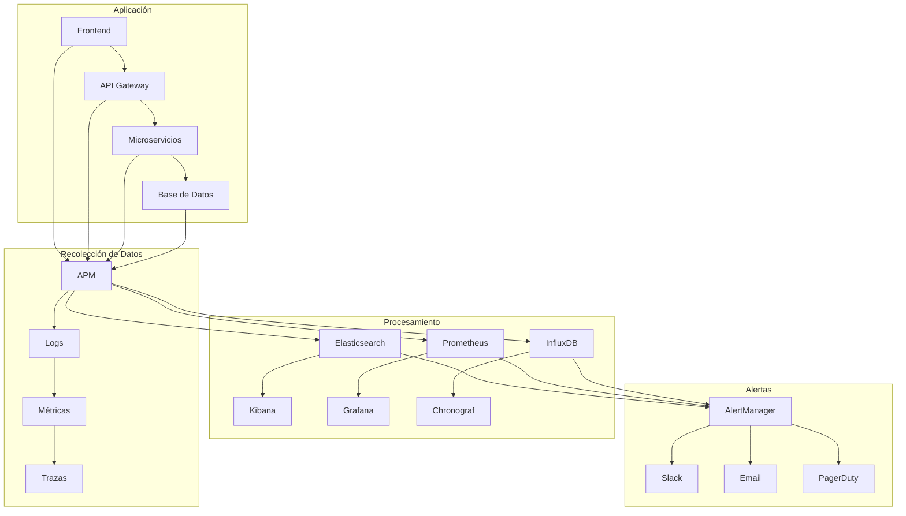

# Monitoreo y Analytics - Facebook de Agencias

## 📊 Visión General del Monitoreo

El sistema de monitoreo y analytics de "Facebook de Agencias" proporciona visibilidad completa sobre el rendimiento, uso y salud de la plataforma, permitiendo tomar decisiones informadas y mantener la calidad del servicio.

## 🎯 Objetivos del Monitoreo

### **Métricas Clave (KPIs)**
- **Disponibilidad**: 99.9% uptime
- **Rendimiento**: < 200ms tiempo de respuesta API
- **Usabilidad**: Tasa de conversión > 5%
- **Seguridad**: 0 incidentes de seguridad críticos
- **Escalabilidad**: Soporte para 10,000 usuarios concurrentes

### **Categorías de Monitoreo**
1. **Infraestructura** - Servidores, base de datos, red
2. **Aplicación** - APIs, frontend, servicios
3. **Negocio** - Usuarios, transacciones, conversiones
4. **Seguridad** - Intrusiones, vulnerabilidades, accesos
5. **Experiencia de Usuario** - Tiempo de carga, errores, satisfacción

## 🏗️ Arquitectura de Monitoreo



## 📈 Métricas de Infraestructura

### **Monitoreo de Servidores**

```yaml
# prometheus.yml
global:
  scrape_interval: 15s
  evaluation_interval: 15s

rule_files:
  - "alert_rules.yml"

scrape_configs:
  - job_name: 'node-exporter'
    static_configs:
      - targets: ['localhost:9100']
  
  - job_name: 'mysql-exporter'
    static_configs:
      - targets: ['localhost:9104']
  
  - job_name: 'redis-exporter'
    static_configs:
      - targets: ['localhost:9121']
  
  - job_name: 'nginx-exporter'
    static_configs:
      - targets: ['localhost:9113']

alerting:
  alertmanagers:
    - static_configs:
        - targets:
          - alertmanager:9093
```

### **Métricas de Sistema**

```javascript
// Métricas de Node.js
const prometheus = require('prom-client');

// Crear registro de métricas
const register = new prometheus.Registry();

// Métricas personalizadas
const httpRequestDuration = new prometheus.Histogram({
    name: 'http_request_duration_seconds',
    help: 'Duration of HTTP requests in seconds',
    labelNames: ['method', 'route', 'status_code'],
    buckets: [0.1, 0.3, 0.5, 0.7, 1, 3, 5, 7, 10]
});

const httpRequestTotal = new prometheus.Counter({
    name: 'http_requests_total',
    help: 'Total number of HTTP requests',
    labelNames: ['method', 'route', 'status_code']
});

const activeConnections = new prometheus.Gauge({
    name: 'active_connections',
    help: 'Number of active connections'
});

const databaseConnections = new prometheus.Gauge({
    name: 'database_connections_active',
    help: 'Number of active database connections'
});

// Registrar métricas
register.registerMetric(httpRequestDuration);
register.registerMetric(httpRequestTotal);
register.registerMetric(activeConnections);
register.registerMetric(databaseConnections);

module.exports = {
    register,
    httpRequestDuration,
    httpRequestTotal,
    activeConnections,
    databaseConnections
};
```

### **Middleware de Métricas**

```javascript
// middleware/metrics.js
const { httpRequestDuration, httpRequestTotal } = require('./metrics');

const metricsMiddleware = (req, res, next) => {
    const start = Date.now();
    
    res.on('finish', () => {
        const duration = (Date.now() - start) / 1000;
        const labels = {
            method: req.method,
            route: req.route?.path || req.path,
            status_code: res.statusCode
        };
        
        httpRequestDuration.observe(labels, duration);
        httpRequestTotal.inc(labels);
    });
    
    next();
};

module.exports = metricsMiddleware;
```

## 📊 Métricas de Aplicación

### **Monitoreo de APIs**

```javascript
// api-monitoring.js
const express = require('express');
const { createPrometheusMetrics } = require('./metrics');

class APIMonitoring {
    constructor() {
        this.metrics = createPrometheusMetrics();
        this.setupHealthChecks();
    }

    setupHealthChecks() {
        const app = express();
        
        // Health check endpoint
        app.get('/health', async (req, res) => {
            const health = await this.checkHealth();
            res.status(health.status === 'healthy' ? 200 : 503).json(health);
        });
        
        // Metrics endpoint
        app.get('/metrics', (req, res) => {
            res.set('Content-Type', this.metrics.register.contentType);
            res.end(this.metrics.register.metrics());
        });
        
        // Readiness check
        app.get('/ready', async (req, res) => {
            const ready = await this.checkReadiness();
            res.status(ready ? 200 : 503).json({ ready });
        });
        
        return app;
    }

    async checkHealth() {
        const checks = {
            database: await this.checkDatabase(),
            redis: await this.checkRedis(),
            external_apis: await this.checkExternalAPIs()
        };
        
        const allHealthy = Object.values(checks).every(check => check.status === 'healthy');
        
        return {
            status: allHealthy ? 'healthy' : 'unhealthy',
            timestamp: new Date().toISOString(),
            checks
        };
    }

    async checkDatabase() {
        try {
            const result = await db.query('SELECT 1');
            return {
                status: 'healthy',
                response_time: result.responseTime
            };
        } catch (error) {
            return {
                status: 'unhealthy',
                error: error.message
            };
        }
    }

    async checkRedis() {
        try {
            const start = Date.now();
            await redis.ping();
            const responseTime = Date.now() - start;
            
            return {
                status: 'healthy',
                response_time: responseTime
            };
        } catch (error) {
            return {
                status: 'unhealthy',
                error: error.message
            };
        }
    }

    trackAPICall(endpoint, method, statusCode, duration) {
        this.metrics.apiCallsTotal.inc({
            endpoint,
            method,
            status_code: statusCode
        });
        
        this.metrics.apiDuration.observe({
            endpoint,
            method
        }, duration);
    }

    trackBusinessMetric(metric, value, labels = {}) {
        this.metrics.businessMetrics.inc({
            metric,
            ...labels
        }, value);
    }
}

module.exports = APIMonitoring;
```

### **Métricas de Negocio**

```javascript
// business-metrics.js
class BusinessMetrics {
    constructor() {
        this.metrics = {
            // Métricas de usuarios
            totalUsers: new prometheus.Gauge({
                name: 'total_users',
                help: 'Total number of registered users'
            }),
            
            activeUsers: new prometheus.Gauge({
                name: 'active_users',
                help: 'Number of active users in the last 24 hours'
            }),
            
            // Métricas de agencias
            totalAgencies: new prometheus.Gauge({
                name: 'total_agencies',
                help: 'Total number of registered agencies'
            }),
            
            verifiedAgencies: new prometheus.Gauge({
                name: 'verified_agencies',
                help: 'Number of verified agencies'
            }),
            
            // Métricas de paquetes
            totalPackages: new prometheus.Gauge({
                name: 'total_packages',
                help: 'Total number of packages'
            }),
            
            activePackages: new prometheus.Gauge({
                name: 'active_packages',
                help: 'Number of active packages'
            }),
            
            // Métricas de interacciones
            totalLikes: new prometheus.Counter({
                name: 'total_likes',
                help: 'Total number of likes'
            }),
            
            totalComments: new prometheus.Counter({
                name: 'total_comments',
                help: 'Total number of comments'
            }),
            
            totalReviews: new prometheus.Counter({
                name: 'total_reviews',
                help: 'Total number of reviews'
            }),
            
            // Métricas de conversión
            packageViews: new prometheus.Counter({
                name: 'package_views_total',
                help: 'Total number of package views',
                labelNames: ['package_id', 'agency_id']
            }),
            
            quotationRequests: new prometheus.Counter({
                name: 'quotation_requests_total',
                help: 'Total number of quotation requests',
                labelNames: ['agency_id', 'destination']
            }),
            
            conversions: new prometheus.Counter({
                name: 'conversions_total',
                help: 'Total number of conversions',
                labelNames: ['type', 'agency_id']
            })
        };
    }

    async updateUserMetrics() {
        const totalUsers = await User.countDocuments();
        const activeUsers = await User.countDocuments({
            last_login: { $gte: new Date(Date.now() - 24 * 60 * 60 * 1000) }
        });
        
        this.metrics.totalUsers.set(totalUsers);
        this.metrics.activeUsers.set(activeUsers);
    }

    async updateAgencyMetrics() {
        const totalAgencies = await Agency.countDocuments();
        const verifiedAgencies = await Agency.countDocuments({ verified: true });
        
        this.metrics.totalAgencies.set(totalAgencies);
        this.metrics.verifiedAgencies.set(verifiedAgencies);
    }

    async updatePackageMetrics() {
        const totalPackages = await Package.countDocuments();
        const activePackages = await Package.countDocuments({ status: 'active' });
        
        this.metrics.totalPackages.set(totalPackages);
        this.metrics.activePackages.set(activePackages);
    }

    trackPackageView(packageId, agencyId) {
        this.metrics.packageViews.inc({
            package_id: packageId,
            agency_id: agencyId
        });
    }

    trackQuotationRequest(agencyId, destination) {
        this.metrics.quotationRequests.inc({
            agency_id: agencyId,
            destination: destination
        });
    }

    trackConversion(type, agencyId) {
        this.metrics.conversions.inc({
            type: type,
            agency_id: agencyId
        });
    }
}

module.exports = BusinessMetrics;
```

## 📝 Logging y Trazabilidad

### **Configuración de Logs**

```javascript
// logging.js
const winston = require('winston');
const { ElasticsearchTransport } = require('winston-elasticsearch');

// Configuración de logger
const logger = winston.createLogger({
    level: process.env.LOG_LEVEL || 'info',
    format: winston.format.combine(
        winston.format.timestamp(),
        winston.format.errors({ stack: true }),
        winston.format.json()
    ),
    defaultMeta: { service: 'facebook-agencias-api' },
    transports: [
        // Console transport
        new winston.transports.Console({
            format: winston.format.combine(
                winston.format.colorize(),
                winston.format.simple()
            )
        }),
        
        // File transport
        new winston.transports.File({
            filename: 'logs/error.log',
            level: 'error'
        }),
        
        // Elasticsearch transport
        new ElasticsearchTransport({
            level: 'info',
            clientOpts: {
                node: process.env.ELASTICSEARCH_URL || 'http://localhost:9200'
            },
            index: 'facebook-agencias-logs',
            indexTemplate: {
                mappings: {
                    properties: {
                        timestamp: { type: 'date' },
                        level: { type: 'keyword' },
                        message: { type: 'text' },
                        service: { type: 'keyword' },
                        request_id: { type: 'keyword' },
                        user_id: { type: 'keyword' },
                        agency_id: { type: 'keyword' }
                    }
                }
            }
        })
    ]
});

// Middleware de logging de requests
const requestLogger = (req, res, next) => {
    const requestId = req.headers['x-request-id'] || generateRequestId();
    req.requestId = requestId;
    
    logger.info('Request started', {
        request_id: requestId,
        method: req.method,
        url: req.url,
        user_agent: req.get('User-Agent'),
        ip: req.ip,
        user_id: req.user?.id,
        agency_id: req.user?.agency_id
    });
    
    const start = Date.now();
    
    res.on('finish', () => {
        const duration = Date.now() - start;
        
        logger.info('Request completed', {
            request_id: requestId,
            method: req.method,
            url: req.url,
            status_code: res.statusCode,
            duration: duration,
            user_id: req.user?.id,
            agency_id: req.user?.agency_id
        });
    });
    
    next();
};

module.exports = { logger, requestLogger };
```

### **Trazabilidad de Errores**

```javascript
// error-tracking.js
const Sentry = require('@sentry/node');

// Configuración de Sentry
Sentry.init({
    dsn: process.env.SENTRY_DSN,
    environment: process.env.NODE_ENV,
    tracesSampleRate: 0.1,
    integrations: [
        new Sentry.Integrations.Http({ tracing: true }),
        new Sentry.Integrations.Express({ app }),
        new Sentry.Integrations.Mongo({ useMongoose: true })
    ]
});

// Middleware de manejo de errores
const errorHandler = (err, req, res, next) => {
    // Log del error
    logger.error('Unhandled error', {
        error: err.message,
        stack: err.stack,
        request_id: req.requestId,
        user_id: req.user?.id,
        agency_id: req.user?.agency_id,
        url: req.url,
        method: req.method
    });
    
    // Enviar a Sentry
    Sentry.captureException(err, {
        tags: {
            request_id: req.requestId,
            user_id: req.user?.id,
            agency_id: req.user?.agency_id
        },
        extra: {
            url: req.url,
            method: req.method,
            headers: req.headers
        }
    });
    
    // Respuesta al cliente
    if (process.env.NODE_ENV === 'production') {
        res.status(500).json({
            error: 'Internal Server Error',
            request_id: req.requestId
        });
    } else {
        res.status(500).json({
            error: err.message,
            stack: err.stack,
            request_id: req.requestId
        });
    }
};

module.exports = { errorHandler };
```

## 🚨 Sistema de Alertas

### **Configuración de Alertas**

```yaml
# alert_rules.yml
groups:
  - name: infrastructure
    rules:
      - alert: HighCPUUsage
        expr: 100 - (avg by(instance) (irate(node_cpu_seconds_total{mode="idle"}[5m])) * 100) > 80
        for: 5m
        labels:
          severity: warning
        annotations:
          summary: "High CPU usage detected"
          description: "CPU usage is above 80% for more than 5 minutes"
      
      - alert: HighMemoryUsage
        expr: (node_memory_MemTotal_bytes - node_memory_MemAvailable_bytes) / node_memory_MemTotal_bytes * 100 > 85
        for: 5m
        labels:
          severity: warning
        annotations:
          summary: "High memory usage detected"
          description: "Memory usage is above 85% for more than 5 minutes"
      
      - alert: DiskSpaceLow
        expr: (node_filesystem_avail_bytes / node_filesystem_size_bytes) * 100 < 10
        for: 5m
        labels:
          severity: critical
        annotations:
          summary: "Low disk space"
          description: "Disk space is below 10%"

  - name: application
    rules:
      - alert: HighErrorRate
        expr: rate(http_requests_total{status_code=~"5.."}[5m]) / rate(http_requests_total[5m]) > 0.05
        for: 5m
        labels:
          severity: critical
        annotations:
          summary: "High error rate detected"
          description: "Error rate is above 5% for more than 5 minutes"
      
      - alert: HighResponseTime
        expr: histogram_quantile(0.95, rate(http_request_duration_seconds_bucket[5m])) > 1
        for: 5m
        labels:
          severity: warning
        annotations:
          summary: "High response time"
          description: "95th percentile response time is above 1 second"
      
      - alert: DatabaseConnectionsHigh
        expr: database_connections_active > 80
        for: 5m
        labels:
          severity: warning
        annotations:
          summary: "High database connections"
          description: "Database connections are above 80"

  - name: business
    rules:
      - alert: LowUserActivity
        expr: rate(active_users[1h]) < 10
        for: 1h
        labels:
          severity: warning
        annotations:
          summary: "Low user activity"
          description: "User activity is below expected levels"
      
      - alert: HighQuotationFailures
        expr: rate(quotation_requests_total{status="failed"}[1h]) / rate(quotation_requests_total[1h]) > 0.1
        for: 30m
        labels:
          severity: warning
        annotations:
          summary: "High quotation failure rate"
          description: "Quotation failure rate is above 10%"
```

### **Configuración de AlertManager**

```yaml
# alertmanager.yml
global:
  smtp_smarthost: 'localhost:587'
  smtp_from: 'alerts@facebookdeagencias.com'

route:
  group_by: ['alertname', 'severity']
  group_wait: 10s
  group_interval: 10s
  repeat_interval: 1h
  receiver: 'default'
  routes:
    - match:
        severity: critical
      receiver: 'critical-alerts'
    - match:
        severity: warning
      receiver: 'warning-alerts'

receivers:
  - name: 'default'
    email_configs:
      - to: 'admin@facebookdeagencias.com'
        subject: 'Facebook de Agencias Alert: {{ .GroupLabels.alertname }}'
        body: |
          {{ range .Alerts }}
          Alert: {{ .Annotations.summary }}
          Description: {{ .Annotations.description }}
          {{ end }}
  
  - name: 'critical-alerts'
    slack_configs:
      - api_url: 'https://hooks.slack.com/services/YOUR/SLACK/WEBHOOK'
        channel: '#alerts-critical'
        title: 'Critical Alert: {{ .GroupLabels.alertname }}'
        text: |
          {{ range .Alerts }}
          *Alert:* {{ .Annotations.summary }}
          *Description:* {{ .Annotations.description }}
          *Severity:* {{ .Labels.severity }}
          {{ end }}
    
    pagerduty_configs:
      - service_key: 'YOUR_PAGERDUTY_SERVICE_KEY'
        description: '{{ .GroupLabels.alertname }}'
  
  - name: 'warning-alerts'
    slack_configs:
      - api_url: 'https://hooks.slack.com/services/YOUR/SLACK/WEBHOOK'
        channel: '#alerts-warning'
        title: 'Warning Alert: {{ .GroupLabels.alertname }}'
        text: |
          {{ range .Alerts }}
          *Alert:* {{ .Annotations.summary }}
          *Description:* {{ .Annotations.description }}
          {{ end }}
```

## 📊 Dashboards de Monitoreo

### **Dashboard de Infraestructura (Grafana)**

```json
{
  "dashboard": {
    "title": "Facebook de Agencias - Infrastructure",
    "panels": [
      {
        "title": "CPU Usage",
        "type": "graph",
        "targets": [
          {
            "expr": "100 - (avg by(instance) (irate(node_cpu_seconds_total{mode=\"idle\"}[5m])) * 100)",
            "legendFormat": "CPU Usage %"
          }
        ]
      },
      {
        "title": "Memory Usage",
        "type": "graph",
        "targets": [
          {
            "expr": "(node_memory_MemTotal_bytes - node_memory_MemAvailable_bytes) / node_memory_MemTotal_bytes * 100",
            "legendFormat": "Memory Usage %"
          }
        ]
      },
      {
        "title": "Disk Usage",
        "type": "graph",
        "targets": [
          {
            "expr": "(node_filesystem_size_bytes - node_filesystem_avail_bytes) / node_filesystem_size_bytes * 100",
            "legendFormat": "Disk Usage %"
          }
        ]
      },
      {
        "title": "Network Traffic",
        "type": "graph",
        "targets": [
          {
            "expr": "rate(node_network_receive_bytes_total[5m])",
            "legendFormat": "Receive {{instance}}"
          },
          {
            "expr": "rate(node_network_transmit_bytes_total[5m])",
            "legendFormat": "Transmit {{instance}}"
          }
        ]
      }
    ]
  }
}
```

### **Dashboard de Aplicación**

```json
{
  "dashboard": {
    "title": "Facebook de Agencias - Application",
    "panels": [
      {
        "title": "Request Rate",
        "type": "graph",
        "targets": [
          {
            "expr": "rate(http_requests_total[5m])",
            "legendFormat": "{{method}} {{route}}"
          }
        ]
      },
      {
        "title": "Response Time",
        "type": "graph",
        "targets": [
          {
            "expr": "histogram_quantile(0.50, rate(http_request_duration_seconds_bucket[5m]))",
            "legendFormat": "50th percentile"
          },
          {
            "expr": "histogram_quantile(0.95, rate(http_request_duration_seconds_bucket[5m]))",
            "legendFormat": "95th percentile"
          }
        ]
      },
      {
        "title": "Error Rate",
        "type": "graph",
        "targets": [
          {
            "expr": "rate(http_requests_total{status_code=~\"5..\"}[5m]) / rate(http_requests_total[5m]) * 100",
            "legendFormat": "Error Rate %"
          }
        ]
      },
      {
        "title": "Database Connections",
        "type": "graph",
        "targets": [
          {
            "expr": "database_connections_active",
            "legendFormat": "Active Connections"
          }
        ]
      }
    ]
  }
}
```

### **Dashboard de Negocio**

```json
{
  "dashboard": {
    "title": "Facebook de Agencias - Business",
    "panels": [
      {
        "title": "User Growth",
        "type": "graph",
        "targets": [
          {
            "expr": "total_users",
            "legendFormat": "Total Users"
          },
          {
            "expr": "active_users",
            "legendFormat": "Active Users (24h)"
          }
        ]
      },
      {
        "title": "Package Metrics",
        "type": "graph",
        "targets": [
          {
            "expr": "total_packages",
            "legendFormat": "Total Packages"
          },
          {
            "expr": "active_packages",
            "legendFormat": "Active Packages"
          }
        ]
      },
      {
        "title": "Social Interactions",
        "type": "graph",
        "targets": [
          {
            "expr": "rate(total_likes[1h])",
            "legendFormat": "Likes/hour"
          },
          {
            "expr": "rate(total_comments[1h])",
            "legendFormat": "Comments/hour"
          },
          {
            "expr": "rate(total_reviews[1h])",
            "legendFormat": "Reviews/hour"
          }
        ]
      },
      {
        "title": "Conversion Funnel",
        "type": "graph",
        "targets": [
          {
            "expr": "rate(package_views_total[1h])",
            "legendFormat": "Package Views/hour"
          },
          {
            "expr": "rate(quotation_requests_total[1h])",
            "legendFormat": "Quotation Requests/hour"
          },
          {
            "expr": "rate(conversions_total[1h])",
            "legendFormat": "Conversions/hour"
          }
        ]
      }
    ]
  }
}
```

## 🔍 Análisis de Logs

### **Consultas de Kibana**

```json
{
  "query": {
    "bool": {
      "must": [
        {
          "range": {
            "timestamp": {
              "gte": "now-1h"
            }
          }
        }
      ],
      "filter": [
        {
          "term": {
            "level": "error"
          }
        }
      ]
    }
  },
  "aggs": {
    "errors_by_service": {
      "terms": {
        "field": "service.keyword"
      }
    },
    "errors_by_status": {
      "terms": {
        "field": "status_code"
      }
    }
  }
}
```

### **Alertas de Logs**

```javascript
// log-alerts.js
const { Client } = require('@elastic/elasticsearch');

class LogAlerts {
    constructor() {
        this.client = new Client({
            node: process.env.ELASTICSEARCH_URL
        });
    }

    async checkErrorRate() {
        const response = await this.client.search({
            index: 'facebook-agencias-logs',
            body: {
                query: {
                    bool: {
                        must: [
                            {
                                range: {
                                    timestamp: {
                                        gte: 'now-5m'
                                    }
                                }
                            },
                            {
                                term: {
                                    level: 'error'
                                }
                            }
                        ]
                    }
                },
                aggs: {
                    error_count: {
                        value_count: {
                            field: 'message.keyword'
                        }
                    }
                }
            }
        });

        const errorCount = response.aggregations.error_count.value;
        
        if (errorCount > 10) {
            await this.sendAlert('High Error Rate', {
                error_count: errorCount,
                time_window: '5 minutes'
            });
        }
    }

    async checkSlowQueries() {
        const response = await this.client.search({
            index: 'facebook-agencias-logs',
            body: {
                query: {
                    bool: {
                        must: [
                            {
                                range: {
                                    timestamp: {
                                        gte: 'now-1h'
                                    }
                                }
                            },
                            {
                                term: {
                                    message: 'slow_query'
                                }
                            }
                        ]
                    }
                }
            }
        });

        if (response.hits.total.value > 5) {
            await this.sendAlert('Slow Queries Detected', {
                slow_query_count: response.hits.total.value,
                time_window: '1 hour'
            });
        }
    }

    async sendAlert(title, data) {
        // Enviar alerta a Slack, email, etc.
        console.log(`ALERT: ${title}`, data);
    }
}

module.exports = LogAlerts;
```

## 📱 Monitoreo de Experiencia de Usuario

### **Real User Monitoring (RUM)**

```javascript
// rum-tracking.js
class RUMTracker {
    constructor() {
        this.init();
    }

    init() {
        // Track page load performance
        window.addEventListener('load', () => {
            this.trackPageLoad();
        });

        // Track user interactions
        this.trackUserInteractions();
    }

    trackPageLoad() {
        const navigation = performance.getEntriesByType('navigation')[0];
        
        const metrics = {
            page_url: window.location.href,
            load_time: navigation.loadEventEnd - navigation.loadEventStart,
            dom_content_loaded: navigation.domContentLoadedEventEnd - navigation.domContentLoadedEventStart,
            first_paint: this.getFirstPaint(),
            first_contentful_paint: this.getFirstContentfulPaint(),
            largest_contentful_paint: this.getLargestContentfulPaint(),
            cumulative_layout_shift: this.getCumulativeLayoutShift(),
            user_agent: navigator.userAgent,
            viewport: {
                width: window.innerWidth,
                height: window.innerHeight
            }
        };

        this.sendMetrics('page_load', metrics);
    }

    trackUserInteractions() {
        // Track clicks
        document.addEventListener('click', (event) => {
            this.sendMetrics('click', {
                element: event.target.tagName,
                class: event.target.className,
                id: event.target.id,
                page_url: window.location.href
            });
        });

        // Track form submissions
        document.addEventListener('submit', (event) => {
            this.sendMetrics('form_submit', {
                form_id: event.target.id,
                form_class: event.target.className,
                page_url: window.location.href
            });
        });

        // Track errors
        window.addEventListener('error', (event) => {
            this.sendMetrics('javascript_error', {
                message: event.message,
                filename: event.filename,
                lineno: event.lineno,
                colno: event.colno,
                page_url: window.location.href
            });
        });
    }

    sendMetrics(eventType, data) {
        fetch('/api/metrics/rum', {
            method: 'POST',
            headers: {
                'Content-Type': 'application/json'
            },
            body: JSON.stringify({
                event_type: eventType,
                timestamp: new Date().toISOString(),
                ...data
            })
        }).catch(error => {
            console.error('Failed to send RUM metrics:', error);
        });
    }
}

// Inicializar RUM tracking
new RUMTracker();
```

## 📈 Reportes y Analytics

### **Reportes Automáticos**

```javascript
// reports.js
class ReportGenerator {
    constructor() {
        this.metrics = new BusinessMetrics();
    }

    async generateDailyReport() {
        const report = {
            date: new Date().toISOString().split('T')[0],
            metrics: {
                users: await this.getUserMetrics(),
                agencies: await this.getAgencyMetrics(),
                packages: await this.getPackageMetrics(),
                interactions: await this.getInteractionMetrics(),
                performance: await this.getPerformanceMetrics()
            }
        };

        await this.sendReport('daily', report);
        return report;
    }

    async getUserMetrics() {
        const totalUsers = await User.countDocuments();
        const newUsers = await User.countDocuments({
            created_at: { $gte: new Date(Date.now() - 24 * 60 * 60 * 1000) }
        });
        const activeUsers = await User.countDocuments({
            last_login: { $gte: new Date(Date.now() - 24 * 60 * 60 * 1000) }
        });

        return { totalUsers, newUsers, activeUsers };
    }

    async getAgencyMetrics() {
        const totalAgencies = await Agency.countDocuments();
        const newAgencies = await Agency.countDocuments({
            created_at: { $gte: new Date(Date.now() - 24 * 60 * 60 * 1000) }
        });
        const verifiedAgencies = await Agency.countDocuments({ verified: true });

        return { totalAgencies, newAgencies, verifiedAgencies };
    }

    async getPackageMetrics() {
        const totalPackages = await Package.countDocuments();
        const newPackages = await Package.countDocuments({
            created_at: { $gte: new Date(Date.now() - 24 * 60 * 60 * 1000) }
        });
        const activePackages = await Package.countDocuments({ status: 'active' });

        return { totalPackages, newPackages, activePackages };
    }

    async getInteractionMetrics() {
        const totalLikes = await PackageLike.countDocuments({
            created_at: { $gte: new Date(Date.now() - 24 * 60 * 60 * 1000) }
        });
        const totalComments = await PackageComment.countDocuments({
            created_at: { $gte: new Date(Date.now() - 24 * 60 * 60 * 1000) }
        });
        const totalReviews = await PackageReview.countDocuments({
            created_at: { $gte: new Date(Date.now() - 24 * 60 * 60 * 1000) }
        });

        return { totalLikes, totalComments, totalReviews };
    }

    async sendReport(type, report) {
        // Enviar reporte por email, Slack, etc.
        console.log(`${type} report generated:`, report);
    }
}

module.exports = ReportGenerator;
```

---

**Documento actualizado**: 19 de Septiembre de 2025  
**Versión Monitoreo**: 1.0.0  
**Próxima actualización**: Machine Learning para predicción de fallos
