# 🔍 Análisis de Integración CRM AMS365 → Red de Agencias 360

## 📊 Resumen Ejecutivo

Este documento analiza la integración entre el CRM AMS365 existente (47 tablas) y la nueva plataforma social "Red de Agencias 360", identificando oportunidades de reutilización, adaptaciones necesarias y nuevas funcionalidades requeridas.

## 🎯 Objetivos de la Integración

### **Reutilización de Datos Existentes**
- ✅ **Agencias**: 100% reutilizable con adaptaciones menores
- ✅ **Paquetes**: 90% reutilizable, requiere campos sociales
- ✅ **Usuarios**: 80% reutilizable, requiere roles sociales
- ✅ **Clientes**: 70% reutilizable, requiere perfil social

### **Nuevas Funcionalidades Sociales**
- 🆕 **Sistema de Likes y Comentarios**
- 🆕 **Reviews y Calificaciones**
- 🆕 **Feed Social de Agencias**
- 🆕 **Sistema de Reportes**
- 🆕 **Notificaciones Sociales**

---

## 🗺️ Mapeo de Entidades

### 1. **Entidades Completamente Reutilizables**

#### **Agencias (100% Compatible)**
| Campo CRM | Campo Red 360 | Estado | Observaciones |
|-----------|---------------|--------|---------------|
| `id` | `id` | ✅ Directo | Identificador único |
| `name` | `name` | ✅ Directo | Nombre de la agencia |
| `slug` | `slug` | ✅ Directo | URL amigable |
| `logo` | `logo_url` | ✅ Adaptar | Renombrar campo |
| `status` | `active` | ✅ Adaptar | Convertir a boolean |
| `entity_type` | `type` | ✅ Directo | Tipo de entidad |
| `nit` | `nit` | ✅ Directo | NIT único |

#### **Paquetes (90% Compatible)**
| Campo CRM | Campo Red 360 | Estado | Observaciones |
|-----------|---------------|--------|---------------|
| `id` | `id` | ✅ Directo | Identificador único |
| `agency_id` | `agency_id` | ✅ Directo | Relación con agencia |
| `title` | `title` | ✅ Directo | Título del paquete |
| `destination` | `destination` | ✅ Directo | Destino |
| `include` | `includes` | ✅ Adaptar | Convertir LONGTEXT a JSON |
| `no_include` | `excludes` | ✅ Adaptar | Convertir LONGTEXT a JSON |
| `main_image` | `images` | ✅ Adaptar | Convertir a JSON array |
| `gallery_images` | `images` | ✅ Directo | Ya es JSON |
| `status` | `status` | ✅ Adaptar | Mapear estados |

### 2. **Entidades Requieren Adaptación**

#### **Usuarios (80% Compatible)**
| Campo CRM | Campo Red 360 | Estado | Observaciones |
|-----------|---------------|--------|---------------|
| `id` | `id` | ✅ Directo | Identificador único |
| `name` | `name` | ✅ Directo | Nombre completo |
| `email` | `email` | ✅ Directo | Email único |
| `phone` | `phone` | ✅ Directo | Teléfono |
| `slug` | `username` | ✅ Adaptar | Renombrar para redes sociales |
| `status` | `active` | ✅ Adaptar | Convertir a boolean |
| `agency_id` | `agency_id` | ✅ Directo | Relación con agencia |
| - | `avatar_url` | 🆕 Nuevo | Avatar del usuario |
| - | `bio` | 🆕 Nuevo | Biografía del usuario |
| - | `social_links` | 🆕 Nuevo | Enlaces sociales |

#### **Clientes (70% Compatible)**
| Campo CRM | Campo Red 360 | Estado | Observaciones |
|-----------|---------------|--------|---------------|
| `id` | `id` | ✅ Directo | Identificador único |
| `name` | `name` | ✅ Directo | Nombre completo |
| `email` | `email` | ✅ Directo | Email único |
| `phone` | `phone` | ✅ Directo | Teléfono |
| `address` | `address` | ✅ Directo | Dirección |
| `client_type` | `user_type` | ✅ Adaptar | Renombrar campo |
| - | `avatar_url` | 🆕 Nuevo | Avatar del usuario |
| - | `bio` | 🆕 Nuevo | Biografía del usuario |
| - | `preferences` | 🆕 Nuevo | Preferencias de viaje |

### 3. **Entidades Nuevas Requeridas**

#### **Sistema Social**
| Tabla | Propósito | Relación con CRM |
|-------|-----------|------------------|
| `package_likes` | Likes en paquetes | `packages.id` |
| `package_comments` | Comentarios en paquetes | `packages.id` |
| `package_reviews` | Reviews de paquetes | `packages.id` |
| `user_follows` | Seguimiento de agencias | `agencies.id` |
| `package_reports` | Reportes de contenido | `packages.id` |
| `social_notifications` | Notificaciones sociales | `users.id` |

---

## 🔄 Estrategia de Integración

### **Fase 1: Sincronización Bidireccional**

#### **1.1 Sincronización de Agencias**
```sql
-- Trigger para sincronizar cambios de agencias
CREATE TRIGGER sync_agency_to_red360
AFTER UPDATE ON agencies
FOR EACH ROW
BEGIN
    -- Sincronizar con Red de Agencias 360
    INSERT INTO red360_agencies_sync (agency_id, action, data, created_at)
    VALUES (NEW.id, 'update', JSON_OBJECT(
        'name', NEW.name,
        'slug', NEW.slug,
        'logo', NEW.logo,
        'status', NEW.status
    ), NOW());
END;
```

#### **1.2 Sincronización de Paquetes**
```sql
-- Trigger para sincronizar cambios de paquetes
CREATE TRIGGER sync_package_to_red360
AFTER INSERT ON packages
FOR EACH ROW
BEGIN
    -- Sincronizar con Red de Agencias 360
    INSERT INTO red360_packages_sync (package_id, action, data, created_at)
    VALUES (NEW.id, 'create', JSON_OBJECT(
        'title', NEW.title,
        'destination', NEW.destination,
        'agency_id', NEW.agency_id,
        'status', NEW.status
    ), NOW());
END;
```

### **Fase 2: API de Integración**

#### **2.1 Endpoints de Sincronización**
```php
// Endpoint para sincronizar agencias
Route::post('/api/v1/sync/agencies', [SyncController::class, 'syncAgencies']);

// Endpoint para sincronizar paquetes
Route::post('/api/v1/sync/packages', [SyncController::class, 'syncPackages']);

// Endpoint para sincronizar usuarios
Route::post('/api/v1/sync/users', [SyncController::class, 'syncUsers']);
```

#### **2.2 Webhooks para Tiempo Real**
```php
// Webhook para notificar cambios en agencias
Route::post('/webhooks/agency-updated', [WebhookController::class, 'agencyUpdated']);

// Webhook para notificar cambios en paquetes
Route::post('/webhooks/package-updated', [WebhookController::class, 'packageUpdated']);
```

---

## 🏗️ Arquitectura de Integración

### **Diagrama de Integración**


### **Flujo de Datos**

```mermaid
sequenceDiagram
    participant CRM as CRM AMS365
    participant SYNC as Servicio Sync
    participant RED as Red de Agencias 360
    participant USER as Usuario Final
    
    CRM->>SYNC: Cambio en agencia/paquete
    SYNC->>RED: Sincronizar datos
    RED->>RED: Actualizar base de datos
    RED->>USER: Mostrar cambios en tiempo real
    
    USER->>RED: Like/Comentario
    RED->>RED: Procesar interacción social
    RED->>CRM: Notificar métricas sociales
    CRM->>CRM: Actualizar estadísticas
```



---

## 📊 Adaptaciones de Base de Datos

### **1. Nuevas Tablas para Funcionalidades Sociales**

#### **Tabla: package_likes**
```sql
CREATE TABLE package_likes (
    id BIGINT UNSIGNED AUTO_INCREMENT PRIMARY KEY,
    package_id BIGINT UNSIGNED NOT NULL,
    user_id BIGINT UNSIGNED NOT NULL,
    created_at TIMESTAMP DEFAULT CURRENT_TIMESTAMP,
    
    FOREIGN KEY (package_id) REFERENCES packages(id) ON DELETE CASCADE,
    FOREIGN KEY (user_id) REFERENCES users(id) ON DELETE CASCADE,
    UNIQUE KEY unique_like (package_id, user_id),
    INDEX idx_package_id (package_id),
    INDEX idx_user_id (user_id)
) ENGINE=InnoDB DEFAULT CHARSET=utf8mb4 COLLATE=utf8mb4_unicode_ci;
```

#### **Tabla: package_comments**
```sql
CREATE TABLE package_comments (
    id BIGINT UNSIGNED AUTO_INCREMENT PRIMARY KEY,
    package_id BIGINT UNSIGNED NOT NULL,
    user_id BIGINT UNSIGNED NOT NULL,
    comment TEXT NOT NULL,
    parent_id BIGINT UNSIGNED NULL,
    likes_count INT UNSIGNED DEFAULT 0,
    created_at TIMESTAMP DEFAULT CURRENT_TIMESTAMP,
    updated_at TIMESTAMP DEFAULT CURRENT_TIMESTAMP ON UPDATE CURRENT_TIMESTAMP,
    
    FOREIGN KEY (package_id) REFERENCES packages(id) ON DELETE CASCADE,
    FOREIGN KEY (user_id) REFERENCES users(id) ON DELETE CASCADE,
    FOREIGN KEY (parent_id) REFERENCES package_comments(id) ON DELETE CASCADE,
    INDEX idx_package_id (package_id),
    INDEX idx_user_id (user_id),
    INDEX idx_parent_id (parent_id)
) ENGINE=InnoDB DEFAULT CHARSET=utf8mb4 COLLATE=utf8mb4_unicode_ci;
```

#### **Tabla: package_reviews**
```sql
CREATE TABLE package_reviews (
    id BIGINT UNSIGNED AUTO_INCREMENT PRIMARY KEY,
    package_id BIGINT UNSIGNED NOT NULL,
    user_id BIGINT UNSIGNED NOT NULL,
    rating INT UNSIGNED NOT NULL CHECK (rating >= 1 AND rating <= 5),
    review TEXT,
    verified BOOLEAN DEFAULT FALSE,
    helpful_count INT UNSIGNED DEFAULT 0,
    created_at TIMESTAMP DEFAULT CURRENT_TIMESTAMP,
    updated_at TIMESTAMP DEFAULT CURRENT_TIMESTAMP ON UPDATE CURRENT_TIMESTAMP,
    
    FOREIGN KEY (package_id) REFERENCES packages(id) ON DELETE CASCADE,
    FOREIGN KEY (user_id) REFERENCES users(id) ON DELETE CASCADE,
    UNIQUE KEY unique_review (package_id, user_id),
    INDEX idx_package_id (package_id),
    INDEX idx_user_id (user_id),
    INDEX idx_rating (rating)
) ENGINE=InnoDB DEFAULT CHARSET=utf8mb4 COLLATE=utf8mb4_unicode_ci;
```

### **2. Modificaciones a Tablas Existentes**

#### **Agregar Campos Sociales a Packages**
```sql
ALTER TABLE packages 
ADD COLUMN likes_count INT UNSIGNED DEFAULT 0,
ADD COLUMN comments_count INT UNSIGNED DEFAULT 0,
ADD COLUMN views_count INT UNSIGNED DEFAULT 0,
ADD COLUMN rating DECIMAL(3,2) DEFAULT 0.00,
ADD COLUMN featured BOOLEAN DEFAULT FALSE,
ADD COLUMN social_visibility ENUM('public', 'private', 'followers') DEFAULT 'public';
```

#### **Agregar Campos Sociales a Users**
```sql
ALTER TABLE users 
ADD COLUMN avatar_url VARCHAR(500),
ADD COLUMN bio TEXT,
ADD COLUMN social_links JSON,
ADD COLUMN followers_count INT UNSIGNED DEFAULT 0,
ADD COLUMN following_count INT UNSIGNED DEFAULT 0,
ADD COLUMN social_verified BOOLEAN DEFAULT FALSE;
```

#### **Agregar Campos Sociales a Agencies**
```sql
ALTER TABLE agencies 
ADD COLUMN followers_count INT UNSIGNED DEFAULT 0,
ADD COLUMN social_rating DECIMAL(3,2) DEFAULT 0.00,
ADD COLUMN social_verified BOOLEAN DEFAULT FALSE,
ADD COLUMN social_links JSON,
ADD COLUMN description TEXT;
```

---

## 🔧 Implementación Técnica

### **1. Servicio de Sincronización**

```php
<?php

namespace App\Services;

class CRMSyncService
{
    public function syncAgency($agencyId)
    {
        $agency = Agency::find($agencyId);
        
        // Sincronizar con Red de Agencias 360
        $red360Data = [
            'id' => $agency->id,
            'name' => $agency->name,
            'slug' => $agency->slug,
            'logo_url' => $agency->logo,
            'description' => $agency->description ?? '',
            'website' => $agency->website ?? '',
            'phone' => $agency->phone ?? '',
            'email' => $agency->email ?? '',
            'address' => $agency->address ?? '',
            'verified' => $agency->status === 'activo',
            'active' => $agency->status === 'activo',
            'social_links' => $agency->social_links ?? [],
            'followers_count' => $agency->followers_count ?? 0,
            'social_rating' => $agency->social_rating ?? 0.00,
            'social_verified' => $agency->social_verified ?? false
        ];
        
        // Enviar a Red de Agencias 360
        $this->sendToRed360('/api/v1/agencies/sync', $red360Data);
    }
    
    public function syncPackage($packageId)
    {
        $package = Package::find($packageId);
        
        // Sincronizar con Red de Agencias 360
        $red360Data = [
            'id' => $package->id,
            'agency_id' => $package->agency_id,
            'title' => $package->title,
            'description' => $package->details ?? '',
            'destination' => $package->destination,
            'origin' => $package->origin,
            'includes' => $this->parseIncludes($package->include),
            'excludes' => $this->parseExcludes($package->no_include),
            'images' => $this->parseImages($package->main_image, $package->gallery_images),
            'status' => $package->status === 'active' ? 'active' : 'inactive',
            'featured' => $package->featured ?? false,
            'social_visibility' => $package->social_visibility ?? 'public',
            'likes_count' => $package->likes_count ?? 0,
            'comments_count' => $package->comments_count ?? 0,
            'views_count' => $package->views_count ?? 0,
            'rating' => $package->rating ?? 0.00
        ];
        
        // Enviar a Red de Agencias 360
        $this->sendToRed360('/api/v1/packages/sync', $red360Data);
    }
    
    private function sendToRed360($endpoint, $data)
    {
        // Implementar envío a Red de Agencias 360
        Http::post(config('red360.api_url') . $endpoint, $data);
    }
}
```

### **2. Webhooks para Tiempo Real**

```php
<?php

namespace App\Http\Controllers;

class WebhookController extends Controller
{
    public function agencyUpdated(Request $request)
    {
        $data = $request->all();
        
        // Procesar actualización de agencia
        $agency = Agency::find($data['id']);
        $agency->update($data);
        
        // Notificar a Red de Agencias 360
        event(new AgencyUpdated($agency));
        
        return response()->json(['status' => 'success']);
    }
    
    public function packageUpdated(Request $request)
    {
        $data = $request->all();
        
        // Procesar actualización de paquete
        $package = Package::find($data['id']);
        $package->update($data);
        
        // Notificar a Red de Agencias 360
        event(new PackageUpdated($package));
        
        return response()->json(['status' => 'success']);
    }
}
```

---

## 📈 Métricas y Analytics

### **1. Métricas Sociales**

```sql
-- Paquetes más populares
SELECT 
    p.title,
    a.name as agency_name,
    p.likes_count,
    p.comments_count,
    p.views_count,
    p.rating
FROM packages p
JOIN agencies a ON p.agency_id = a.id
WHERE p.status = 'active'
ORDER BY p.likes_count DESC
LIMIT 10;

-- Agencias con mejor rendimiento social
SELECT 
    a.name,
    a.social_rating,
    a.followers_count,
    COUNT(p.id) as total_packages,
    SUM(p.likes_count) as total_likes,
    AVG(p.rating) as avg_package_rating
FROM agencies a
LEFT JOIN packages p ON a.id = p.agency_id AND p.status = 'active'
GROUP BY a.id, a.name, a.social_rating, a.followers_count
ORDER BY a.social_rating DESC, a.followers_count DESC;
```

### **2. Dashboard de Integración**

```php
<?php

namespace App\Http\Controllers;

class IntegrationDashboardController extends Controller
{
    public function index()
    {
        $metrics = [
            'total_agencies' => Agency::count(),
            'total_packages' => Package::count(),
            'total_users' => User::count(),
            'total_likes' => PackageLike::count(),
            'total_comments' => PackageComment::count(),
            'total_reviews' => PackageReview::count(),
            'sync_status' => $this->getSyncStatus(),
            'last_sync' => $this->getLastSyncTime()
        ];
        
        return view('integration.dashboard', compact('metrics'));
    }
}
```

---

## 🔒 Seguridad y Permisos

### **1. Autenticación entre Sistemas**

```php
<?php

namespace App\Services;

class AuthenticationService
{
    public function generateApiToken($agencyId)
    {
        $token = Str::random(64);
        
        // Almacenar token en base de datos
        ApiToken::create([
            'agency_id' => $agencyId,
            'token' => Hash::make($token),
            'expires_at' => now()->addDays(30)
        ]);
        
        return $token;
    }
    
    public function validateApiToken($token)
    {
        $hashedToken = Hash::make($token);
        
        return ApiToken::where('token', $hashedToken)
            ->where('expires_at', '>', now())
            ->first();
    }
}
```

### **2. Permisos de Sincronización**

```php
<?php

namespace App\Policies;

class SyncPolicy
{
    public function syncAgency(User $user, Agency $agency)
    {
        return $user->agency_id === $agency->id || $user->hasRole('admin');
    }
    
    public function syncPackage(User $user, Package $package)
    {
        return $user->agency_id === $package->agency_id || $user->hasRole('admin');
    }
}
```

---

## 🚀 Plan de Implementación

### **Fase 1: Preparación (Semana 1-2)**
- [ ] Análisis detallado de datos existentes
- [ ] Configuración de entorno de desarrollo
- [ ] Creación de tablas sociales
- [ ] Implementación de servicio de sincronización

### **Fase 2: Integración Básica (Semana 3-4)**
- [ ] Sincronización de agencias
- [ ] Sincronización de paquetes
- [ ] Sincronización de usuarios
- [ ] Implementación de webhooks

### **Fase 3: Funcionalidades Sociales (Semana 5-6)**
- [ ] Sistema de likes y comentarios
- [ ] Sistema de reviews
- [ ] Feed social
- [ ] Notificaciones

### **Fase 4: Testing y Optimización (Semana 7-8)**
- [ ] Pruebas de integración
- [ ] Optimización de rendimiento
- [ ] Pruebas de carga
- [ ] Documentación final

---

## 📋 Checklist de Migración

### **Pre-migración**
- [ ] Backup completo de base de datos CRM
- [ ] Verificación de integridad de datos
- [ ] Pruebas en entorno de desarrollo
- [ ] Documentación de procesos

### **Migración**
- [ ] Creación de tablas sociales
- [ ] Modificación de tablas existentes
- [ ] Migración de datos
- [ ] Configuración de sincronización

### **Post-migración**
- [ ] Verificación de datos migrados
- [ ] Pruebas de funcionalidad
- [ ] Monitoreo de rendimiento
- [ ] Capacitación de usuarios

---

## 🎯 Próximos Pasos

1. **Revisar y aprobar** este análisis de integración
2. **Configurar entorno** de desarrollo para pruebas
3. **Implementar servicio** de sincronización básico
4. **Crear tablas sociales** en base de datos
5. **Desarrollar API** de integración
6. **Implementar webhooks** para tiempo real
7. **Crear dashboard** de monitoreo
8. **Realizar pruebas** de integración
9. **Desplegar en producción**
10. **Monitorear y optimizar**

---

*Documento generado para Red de Agencias 360*  
*Análisis basado en CRM AMS365*  
*Fecha: 19 de Septiembre de 2025*
