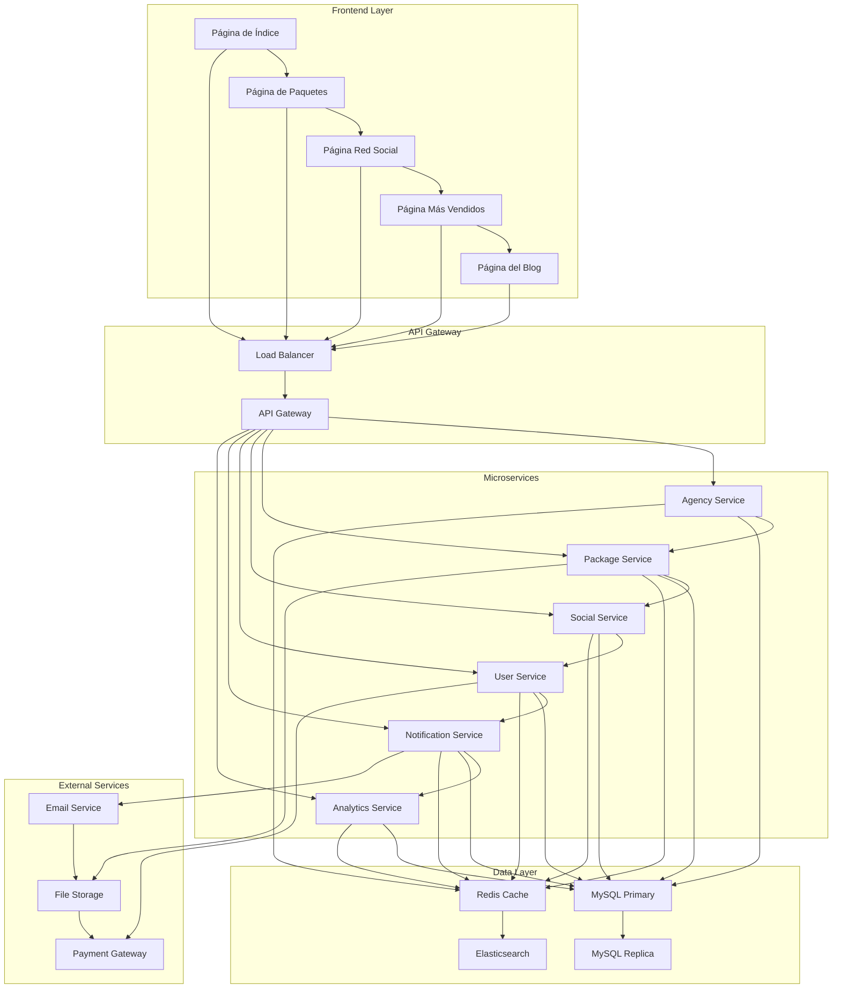
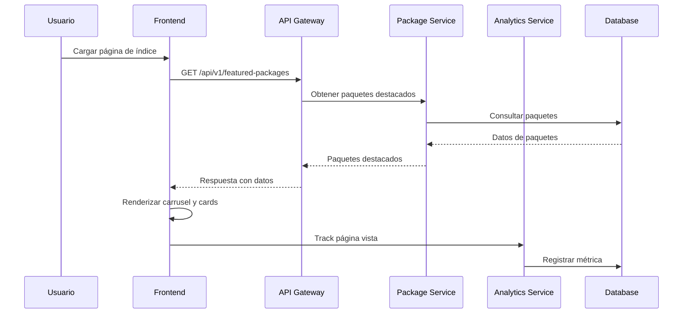
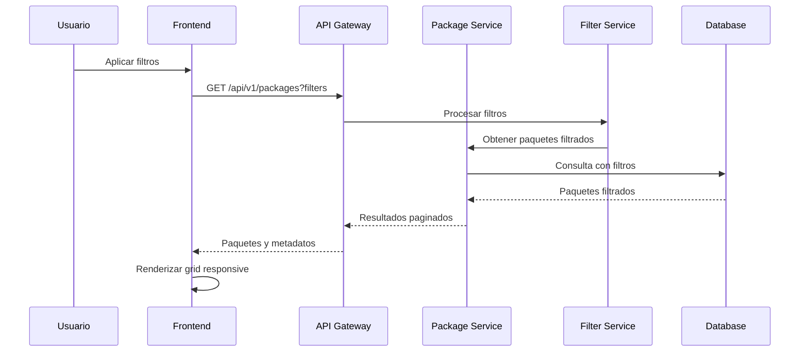
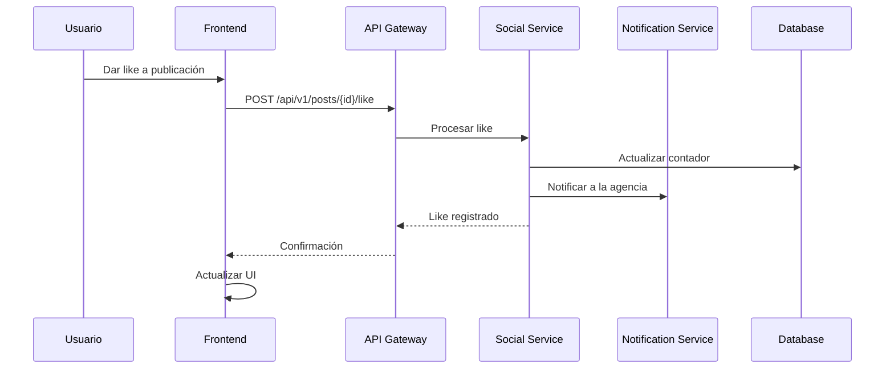
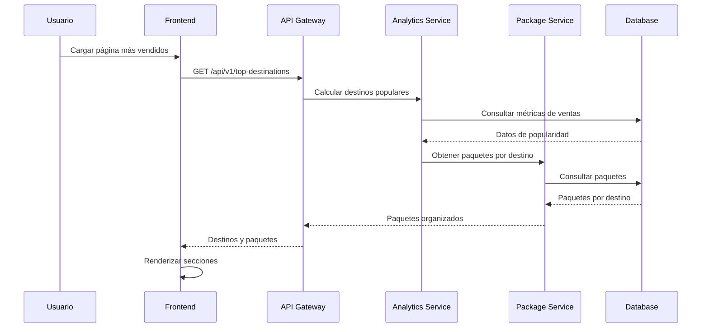

# 🏗️ Arquitectura del Sistema - Red de Agencias 360

## 📊 Resumen Ejecutivo

Este documento describe la arquitectura completa del sistema "Red de Agencias 360", una plataforma social que conecta agencias de viajes con viajeros, permitiendo la interacción, descubrimiento de paquetes y construcción de comunidad en el sector turístico. La plataforma incluye cinco páginas principales con funcionalidades específicas de red social.

## 🎯 Principios de Diseño

### 1. **Arquitectura de Microservicios**
- Separación clara de responsabilidades
- Escalabilidad independiente de componentes
- Tolerancia a fallos mejorada

### 2. **API-First Design**
- Todas las funcionalidades expuestas vía API REST
- Documentación completa de endpoints
- Versionado de API para compatibilidad

### 3. **Responsive y Mobile-First**
- Diseño adaptativo para todos los dispositivos
- Optimización para móviles
- Progressive Web App (PWA) capabilities

### 4. **Modo Oscuro/Claro Automático**
- Detección automática de preferencias del sistema
- Persistencia de preferencias del usuario
- Transiciones suaves entre modos

## 🏛️ Arquitectura de Alto Nivel



## 🔧 Componentes Principales

### 1. **Frontend (Cliente)**

#### **Páginas Principales**
- **Página de Índice** - Landing page con carrusel y cards interactivas
- **Página de Paquetes** - Catálogo con filtros avanzados y paginación
- **Página Red Social** - Feed de publicaciones con interacciones
- **Página Más Vendidos** - Destinos populares sin mostrar estadísticas
- **Página del Blog** - Biblioteca de conceptos para asesores

#### **Tecnologías Frontend**
- **HTML5** - Estructura semántica
- **CSS3** - Estilos modernos con Grid y Flexbox
- **JavaScript ES6+** - Lógica de aplicación
- **Font Awesome 6.4.0** - Iconografía
- **Google Fonts** - Tipografía (Poppins, Playfair Display)

#### **Estructura de Componentes**
```
frontend/
├── pages/
│   ├── index.html                 # Página de índice
│   ├── paquetes.html              # Página de paquetes turísticos
│   ├── red-social.html            # Página tipo red social
│   ├── mas-vendidos.html          # Página de paquetes más vendidos
│   └── blog.html                  # Página del blog
├── components/
│   ├── carousel/                  # Carrusel de imágenes infinitas
│   ├── cards/                     # Cards interactivas
│   ├── filters/                   # Sistema de filtros
│   ├── social-feed/               # Feed de publicaciones
│   ├── forms/                     # Formularios
│   └── modals/                    # Modales
├── styles/
│   ├── style.css                  # Estilos principales
│   ├── components.css             # Componentes reutilizables
│   ├── responsive.css             # Media queries
│   ├── dark-mode.css              # Modo oscuro
│   └── animations.css             # Animaciones
└── scripts/
    ├── main.js                    # Lógica principal
    ├── api.js                     # Cliente API
    ├── theme.js                   # Gestión de temas
    ├── carousel.js                # Carrusel infinito
    ├── filters.js                 # Sistema de filtros
    └── social.js                  # Funcionalidades sociales
```

### 2. **Backend (Servidor)**

#### **API REST (Laravel)**
- **Framework**: Laravel 11+
- **PHP**: 8.2+
- **Autenticación**: Laravel Sanctum
- **Validación**: Form Requests
- **Documentación**: OpenAPI 3.0

#### **Estructura de Módulos**
```
backend/
├── app/
│   ├── Http/Controllers/
│   │   ├── AgencyController.php
│   │   ├── PackageController.php
│   │   ├── SocialController.php
│   │   ├── UserController.php
│   │   ├── BlogController.php
│   │   └── AnalyticsController.php
│   ├── Models/
│   │   ├── Agency.php
│   │   ├── Package.php
│   │   ├── User.php
│   │   ├── Post.php
│   │   ├── Comment.php
│   │   ├── Like.php
│   │   └── BlogPost.php
│   ├── Services/
│   │   ├── PackageService.php
│   │   ├── SocialService.php
│   │   ├── NotificationService.php
│   │   ├── AnalyticsService.php
│   │   └── ThemeService.php
│   └── Repositories/
│       ├── AgencyRepository.php
│       ├── PackageRepository.php
│       └── SocialRepository.php
├── database/
│   ├── migrations/
│   └── seeders/
└── routes/
    ├── api.php
    └── web.php
```

### 3. **Base de Datos**

#### **MySQL 8.0**
- **Motor**: InnoDB
- **Charset**: utf8mb4_unicode_ci
- **Replicación**: Master-Slave
- **Backup**: Automático diario

#### **Redis Cache**
- **Uso**: Cache de sesiones y datos frecuentes
- **TTL**: Configurable por tipo de dato
- **Clustering**: Para alta disponibilidad

## 🔄 Flujo de Datos

### 1. **Flujo de Página de Índice**



### 2. **Flujo de Página de Paquetes**



### 3. **Flujo de Red Social**



### 4. **Flujo de Paquetes Más Vendidos**



## 🎨 Sistema de Temas

### **Detección Automática de Tema**

```javascript
// Detectar preferencia del sistema
function detectSystemTheme() {
    if (window.matchMedia && window.matchMedia('(prefers-color-scheme: dark)').matches) {
        return 'dark';
    }
    return 'light';
}

// Aplicar tema al cargar la página
function applyTheme() {
    const savedTheme = localStorage.getItem('theme');
    const systemTheme = detectSystemTheme();
    const theme = savedTheme || systemTheme;
    
    document.documentElement.setAttribute('data-theme', theme);
}

// Toggle manual de tema
function toggleTheme() {
    const currentTheme = document.documentElement.getAttribute('data-theme');
    const newTheme = currentTheme === 'dark' ? 'light' : 'dark';
    
    document.documentElement.setAttribute('data-theme', newTheme);
    localStorage.setItem('theme', newTheme);
}
```

### **Variables CSS para Temas**

```css
/* Variables CSS para modo claro */
:root {
    --bg-primary: #ffffff;
    --bg-secondary: #f8f9fa;
    --text-primary: #212529;
    --text-secondary: #6c757d;
    --border-color: #dee2e6;
    --card-bg: #ffffff;
    --shadow: 0 2px 4px rgba(0,0,0,0.1);
    --primary-blue: #2563eb;
    --secondary-blue: #3b82f6;
}

/* Variables CSS para modo oscuro */
@media (prefers-color-scheme: dark) {
    :root {
        --bg-primary: #1a1a1a;
        --bg-secondary: #2d2d2d;
        --text-primary: #ffffff;
        --text-secondary: #b0b0b0;
        --border-color: #404040;
        --card-bg: #2d2d2d;
        --shadow: 0 2px 4px rgba(0,0,0,0.3);
        --primary-blue: #3b82f6;
        --secondary-blue: #60a5fa;
    }
}
```

## 📱 Responsive Design

### **Breakpoints**

```css
/* Mobile First */
@media (min-width: 480px) { /* Small devices */ }
@media (min-width: 768px) { /* Medium devices */ }
@media (min-width: 1024px) { /* Large devices */ }
@media (min-width: 1200px) { /* Extra large devices */ }
```

### **Grid Responsive para Paquetes**

```css
.packages-grid {
    display: grid;
    gap: 1.5rem;
    grid-template-columns: 1fr; /* Mobile: 1 columna */
}

@media (min-width: 768px) {
    .packages-grid {
        grid-template-columns: repeat(2, 1fr); /* Tablet: 2 columnas */
    }
}

@media (min-width: 1024px) {
    .packages-grid {
        grid-template-columns: repeat(3, 1fr); /* Desktop: 3 columnas */
    }
}

@media (min-width: 1200px) {
    .packages-grid {
        grid-template-columns: repeat(4, 1fr); /* Large: 4 columnas */
    }
}
```

## 🛡️ Seguridad

### 1. **Autenticación y Autorización**
- **JWT Tokens** para autenticación stateless
- **OAuth 2.0** para integración con terceros
- **Rate Limiting** para prevenir abuso
- **CORS** configurado para dominios específicos

### 2. **Validación de Datos**
- **Sanitización** de inputs del usuario
- **Validación** en frontend y backend
- **Escape** de datos para prevenir XSS
- **Prepared Statements** para prevenir SQL Injection

### 3. **Protección de Archivos**
- **Upload seguro** con validación de tipos
- **Escaneo de malware** en archivos subidos
- **CDN** para distribución segura de assets

## 📊 Escalabilidad

### 1. **Horizontal Scaling**
- **Load Balancer** para distribución de carga
- **Microservicios** independientes
- **Database Sharding** por agencia
- **CDN** para contenido estático

### 2. **Caching Strategy**
- **Redis** para cache de sesiones
- **Memcached** para cache de consultas
- **Browser Cache** para assets estáticos
- **CDN Cache** para imágenes y videos

### 3. **Monitoring y Logging**
- **Application Performance Monitoring (APM)**
- **Log aggregation** con ELK Stack
- **Métricas** en tiempo real
- **Alertas** automáticas

## 🔧 Configuración de Entorno

### 1. **Desarrollo**
```bash
# Variables de entorno
APP_ENV=local
APP_DEBUG=true
DB_CONNECTION=mysql
CACHE_DRIVER=redis
QUEUE_CONNECTION=sync
THEME_DETECTION=true
```

### 2. **Producción**
```bash
# Variables de entorno
APP_ENV=production
APP_DEBUG=false
DB_CONNECTION=mysql
CACHE_DRIVER=redis
QUEUE_CONNECTION=redis
THEME_DETECTION=true
```

## 📈 Métricas de Rendimiento

### 1. **Objetivos de Rendimiento**
- **Tiempo de respuesta API**: < 200ms
- **Tiempo de carga página**: < 3 segundos
- **Disponibilidad**: 99.9%
- **Throughput**: 1000 requests/segundo

### 2. **Monitoreo Continuo**
- **Uptime monitoring**
- **Performance metrics**
- **Error tracking**
- **User experience metrics**

## 🚀 Roadmap Técnico

### **Fase 1** (Actual)
- ✅ Arquitectura base
- ✅ API REST básica
- ✅ Frontend responsivo
- ✅ Autenticación básica
- ✅ Modo oscuro/claro automático

### **Fase 2** (Próximos 3 meses)
- 🔄 Sistema de notificaciones
- 🔄 Cache avanzado
- 🔄 Optimización de consultas
- 🔄 Testing automatizado
- 🔄 Carrusel infinito

### **Fase 3** (6 meses)
- 📋 Microservicios completos
- 📋 Mobile app nativa
- 📋 Analytics avanzados
- 📋 Machine Learning para recomendaciones
- 📋 PWA capabilities

---

**Documento generado para Red de Agencias 360**  
**Arquitectura del Sistema**  
**Fecha: 20 de Septiembre de 2025**  
**Versión: 1.0.0**
