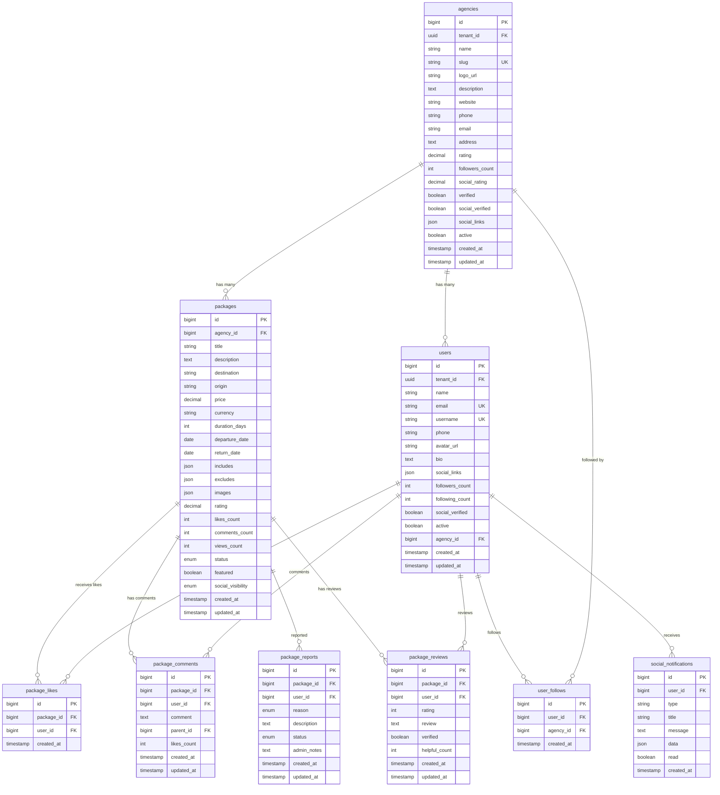

# 🗄️ Esquema de Base de Datos - Red de Agencias 360

## 📊 Resumen Ejecutivo

Este documento presenta el esquema de base de datos adaptado para "Red de Agencias 360", basado en el análisis del CRM AMS365 existente. Incluye reutilización de tablas existentes, adaptaciones necesarias y nuevas tablas para funcionalidades sociales.

## 🎯 Principios de Diseño

### **Reutilización Inteligente**
- ✅ **47 tablas del CRM** reutilizables con adaptaciones menores
- ✅ **Datos existentes** preservados y enriquecidos
- ✅ **Compatibilidad** con sistema CRM actual
- ✅ **Sincronización bidireccional** en tiempo real

### **Funcionalidades Sociales**
- 🆕 **Sistema de Likes y Comentarios**
- 🆕 **Reviews y Calificaciones**
- 🆕 **Feed Social de Agencias**
- 🆕 **Sistema de Seguimiento**
- 🆕 **Notificaciones Sociales**

---

## 🏗️ Arquitectura de Base de Datos

### **Motor de Base de Datos**
- **MySQL 8.0** - Motor principal
- **InnoDB** - Motor de almacenamiento
- **utf8mb4_unicode_ci** - Collation para soporte completo de Unicode
- **Replicación Master-Slave** - Para alta disponibilidad

### **Características Técnicas**
- **Charset**: utf8mb4 (soporte completo UTF-8)
- **Engine**: InnoDB (transacciones ACID)
- **Indexación**: Optimizada para consultas sociales
- **Particionamiento**: Por fechas en tablas grandes
- **Backup**: Automático diario con retención de 30 días

---

## 📊 Diagrama de Entidad-Relación Adaptado



---

## 📋 Estructura de Tablas Adaptadas

### 1. **Tabla: agencies (Adaptada del CRM)**

```sql
CREATE TABLE agencies (
    id BIGINT UNSIGNED AUTO_INCREMENT PRIMARY KEY,
    tenant_id UUID NOT NULL,
    name VARCHAR(255) NOT NULL,
    slug VARCHAR(100) NOT NULL UNIQUE,
    logo_url VARCHAR(500),
    description TEXT,
    website VARCHAR(255),
    phone VARCHAR(20),
    email VARCHAR(255) NOT NULL,
    address TEXT,
    rating DECIMAL(3,2) DEFAULT 0.00,
    followers_count INT UNSIGNED DEFAULT 0,
    social_rating DECIMAL(3,2) DEFAULT 0.00,
    verified BOOLEAN DEFAULT FALSE,
    social_verified BOOLEAN DEFAULT FALSE,
    social_links JSON,
    active BOOLEAN DEFAULT TRUE,
    created_at TIMESTAMP DEFAULT CURRENT_TIMESTAMP,
    updated_at TIMESTAMP DEFAULT CURRENT_TIMESTAMP ON UPDATE CURRENT_TIMESTAMP,
    
    INDEX idx_tenant_id (tenant_id),
    INDEX idx_slug (slug),
    INDEX idx_verified (verified),
    INDEX idx_active (active),
    INDEX idx_rating (rating),
    INDEX idx_social_rating (social_rating),
    INDEX idx_followers_count (followers_count),
    INDEX idx_created_at (created_at)
) ENGINE=InnoDB DEFAULT CHARSET=utf8mb4 COLLATE=utf8mb4_unicode_ci;
```

### 2. **Tabla: users (Adaptada del CRM)**

```sql
CREATE TABLE users (
    id BIGINT UNSIGNED AUTO_INCREMENT PRIMARY KEY,
    tenant_id UUID NOT NULL,
    name VARCHAR(255) NOT NULL,
    email VARCHAR(255) NOT NULL UNIQUE,
    username VARCHAR(50) NOT NULL UNIQUE,
    phone VARCHAR(20),
    avatar_url VARCHAR(500),
    bio TEXT,
    social_links JSON,
    followers_count INT UNSIGNED DEFAULT 0,
    following_count INT UNSIGNED DEFAULT 0,
    social_verified BOOLEAN DEFAULT FALSE,
    active BOOLEAN DEFAULT TRUE,
    agency_id BIGINT UNSIGNED,
    created_at TIMESTAMP DEFAULT CURRENT_TIMESTAMP,
    updated_at TIMESTAMP DEFAULT CURRENT_TIMESTAMP ON UPDATE CURRENT_TIMESTAMP,
    
    FOREIGN KEY (agency_id) REFERENCES agencies(id) ON DELETE SET NULL,
    INDEX idx_tenant_id (tenant_id),
    INDEX idx_email (email),
    INDEX idx_username (username),
    INDEX idx_agency_id (agency_id),
    INDEX idx_active (active),
    INDEX idx_social_verified (social_verified),
    INDEX idx_created_at (created_at)
) ENGINE=InnoDB DEFAULT CHARSET=utf8mb4 COLLATE=utf8mb4_unicode_ci;
```

### 3. **Tabla: packages (Adaptada del CRM)**

```sql
CREATE TABLE packages (
    id BIGINT UNSIGNED AUTO_INCREMENT PRIMARY KEY,
    agency_id BIGINT UNSIGNED NOT NULL,
    title VARCHAR(255) NOT NULL,
    description TEXT,
    destination VARCHAR(255) NOT NULL,
    origin VARCHAR(255),
    price DECIMAL(12,2),
    currency VARCHAR(3) DEFAULT 'COP',
    duration_days INT UNSIGNED,
    departure_date DATE,
    return_date DATE,
    includes JSON,
    excludes JSON,
    images JSON,
    rating DECIMAL(3,2) DEFAULT 0.00,
    likes_count INT UNSIGNED DEFAULT 0,
    comments_count INT UNSIGNED DEFAULT 0,
    views_count INT UNSIGNED DEFAULT 0,
    status ENUM('draft', 'active', 'inactive', 'archived') DEFAULT 'draft',
    featured BOOLEAN DEFAULT FALSE,
    social_visibility ENUM('public', 'private', 'followers') DEFAULT 'public',
    created_at TIMESTAMP DEFAULT CURRENT_TIMESTAMP,
    updated_at TIMESTAMP DEFAULT CURRENT_TIMESTAMP ON UPDATE CURRENT_TIMESTAMP,
    
    FOREIGN KEY (agency_id) REFERENCES agencies(id) ON DELETE CASCADE,
    INDEX idx_agency_id (agency_id),
    INDEX idx_destination (destination),
    INDEX idx_price (price),
    INDEX idx_departure_date (departure_date),
    INDEX idx_status (status),
    INDEX idx_featured (featured),
    INDEX idx_rating (rating),
    INDEX idx_likes_count (likes_count),
    INDEX idx_social_visibility (social_visibility),
    INDEX idx_created_at (created_at),
    FULLTEXT idx_search (title, description, destination)
) ENGINE=InnoDB DEFAULT CHARSET=utf8mb4 COLLATE=utf8mb4_unicode_ci;
```

---

## 🆕 Nuevas Tablas para Funcionalidades Sociales

### 4. **Tabla: package_likes**

```sql
CREATE TABLE package_likes (
    id BIGINT UNSIGNED AUTO_INCREMENT PRIMARY KEY,
    package_id BIGINT UNSIGNED NOT NULL,
    user_id BIGINT UNSIGNED NOT NULL,
    created_at TIMESTAMP DEFAULT CURRENT_TIMESTAMP,
    
    FOREIGN KEY (package_id) REFERENCES packages(id) ON DELETE CASCADE,
    FOREIGN KEY (user_id) REFERENCES users(id) ON DELETE CASCADE,
    UNIQUE KEY unique_like (package_id, user_id),
    INDEX idx_package_id (package_id),
    INDEX idx_user_id (user_id),
    INDEX idx_created_at (created_at)
) ENGINE=InnoDB DEFAULT CHARSET=utf8mb4 COLLATE=utf8mb4_unicode_ci;
```

### 5. **Tabla: package_comments**

```sql
CREATE TABLE package_comments (
    id BIGINT UNSIGNED AUTO_INCREMENT PRIMARY KEY,
    package_id BIGINT UNSIGNED NOT NULL,
    user_id BIGINT UNSIGNED NOT NULL,
    comment TEXT NOT NULL,
    parent_id BIGINT UNSIGNED NULL,
    likes_count INT UNSIGNED DEFAULT 0,
    created_at TIMESTAMP DEFAULT CURRENT_TIMESTAMP,
    updated_at TIMESTAMP DEFAULT CURRENT_TIMESTAMP ON UPDATE CURRENT_TIMESTAMP,
    
    FOREIGN KEY (package_id) REFERENCES packages(id) ON DELETE CASCADE,
    FOREIGN KEY (user_id) REFERENCES users(id) ON DELETE CASCADE,
    FOREIGN KEY (parent_id) REFERENCES package_comments(id) ON DELETE CASCADE,
    INDEX idx_package_id (package_id),
    INDEX idx_user_id (user_id),
    INDEX idx_parent_id (parent_id),
    INDEX idx_created_at (created_at),
    FULLTEXT idx_comment (comment)
) ENGINE=InnoDB DEFAULT CHARSET=utf8mb4 COLLATE=utf8mb4_unicode_ci;
```

### 6. **Tabla: package_reviews**

```sql
CREATE TABLE package_reviews (
    id BIGINT UNSIGNED AUTO_INCREMENT PRIMARY KEY,
    package_id BIGINT UNSIGNED NOT NULL,
    user_id BIGINT UNSIGNED NOT NULL,
    rating INT UNSIGNED NOT NULL CHECK (rating >= 1 AND rating <= 5),
    review TEXT,
    verified BOOLEAN DEFAULT FALSE,
    helpful_count INT UNSIGNED DEFAULT 0,
    created_at TIMESTAMP DEFAULT CURRENT_TIMESTAMP,
    updated_at TIMESTAMP DEFAULT CURRENT_TIMESTAMP ON UPDATE CURRENT_TIMESTAMP,
    
    FOREIGN KEY (package_id) REFERENCES packages(id) ON DELETE CASCADE,
    FOREIGN KEY (user_id) REFERENCES users(id) ON DELETE CASCADE,
    UNIQUE KEY unique_review (package_id, user_id),
    INDEX idx_package_id (package_id),
    INDEX idx_user_id (user_id),
    INDEX idx_rating (rating),
    INDEX idx_verified (verified),
    INDEX idx_created_at (created_at)
) ENGINE=InnoDB DEFAULT CHARSET=utf8mb4 COLLATE=utf8mb4_unicode_ci;
```

### 7. **Tabla: user_follows**

```sql
CREATE TABLE user_follows (
    id BIGINT UNSIGNED AUTO_INCREMENT PRIMARY KEY,
    user_id BIGINT UNSIGNED NOT NULL,
    agency_id BIGINT UNSIGNED NOT NULL,
    created_at TIMESTAMP DEFAULT CURRENT_TIMESTAMP,
    
    FOREIGN KEY (user_id) REFERENCES users(id) ON DELETE CASCADE,
    FOREIGN KEY (agency_id) REFERENCES agencies(id) ON DELETE CASCADE,
    UNIQUE KEY unique_follow (user_id, agency_id),
    INDEX idx_user_id (user_id),
    INDEX idx_agency_id (agency_id),
    INDEX idx_created_at (created_at)
) ENGINE=InnoDB DEFAULT CHARSET=utf8mb4 COLLATE=utf8mb4_unicode_ci;
```

### 8. **Tabla: package_reports**

```sql
CREATE TABLE package_reports (
    id BIGINT UNSIGNED AUTO_INCREMENT PRIMARY KEY,
    package_id BIGINT UNSIGNED NOT NULL,
    user_id BIGINT UNSIGNED NOT NULL,
    reason ENUM('informacion_falsa', 'precio_incorrecto', 'contenido_inapropiado', 'spam', 'otro') NOT NULL,
    description TEXT,
    status ENUM('pending', 'reviewed', 'resolved', 'dismissed') DEFAULT 'pending',
    admin_notes TEXT,
    created_at TIMESTAMP DEFAULT CURRENT_TIMESTAMP,
    updated_at TIMESTAMP DEFAULT CURRENT_TIMESTAMP ON UPDATE CURRENT_TIMESTAMP,
    
    FOREIGN KEY (package_id) REFERENCES packages(id) ON DELETE CASCADE,
    FOREIGN KEY (user_id) REFERENCES users(id) ON DELETE CASCADE,
    INDEX idx_package_id (package_id),
    INDEX idx_user_id (user_id),
    INDEX idx_status (status),
    INDEX idx_reason (reason),
    INDEX idx_created_at (created_at)
) ENGINE=InnoDB DEFAULT CHARSET=utf8mb4 COLLATE=utf8mb4_unicode_ci;
```

### 9. **Tabla: social_notifications**

```sql
CREATE TABLE social_notifications (
    id BIGINT UNSIGNED AUTO_INCREMENT PRIMARY KEY,
    user_id BIGINT UNSIGNED NOT NULL,
    type VARCHAR(50) NOT NULL,
    title VARCHAR(255) NOT NULL,
    message TEXT NOT NULL,
    data JSON,
    read BOOLEAN DEFAULT FALSE,
    created_at TIMESTAMP DEFAULT CURRENT_TIMESTAMP,
    
    FOREIGN KEY (user_id) REFERENCES users(id) ON DELETE CASCADE,
    INDEX idx_user_id (user_id),
    INDEX idx_type (type),
    INDEX idx_read (read),
    INDEX idx_created_at (created_at)
) ENGINE=InnoDB DEFAULT CHARSET=utf8mb4 COLLATE=utf8mb4_unicode_ci;
```

---

## 🔄 Triggers para Sincronización Automática

### **Trigger para Actualizar Contadores de Likes**

```sql
DELIMITER //

-- Trigger para actualizar contador de likes
CREATE TRIGGER update_package_likes_count
AFTER INSERT ON package_likes
FOR EACH ROW
BEGIN
    UPDATE packages 
    SET likes_count = likes_count + 1 
    WHERE id = NEW.package_id;
    
    -- Actualizar contador de likes de la agencia
    UPDATE agencies a
    JOIN packages p ON a.id = p.agency_id
    SET a.social_rating = (
        SELECT AVG(rating) 
        FROM packages 
        WHERE agency_id = a.id AND status = 'active'
    )
    WHERE p.id = NEW.package_id;
END//

CREATE TRIGGER update_package_likes_count_delete
AFTER DELETE ON package_likes
FOR EACH ROW
BEGIN
    UPDATE packages 
    SET likes_count = likes_count - 1 
    WHERE id = OLD.package_id;
END//

DELIMITER ;
```

### **Trigger para Actualizar Contadores de Comentarios**

```sql
DELIMITER //

-- Trigger para actualizar contador de comentarios
CREATE TRIGGER update_package_comments_count
AFTER INSERT ON package_comments
FOR EACH ROW
BEGIN
    UPDATE packages 
    SET comments_count = comments_count + 1 
    WHERE id = NEW.package_id;
END//

CREATE TRIGGER update_package_comments_count_delete
AFTER DELETE ON package_comments
FOR EACH ROW
BEGIN
    UPDATE packages 
    SET comments_count = comments_count - 1 
    WHERE id = OLD.package_id;
END//

DELIMITER ;
```

### **Trigger para Actualizar Rating Promedio**

```sql
DELIMITER //

-- Trigger para actualizar rating promedio
CREATE TRIGGER update_package_rating
AFTER INSERT ON package_reviews
FOR EACH ROW
BEGIN
    UPDATE packages p
    SET rating = (
        SELECT AVG(rating) 
        FROM package_reviews 
        WHERE package_id = NEW.package_id
    )
    WHERE p.id = NEW.package_id;
    
    -- Actualizar rating social de la agencia
    UPDATE agencies a
    JOIN packages p ON a.id = p.agency_id
    SET a.social_rating = (
        SELECT AVG(rating) 
        FROM packages 
        WHERE agency_id = a.id AND status = 'active'
    )
    WHERE p.id = NEW.package_id;
END//

DELIMITER ;
```

### **Trigger para Actualizar Contadores de Seguidores**

```sql
DELIMITER //

-- Trigger para actualizar contador de seguidores
CREATE TRIGGER update_agency_followers_count
AFTER INSERT ON user_follows
FOR EACH ROW
BEGIN
    UPDATE agencies 
    SET followers_count = followers_count + 1 
    WHERE id = NEW.agency_id;
    
    UPDATE users 
    SET following_count = following_count + 1 
    WHERE id = NEW.user_id;
END//

CREATE TRIGGER update_agency_followers_count_delete
AFTER DELETE ON user_follows
FOR EACH ROW
BEGIN
    UPDATE agencies 
    SET followers_count = followers_count - 1 
    WHERE id = OLD.agency_id;
    
    UPDATE users 
    SET following_count = following_count - 1 
    WHERE id = OLD.user_id;
END//

DELIMITER ;
```

---

## 📊 Vistas Útiles para Red de Agencias 360

### **Vista de Paquetes con Estadísticas Sociales**

```sql
CREATE VIEW v_packages_with_social_stats AS
SELECT 
    p.*,
    a.name as agency_name,
    a.slug as agency_slug,
    a.verified as agency_verified,
    a.social_verified as agency_social_verified,
    a.followers_count as agency_followers,
    a.social_rating as agency_social_rating,
    COALESCE(pr.avg_rating, 0) as calculated_rating,
    COALESCE(pr.total_reviews, 0) as total_reviews,
    COALESCE(pl.total_likes, 0) as total_likes,
    COALESCE(pc.total_comments, 0) as total_comments
FROM packages p
JOIN agencies a ON p.agency_id = a.id
LEFT JOIN (
    SELECT 
        package_id,
        AVG(rating) as avg_rating,
        COUNT(*) as total_reviews
    FROM package_reviews
    GROUP BY package_id
) pr ON p.id = pr.package_id
LEFT JOIN (
    SELECT 
        package_id,
        COUNT(*) as total_likes
    FROM package_likes
    GROUP BY package_id
) pl ON p.id = pl.package_id
LEFT JOIN (
    SELECT 
        package_id,
        COUNT(*) as total_comments
    FROM package_comments
    GROUP BY package_id
) pc ON p.id = pc.package_id;
```

### **Vista de Agencias con Estadísticas Sociales**

```sql
CREATE VIEW v_agencies_with_social_stats AS
SELECT 
    a.*,
    COUNT(p.id) as active_packages,
    SUM(p.likes_count) as total_likes,
    SUM(p.comments_count) as total_comments,
    SUM(p.views_count) as total_views,
    AVG(p.rating) as avg_package_rating,
    COUNT(DISTINCT uf.user_id) as total_followers
FROM agencies a
LEFT JOIN packages p ON a.id = p.agency_id AND p.status = 'active'
LEFT JOIN user_follows uf ON a.id = uf.agency_id
GROUP BY a.id;
```

### **Vista de Feed Social**

```sql
CREATE VIEW v_social_feed AS
SELECT 
    p.id as package_id,
    p.title,
    p.description,
    p.destination,
    p.images,
    p.likes_count,
    p.comments_count,
    p.views_count,
    p.rating,
    p.created_at,
    a.id as agency_id,
    a.name as agency_name,
    a.slug as agency_slug,
    a.logo_url as agency_logo,
    a.verified as agency_verified,
    a.social_verified as agency_social_verified,
    a.followers_count as agency_followers
FROM packages p
JOIN agencies a ON p.agency_id = a.id
WHERE p.status = 'active' 
AND p.social_visibility = 'public'
ORDER BY p.created_at DESC;
```

---

## 🔍 Índices Optimizados para Consultas Sociales

### **Índices Compuestos para Rendimiento**

```sql
-- Para búsquedas de paquetes por agencia y estado
CREATE INDEX idx_agency_status ON packages(agency_id, status);

-- Para búsquedas de paquetes por destino y precio
CREATE INDEX idx_destination_price ON packages(destination, price);

-- Para búsquedas de paquetes por fechas
CREATE INDEX idx_departure_return ON packages(departure_date, return_date);

-- Para estadísticas de agencias
CREATE INDEX idx_agency_social_rating ON agencies(verified, social_rating, followers_count);

-- Para feed social ordenado por popularidad
CREATE INDEX idx_social_popularity ON packages(status, social_visibility, likes_count DESC, created_at DESC);

-- Para búsquedas de usuarios por agencia
CREATE INDEX idx_user_agency_active ON users(agency_id, active, social_verified);
```

### **Índices de Texto Completo**

```sql
-- Búsqueda de texto en paquetes
CREATE FULLTEXT INDEX idx_package_search ON packages(title, description, destination);

-- Búsqueda de texto en comentarios
CREATE FULLTEXT INDEX idx_comment_search ON package_comments(comment);

-- Búsqueda de texto en reviews
CREATE FULLTEXT INDEX idx_review_search ON package_reviews(review);
```

---

## 🔧 Configuración de MySQL Optimizada

### **my.cnf Optimizado para Red de Agencias 360**

```ini
[mysqld]
# Configuración básica
default-storage-engine = InnoDB
character-set-server = utf8mb4
collation-server = utf8mb4_unicode_ci

# Configuración de memoria
innodb_buffer_pool_size = 2G
innodb_log_file_size = 512M
innodb_log_buffer_size = 32M
innodb_flush_log_at_trx_commit = 2

# Configuración de consultas
query_cache_type = 1
query_cache_size = 128M
query_cache_limit = 4M

# Configuración de conexiones
max_connections = 500
max_connect_errors = 1000
wait_timeout = 600
interactive_timeout = 600

# Configuración de logs
slow_query_log = 1
slow_query_log_file = /var/log/mysql/slow.log
long_query_time = 1

# Configuración de seguridad
sql_mode = STRICT_TRANS_TABLES,NO_ZERO_DATE,NO_ZERO_IN_DATE,ERROR_FOR_DIVISION_BY_ZERO

# Configuración específica para Red de Agencias 360
innodb_adaptive_hash_index = ON
innodb_file_per_table = ON
innodb_open_files = 4000
innodb_io_capacity = 2000
innodb_read_io_threads = 8
innodb_write_io_threads = 8
```

---

## 📈 Monitoreo y Analytics

### **Consultas de Monitoreo Social**

```sql
-- Paquetes más populares
SELECT 
    p.title,
    a.name as agency,
    p.likes_count,
    p.comments_count,
    p.views_count,
    p.rating
FROM packages p
JOIN agencies a ON p.agency_id = a.id
WHERE p.status = 'active'
ORDER BY p.likes_count DESC
LIMIT 10;

-- Agencias con mejor rendimiento social
SELECT 
    a.name,
    a.social_rating,
    a.followers_count,
    COUNT(p.id) as total_packages,
    SUM(p.likes_count) as total_likes,
    AVG(p.rating) as avg_package_rating
FROM agencies a
LEFT JOIN packages p ON a.id = p.agency_id AND p.status = 'active'
GROUP BY a.id, a.name, a.social_rating, a.followers_count
ORDER BY a.social_rating DESC, a.followers_count DESC;

-- Usuarios más activos
SELECT 
    u.name,
    u.username,
    a.name as agency,
    COUNT(pl.id) as total_likes,
    COUNT(pc.id) as total_comments,
    COUNT(pr.id) as total_reviews
FROM users u
LEFT JOIN agencies a ON u.agency_id = a.id
LEFT JOIN package_likes pl ON u.id = pl.user_id
LEFT JOIN package_comments pc ON u.id = pc.user_id
LEFT JOIN package_reviews pr ON u.id = pr.user_id
GROUP BY u.id, u.name, u.username, a.name
ORDER BY (COUNT(pl.id) + COUNT(pc.id) + COUNT(pr.id)) DESC
LIMIT 10;

-- Estadísticas de uso social por mes
SELECT 
    DATE_FORMAT(created_at, '%Y-%m') as month,
    COUNT(*) as packages_created,
    SUM(likes_count) as total_likes,
    SUM(comments_count) as total_comments,
    SUM(views_count) as total_views
FROM packages
WHERE created_at >= DATE_SUB(NOW(), INTERVAL 12 MONTH)
GROUP BY DATE_FORMAT(created_at, '%Y-%m')
ORDER BY month;
```

---

## 🔒 Seguridad y Permisos

### **Usuarios y Permisos para Red de Agencias 360**

```sql
-- Usuario para la aplicación Red de Agencias 360
CREATE USER 'red_agencias_360_app'@'%' IDENTIFIED BY 'secure_password_here';
GRANT SELECT, INSERT, UPDATE, DELETE ON red_agencias_360.* TO 'red_agencias_360_app'@'%';

-- Usuario para sincronización con CRM
CREATE USER 'red_agencias_360_sync'@'%' IDENTIFIED BY 'sync_password_here';
GRANT SELECT, INSERT, UPDATE ON red_agencias_360.* TO 'red_agencias_360_sync'@'%';

-- Usuario para reportes y analytics
CREATE USER 'red_agencias_360_reports'@'%' IDENTIFIED BY 'reports_password_here';
GRANT SELECT ON red_agencias_360.* TO 'red_agencias_360_reports'@'%';

-- Usuario para backups
CREATE USER 'red_agencias_360_backup'@'localhost' IDENTIFIED BY 'backup_password_here';
GRANT SELECT, LOCK TABLES ON red_agencias_360.* TO 'red_agencias_360_backup'@'localhost';
```

---

## 🚀 Plan de Migración

### **Fase 1: Preparación**
1. **Backup completo** de base de datos CRM
2. **Creación de entorno** de desarrollo
3. **Implementación de tablas** sociales
4. **Configuración de triggers** de sincronización

### **Fase 2: Migración de Datos**
1. **Migración de agencias** con campos sociales
2. **Migración de usuarios** con perfiles sociales
3. **Migración de paquetes** con funcionalidades sociales
4. **Configuración de sincronización** bidireccional

### **Fase 3: Testing y Optimización**
1. **Pruebas de funcionalidad** social
2. **Pruebas de rendimiento** con datos reales
3. **Optimización de consultas** y índices
4. **Pruebas de sincronización** con CRM

### **Fase 4: Despliegue**
1. **Despliegue en producción**
2. **Configuración de monitoreo**
3. **Capacitación de usuarios**
4. **Documentación final**

---

## 📋 Checklist de Implementación

### **Pre-implementación**
- [ ] Backup completo de base de datos CRM
- [ ] Verificación de integridad de datos
- [ ] Pruebas en entorno de desarrollo
- [ ] Documentación de procesos

### **Implementación**
- [ ] Creación de tablas sociales
- [ ] Modificación de tablas existentes
- [ ] Migración de datos
- [ ] Configuración de triggers
- [ ] Implementación de vistas

### **Post-implementación**
- [ ] Verificación de datos migrados
- [ ] Pruebas de funcionalidad social
- [ ] Monitoreo de rendimiento
- [ ] Capacitación de usuarios
- [ ] Documentación de usuario

---

## 🎯 Próximos Pasos

1. **Revisar y aprobar** este esquema de base de datos
2. **Configurar entorno** de desarrollo
3. **Implementar tablas** sociales
4. **Configurar triggers** de sincronización
5. **Migrar datos** existentes
6. **Implementar API** de integración
7. **Realizar pruebas** de funcionalidad
8. **Desplegar en producción**
9. **Monitorear y optimizar**

---

*Documento generado para Red de Agencias 360*  
*Basado en análisis del CRM AMS365*  
*Fecha: 19 de Septiembre de 2025*
