# 🔄 Estrategia de Integración - Red de Agencias 360

## 📊 Resumen Ejecutivo

Este documento define la estrategia completa de integración entre el CRM AMS365 existente y la nueva plataforma social "Red de Agencias 360", incluyendo arquitectura, flujos de datos, APIs, sincronización y monitoreo.

## 🎯 Objetivos de la Integración

### **Objetivos Principales**
- ✅ **Sincronización bidireccional** en tiempo real
- ✅ **Preservación de datos** existentes del CRM
- ✅ **Funcionalidades sociales** nativas
- ✅ **Escalabilidad** y rendimiento óptimo
- ✅ **Seguridad** y privacidad de datos

### **Beneficios Esperados**
- 🚀 **Reutilización** de 90% de datos existentes
- 🚀 **Tiempo de desarrollo** reducido en 60%
- 🚀 **Costo de implementación** reducido en 40%
- 🚀 **Experiencia de usuario** mejorada
- 🚀 **Métricas sociales** en tiempo real

---

## 🏗️ Arquitectura de Integración

### **Diagrama de Arquitectura General**

```mermaid
graph TB
    subgraph "CRM AMS365"
        CRM_DB[(Base de Datos CRM)]
        CRM_API[API CRM Laravel]
        CRM_WEB[Panel Web CRM]
        CRM_QUEUE[Cola de Trabajos]
    end
    
    subgraph "Red de Agencias 360"
        RED_DB[(Base de Datos Red 360)]
        RED_API[API Red 360]
        RED_WEB[Plataforma Web]
        RED_MOBILE[App Móvil]
        RED_QUEUE[Cola de Trabajos]
    end
    
    subgraph "Servicios de Integración"
        SYNC_SERVICE[Servicio de Sincronización]
        WEBHOOK_SERVICE[Servicio de Webhooks]
        QUEUE_SERVICE[Cola de Procesamiento]
        CACHE_SERVICE[Servicio de Cache]
        MONITOR_SERVICE[Servicio de Monitoreo]
    end
    
    subgraph "Infraestructura"
        REDIS[(Redis Cache)]
        RABBITMQ[(RabbitMQ Queue)]
        ELASTICSEARCH[(Elasticsearch)]
        NGINX[Nginx Load Balancer]
    end
    
    CRM_DB -->|Triggers| SYNC_SERVICE
    CRM_API -->|Webhooks| WEBHOOK_SERVICE
    SYNC_SERVICE -->|Sincronización| RED_DB
    WEBHOOK_SERVICE -->|Notificaciones| RED_API
    QUEUE_SERVICE -->|Procesamiento| RED_DB
    
    RED_WEB --> RED_API
    RED_MOBILE --> RED_API
    RED_API --> RED_DB
    RED_API --> REDIS
    RED_QUEUE --> RABBITMQ
    
    SYNC_SERVICE --> RABBITMQ
    WEBHOOK_SERVICE --> RABBITMQ
    QUEUE_SERVICE --> RABBITMQ
    CACHE_SERVICE --> REDIS
    MONITOR_SERVICE --> ELASTICSEARCH
```



### **Flujo de Datos Principal**

```mermaid
sequenceDiagram
    participant CRM as CRM AMS365
    participant SYNC as Servicio Sync
    participant QUEUE as Cola de Trabajos
    participant RED as Red de Agencias 360
    participant USER as Usuario Final
    
    CRM->>SYNC: Cambio en agencia/paquete
    SYNC->>QUEUE: Encolar tarea de sincronización
    QUEUE->>RED: Procesar sincronización
    RED->>RED: Actualizar base de datos
    RED->>USER: Mostrar cambios en tiempo real
    
    USER->>RED: Like/Comentario
    RED->>RED: Procesar interacción social
    RED->>QUEUE: Encolar métricas sociales
    QUEUE->>CRM: Actualizar estadísticas CRM
    CRM->>CRM: Actualizar métricas
```



---

## 🔧 Componentes de Integración

### **1. Servicio de Sincronización**

#### **Arquitectura del Servicio**
```php
<?php

namespace App\Services\Integration;

class SyncService
{
    private $crmApiClient;
    private $red360ApiClient;
    private $queueService;
    private $cacheService;
    
    public function __construct(
        CRMApiClient $crmApiClient,
        Red360ApiClient $red360ApiClient,
        QueueService $queueService,
        CacheService $cacheService
    ) {
        $this->crmApiClient = $crmApiClient;
        $this->red360ApiClient = $red360ApiClient;
        $this->queueService = $queueService;
        $this->cacheService = $cacheService;
    }
    
    public function syncAgency($agencyId)
    {
        try {
            // Obtener datos del CRM
            $crmAgency = $this->crmApiClient->getAgency($agencyId);
            
            // Transformar datos para Red 360
            $red360Data = $this->transformAgencyData($crmAgency);
            
            // Sincronizar con Red 360
            $result = $this->red360ApiClient->syncAgency($red360Data);
            
            // Actualizar cache
            $this->cacheService->updateAgencyCache($agencyId, $result);
            
            // Log de sincronización
            $this->logSync('agency', $agencyId, 'success');
            
            return $result;
            
        } catch (Exception $e) {
            // Encolar para reintento
            $this->queueService->enqueueRetry('sync_agency', $agencyId);
            
            // Log de error
            $this->logSync('agency', $agencyId, 'error', $e->getMessage());
            
            throw $e;
        }
    }
    
    public function syncPackage($packageId)
    {
        try {
            // Obtener datos del CRM
            $crmPackage = $this->crmApiClient->getPackage($packageId);
            
            // Transformar datos para Red 360
            $red360Data = $this->transformPackageData($crmPackage);
            
            // Sincronizar con Red 360
            $result = $this->red360ApiClient->syncPackage($red360Data);
            
            // Actualizar cache
            $this->cacheService->updatePackageCache($packageId, $result);
            
            // Log de sincronización
            $this->logSync('package', $packageId, 'success');
            
            return $result;
            
        } catch (Exception $e) {
            // Encolar para reintento
            $this->queueService->enqueueRetry('sync_package', $packageId);
            
            // Log de error
            $this->logSync('package', $packageId, 'error', $e->getMessage());
            
            throw $e;
        }
    }
    
    private function transformAgencyData($crmAgency)
    {
        return [
            'id' => $crmAgency['id'],
            'name' => $crmAgency['name'],
            'slug' => $crmAgency['slug'],
            'logo_url' => $crmAgency['logo'],
            'description' => $crmAgency['description'] ?? '',
            'website' => $crmAgency['website'] ?? '',
            'phone' => $crmAgency['phone'] ?? '',
            'email' => $crmAgency['email'],
            'address' => $crmAgency['address'] ?? '',
            'verified' => $crmAgency['status'] === 'activo',
            'active' => $crmAgency['status'] === 'activo',
            'social_links' => $crmAgency['social_links'] ?? [],
            'followers_count' => $crmAgency['followers_count'] ?? 0,
            'social_rating' => $crmAgency['social_rating'] ?? 0.00,
            'social_verified' => $crmAgency['social_verified'] ?? false
        ];
    }
    
    private function transformPackageData($crmPackage)
    {
        return [
            'id' => $crmPackage['id'],
            'agency_id' => $crmPackage['agency_id'],
            'title' => $crmPackage['title'],
            'description' => $crmPackage['details'] ?? '',
            'destination' => $crmPackage['destination'],
            'origin' => $crmPackage['origin'],
            'includes' => $this->parseIncludes($crmPackage['include']),
            'excludes' => $this->parseExcludes($crmPackage['no_include']),
            'images' => $this->parseImages($crmPackage['main_image'], $crmPackage['gallery_images']),
            'status' => $crmPackage['status'] === 'active' ? 'active' : 'inactive',
            'featured' => $crmPackage['featured'] ?? false,
            'social_visibility' => $crmPackage['social_visibility'] ?? 'public',
            'likes_count' => $crmPackage['likes_count'] ?? 0,
            'comments_count' => $crmPackage['comments_count'] ?? 0,
            'views_count' => $crmPackage['views_count'] ?? 0,
            'rating' => $crmPackage['rating'] ?? 0.00
        ];
    }
}
```

### **2. Servicio de Webhooks**

#### **Implementación de Webhooks**
```php
<?php

namespace App\Services\Integration;

class WebhookService
{
    private $queueService;
    private $notificationService;
    
    public function __construct(
        QueueService $queueService,
        NotificationService $notificationService
    ) {
        $this->queueService = $queueService;
        $this->notificationService = $notificationService;
    }
    
    public function handleAgencyUpdated($data)
    {
        try {
            // Validar datos del webhook
            $this->validateWebhookData($data, 'agency');
            
            // Encolar tarea de sincronización
            $this->queueService->enqueue('sync_agency', $data['id']);
            
            // Notificar a usuarios relevantes
            $this->notificationService->notifyAgencyUpdate($data);
            
            return ['status' => 'success', 'message' => 'Webhook processed'];
            
        } catch (Exception $e) {
            // Log de error
            $this->logWebhookError('agency_updated', $data, $e->getMessage());
            
            return ['status' => 'error', 'message' => $e->getMessage()];
        }
    }
    
    public function handlePackageUpdated($data)
    {
        try {
            // Validar datos del webhook
            $this->validateWebhookData($data, 'package');
            
            // Encolar tarea de sincronización
            $this->queueService->enqueue('sync_package', $data['id']);
            
            // Notificar a seguidores de la agencia
            $this->notificationService->notifyPackageUpdate($data);
            
            return ['status' => 'success', 'message' => 'Webhook processed'];
            
        } catch (Exception $e) {
            // Log de error
            $this->logWebhookError('package_updated', $data, $e->getMessage());
            
            return ['status' => 'error', 'message' => $e->getMessage()];
        }
    }
    
    private function validateWebhookData($data, $type)
    {
        $requiredFields = $this->getRequiredFields($type);
        
        foreach ($requiredFields as $field) {
            if (!isset($data[$field])) {
                throw new ValidationException("Missing required field: {$field}");
            }
        }
    }
    
    private function getRequiredFields($type)
    {
        return match($type) {
            'agency' => ['id', 'name', 'slug', 'status'],
            'package' => ['id', 'agency_id', 'title', 'status'],
            default => []
        };
    }
}
```

### **3. Servicio de Cola de Trabajos**

#### **Implementación con RabbitMQ**
```php
<?php

namespace App\Services\Integration;

use PhpAmqpLib\Connection\AMQPStreamConnection;
use PhpAmqpLib\Message\AMQPMessage;

class QueueService
{
    private $connection;
    private $channel;
    
    public function __construct()
    {
        $this->connection = new AMQPStreamConnection(
            config('queue.rabbitmq.host'),
            config('queue.rabbitmq.port'),
            config('queue.rabbitmq.user'),
            config('queue.rabbitmq.password')
        );
        $this->channel = $this->connection->channel();
    }
    
    public function enqueue($queue, $data)
    {
        $this->channel->queue_declare($queue, false, true, false, false);
        
        $message = new AMQPMessage(
            json_encode($data),
            ['delivery_mode' => AMQPMessage::DELIVERY_MODE_PERSISTENT]
        );
        
        $this->channel->basic_publish($message, '', $queue);
    }
    
    public function enqueueRetry($queue, $data, $retryCount = 0)
    {
        $retryData = array_merge($data, ['retry_count' => $retryCount]);
        
        if ($retryCount < 3) {
            // Encolar con delay exponencial
            $delay = pow(2, $retryCount) * 60; // 1, 2, 4 minutos
            $this->enqueueWithDelay($queue, $retryData, $delay);
        } else {
            // Enviar a cola de fallos
            $this->enqueue('failed_jobs', $retryData);
        }
    }
    
    public function consume($queue, $callback)
    {
        $this->channel->queue_declare($queue, false, true, false, false);
        
        $this->channel->basic_qos(null, 1, null);
        $this->channel->basic_consume($queue, '', false, false, false, false, $callback);
        
        while ($this->channel->is_consuming()) {
            $this->channel->wait();
        }
    }
}
```

---

## 🌐 APIs de Integración

### **1. API de Sincronización CRM → Red 360**

#### **Endpoints de Sincronización**
```php
<?php

namespace App\Http\Controllers\Api\Integration;

class SyncController extends Controller
{
    private $syncService;
    
    public function __construct(SyncService $syncService)
    {
        $this->syncService = $syncService;
    }
    
    /**
     * Sincronizar agencia
     */
    public function syncAgency(Request $request)
    {
        $request->validate([
            'agency_id' => 'required|integer|exists:agencies,id'
        ]);
        
        try {
            $result = $this->syncService->syncAgency($request->agency_id);
            
            return response()->json([
                'status' => 'success',
                'data' => $result
            ]);
            
        } catch (Exception $e) {
            return response()->json([
                'status' => 'error',
                'message' => $e->getMessage()
            ], 500);
        }
    }
    
    /**
     * Sincronizar paquete
     */
    public function syncPackage(Request $request)
    {
        $request->validate([
            'package_id' => 'required|integer|exists:packages,id'
        ]);
        
        try {
            $result = $this->syncService->syncPackage($request->package_id);
            
            return response()->json([
                'status' => 'success',
                'data' => $result
            ]);
            
        } catch (Exception $e) {
            return response()->json([
                'status' => 'error',
                'message' => $e->getMessage()
            ], 500);
        }
    }
    
    /**
     * Sincronización masiva
     */
    public function bulkSync(Request $request)
    {
        $request->validate([
            'type' => 'required|in:agencies,packages,users',
            'ids' => 'required|array',
            'ids.*' => 'integer'
        ]);
        
        try {
            $results = [];
            
            foreach ($request->ids as $id) {
                $results[] = $this->syncService->sync($request->type, $id);
            }
            
            return response()->json([
                'status' => 'success',
                'data' => $results
            ]);
            
        } catch (Exception $e) {
            return response()->json([
                'status' => 'error',
                'message' => $e->getMessage()
            ], 500);
        }
    }
}
```

### **2. API de Webhooks Red 360 → CRM**

#### **Endpoints de Webhooks**
```php
<?php

namespace App\Http\Controllers\Api\Webhooks;

class WebhookController extends Controller
{
    private $webhookService;
    
    public function __construct(WebhookService $webhookService)
    {
        $this->webhookService = $webhookService;
    }
    
    /**
     * Webhook para actualización de agencia
     */
    public function agencyUpdated(Request $request)
    {
        // Verificar firma del webhook
        if (!$this->verifyWebhookSignature($request)) {
            return response()->json(['error' => 'Invalid signature'], 401);
        }
        
        $result = $this->webhookService->handleAgencyUpdated($request->all());
        
        return response()->json($result);
    }
    
    /**
     * Webhook para actualización de paquete
     */
    public function packageUpdated(Request $request)
    {
        // Verificar firma del webhook
        if (!$this->verifyWebhookSignature($request)) {
            return response()->json(['error' => 'Invalid signature'], 401);
        }
        
        $result = $this->webhookService->handlePackageUpdated($request->all());
        
        return response()->json($result);
    }
    
    /**
     * Webhook para métricas sociales
     */
    public function socialMetrics(Request $request)
    {
        // Verificar firma del webhook
        if (!$this->verifyWebhookSignature($request)) {
            return response()->json(['error' => 'Invalid signature'], 401);
        }
        
        $result = $this->webhookService->handleSocialMetrics($request->all());
        
        return response()->json($result);
    }
    
    private function verifyWebhookSignature(Request $request)
    {
        $signature = $request->header('X-Webhook-Signature');
        $payload = $request->getContent();
        $expectedSignature = hash_hmac('sha256', $payload, config('webhooks.secret'));
        
        return hash_equals($expectedSignature, $signature);
    }
}
```

---

## 🔄 Sincronización en Tiempo Real

### **1. Triggers de Base de Datos**

#### **Trigger para Agencias**
```sql
DELIMITER //

CREATE TRIGGER trigger_agency_sync
AFTER UPDATE ON agencies
FOR EACH ROW
BEGIN
    -- Solo sincronizar si hay cambios relevantes
    IF (OLD.name != NEW.name OR 
        OLD.logo != NEW.logo OR 
        OLD.status != NEW.status OR 
        OLD.description != NEW.description) THEN
        
        -- Insertar en cola de sincronización
        INSERT INTO sync_queue (entity_type, entity_id, action, data, created_at)
        VALUES ('agency', NEW.id, 'update', JSON_OBJECT(
            'id', NEW.id,
            'name', NEW.name,
            'slug', NEW.slug,
            'logo', NEW.logo,
            'status', NEW.status,
            'description', NEW.description
        ), NOW());
    END IF;
END//

DELIMITER ;
```

#### **Trigger para Paquetes**
```sql
DELIMITER //

CREATE TRIGGER trigger_package_sync
AFTER INSERT ON packages
FOR EACH ROW
BEGIN
    -- Insertar en cola de sincronización
    INSERT INTO sync_queue (entity_type, entity_id, action, data, created_at)
    VALUES ('package', NEW.id, 'create', JSON_OBJECT(
        'id', NEW.id,
        'agency_id', NEW.agency_id,
        'title', NEW.title,
        'destination', NEW.destination,
        'status', NEW.status
    ), NOW());
END//

CREATE TRIGGER trigger_package_sync_update
AFTER UPDATE ON packages
FOR EACH ROW
BEGIN
    -- Solo sincronizar si hay cambios relevantes
    IF (OLD.title != NEW.title OR 
        OLD.destination != NEW.destination OR 
        OLD.status != NEW.status) THEN
        
        -- Insertar en cola de sincronización
        INSERT INTO sync_queue (entity_type, entity_id, action, data, created_at)
        VALUES ('package', NEW.id, 'update', JSON_OBJECT(
            'id', NEW.id,
            'agency_id', NEW.agency_id,
            'title', NEW.title,
            'destination', NEW.destination,
            'status', NEW.status
        ), NOW());
    END IF;
END//

DELIMITER ;
```

### **2. Procesador de Cola de Sincronización**

```php
<?php

namespace App\Console\Commands;

use Illuminate\Console\Command;
use App\Services\Integration\SyncService;

class ProcessSyncQueue extends Command
{
    protected $signature = 'sync:process-queue';
    protected $description = 'Process synchronization queue';
    
    private $syncService;
    
    public function __construct(SyncService $syncService)
    {
        parent::__construct();
        $this->syncService = $syncService;
    }
    
    public function handle()
    {
        $this->info('Processing sync queue...');
        
        $queueItems = DB::table('sync_queue')
            ->where('processed', false)
            ->orderBy('created_at')
            ->limit(100)
            ->get();
        
        foreach ($queueItems as $item) {
            try {
                $this->processSyncItem($item);
                
                // Marcar como procesado
                DB::table('sync_queue')
                    ->where('id', $item->id)
                    ->update(['processed' => true, 'processed_at' => now()]);
                
                $this->info("Processed {$item->entity_type} {$item->entity_id}");
                
            } catch (Exception $e) {
                // Marcar como error
                DB::table('sync_queue')
                    ->where('id', $item->id)
                    ->update([
                        'processed' => false,
                        'error' => $e->getMessage(),
                        'retry_count' => $item->retry_count + 1
                    ]);
                
                $this->error("Error processing {$item->entity_type} {$item->entity_id}: {$e->getMessage()}");
            }
        }
        
        $this->info('Sync queue processing completed');
    }
    
    private function processSyncItem($item)
    {
        $data = json_decode($item->data, true);
        
        switch ($item->entity_type) {
            case 'agency':
                $this->syncService->syncAgency($item->entity_id);
                break;
            case 'package':
                $this->syncService->syncPackage($item->entity_id);
                break;
            case 'user':
                $this->syncService->syncUser($item->entity_id);
                break;
            default:
                throw new Exception("Unknown entity type: {$item->entity_type}");
        }
    }
}
```

---

## 📊 Monitoreo y Analytics

### **1. Dashboard de Integración**

```php
<?php

namespace App\Http\Controllers\Admin;

class IntegrationDashboardController extends Controller
{
    public function index()
    {
        $metrics = [
            'sync_status' => $this->getSyncStatus(),
            'queue_status' => $this->getQueueStatus(),
            'error_rate' => $this->getErrorRate(),
            'sync_volume' => $this->getSyncVolume(),
            'last_sync' => $this->getLastSyncTime(),
            'failed_syncs' => $this->getFailedSyncs()
        ];
        
        $charts = [
            'sync_timeline' => $this->getSyncTimeline(),
            'error_timeline' => $this->getErrorTimeline(),
            'volume_by_type' => $this->getVolumeByType()
        ];
        
        return view('admin.integration.dashboard', compact('metrics', 'charts'));
    }
    
    private function getSyncStatus()
    {
        return [
            'total_agencies' => Agency::count(),
            'synced_agencies' => Agency::where('synced_at', '!=', null)->count(),
            'total_packages' => Package::count(),
            'synced_packages' => Package::where('synced_at', '!=', null)->count(),
            'total_users' => User::count(),
            'synced_users' => User::where('synced_at', '!=', null)->count()
        ];
    }
    
    private function getQueueStatus()
    {
        return [
            'pending' => DB::table('sync_queue')->where('processed', false)->count(),
            'processing' => DB::table('sync_queue')->where('processing', true)->count(),
            'failed' => DB::table('sync_queue')->where('error', '!=', null)->count(),
            'processed_today' => DB::table('sync_queue')
                ->where('processed', true)
                ->whereDate('processed_at', today())
                ->count()
        ];
    }
}
```

### **2. Métricas de Rendimiento**

```sql
-- Consultas de monitoreo
SELECT 
    'sync_queue' as table_name,
    COUNT(*) as total_records,
    COUNT(CASE WHEN processed = 1 THEN 1 END) as processed,
    COUNT(CASE WHEN processed = 0 THEN 1 END) as pending,
    COUNT(CASE WHEN error IS NOT NULL THEN 1 END) as failed
FROM sync_queue
UNION ALL
SELECT 
    'agencies' as table_name,
    COUNT(*) as total_records,
    COUNT(CASE WHEN synced_at IS NOT NULL THEN 1 END) as processed,
    COUNT(CASE WHEN synced_at IS NULL THEN 1 END) as pending,
    0 as failed
FROM agencies;

-- Tiempo promedio de sincronización
SELECT 
    entity_type,
    AVG(TIMESTAMPDIFF(SECOND, created_at, processed_at)) as avg_sync_time_seconds,
    COUNT(*) as total_synced
FROM sync_queue
WHERE processed = 1
AND processed_at IS NOT NULL
GROUP BY entity_type;

-- Tasa de error por tipo de entidad
SELECT 
    entity_type,
    COUNT(*) as total_attempts,
    COUNT(CASE WHEN error IS NOT NULL THEN 1 END) as errors,
    ROUND(COUNT(CASE WHEN error IS NOT NULL THEN 1 END) * 100.0 / COUNT(*), 2) as error_rate_percent
FROM sync_queue
GROUP BY entity_type;
```

---

## 🔒 Seguridad y Autenticación

### **1. Autenticación entre Sistemas**

```php
<?php

namespace App\Services\Integration;

class AuthenticationService
{
    public function generateApiToken($system, $expiresInDays = 30)
    {
        $token = Str::random(64);
        $hashedToken = Hash::make($token);
        
        // Almacenar token en base de datos
        ApiToken::create([
            'system' => $system,
            'token' => $hashedToken,
            'expires_at' => now()->addDays($expiresInDays),
            'permissions' => $this->getSystemPermissions($system)
        ]);
        
        return $token;
    }
    
    public function validateApiToken($token, $requiredPermissions = [])
    {
        $hashedToken = Hash::make($token);
        
        $apiToken = ApiToken::where('token', $hashedToken)
            ->where('expires_at', '>', now())
            ->where('active', true)
            ->first();
        
        if (!$apiToken) {
            return false;
        }
        
        // Verificar permisos
        foreach ($requiredPermissions as $permission) {
            if (!in_array($permission, $apiToken->permissions)) {
                return false;
            }
        }
        
        return $apiToken;
    }
    
    private function getSystemPermissions($system)
    {
        return match($system) {
            'crm' => ['sync:agencies', 'sync:packages', 'sync:users'],
            'red360' => ['webhook:receive', 'metrics:send'],
            default => []
        };
    }
}
```

### **2. Encriptación de Datos Sensibles**

```php
<?php

namespace App\Services\Integration;

class EncryptionService
{
    private $encryptionKey;
    
    public function __construct()
    {
        $this->encryptionKey = config('app.encryption_key');
    }
    
    public function encrypt($data)
    {
        $iv = random_bytes(16);
        $encrypted = openssl_encrypt($data, 'AES-256-CBC', $this->encryptionKey, 0, $iv);
        
        return base64_encode($iv . $encrypted);
    }
    
    public function decrypt($encryptedData)
    {
        $data = base64_decode($encryptedData);
        $iv = substr($data, 0, 16);
        $encrypted = substr($data, 16);
        
        return openssl_decrypt($encrypted, 'AES-256-CBC', $this->encryptionKey, 0, $iv);
    }
    
    public function encryptSensitiveFields($data, $sensitiveFields = [])
    {
        $encryptedData = $data;
        
        foreach ($sensitiveFields as $field) {
            if (isset($data[$field])) {
                $encryptedData[$field] = $this->encrypt($data[$field]);
            }
        }
        
        return $encryptedData;
    }
}
```

---

## 🚀 Plan de Implementación

### **Fase 1: Preparación (Semana 1-2)**
- [ ] **Configuración de entorno** de desarrollo
- [ ] **Instalación de dependencias** (RabbitMQ, Redis, Elasticsearch)
- [ ] **Configuración de base de datos** con triggers
- [ ] **Implementación de servicios** básicos

### **Fase 2: Integración Básica (Semana 3-4)**
- [ ] **Implementación de API** de sincronización
- [ ] **Configuración de webhooks**
- [ ] **Implementación de cola** de trabajos
- [ ] **Pruebas de sincronización** básica

### **Fase 3: Funcionalidades Avanzadas (Semana 5-6)**
- [ ] **Implementación de cache** distribuido
- [ ] **Sincronización en tiempo real**
- [ ] **Sistema de reintentos** automáticos
- [ ] **Monitoreo y alertas**

### **Fase 4: Testing y Optimización (Semana 7-8)**
- [ ] **Pruebas de carga** y rendimiento
- [ ] **Optimización de consultas** y índices
- [ ] **Pruebas de fallos** y recuperación
- [ ] **Documentación final**

---

## 📋 Checklist de Implementación

### **Pre-implementación**
- [ ] Backup completo de base de datos CRM
- [ ] Configuración de entorno de desarrollo
- [ ] Instalación de dependencias
- [ ] Configuración de servicios externos

### **Implementación**
- [ ] Creación de tablas de sincronización
- [ ] Implementación de triggers
- [ ] Desarrollo de APIs de integración
- [ ] Configuración de webhooks
- [ ] Implementación de cola de trabajos

### **Post-implementación**
- [ ] Pruebas de funcionalidad
- [ ] Pruebas de rendimiento
- [ ] Configuración de monitoreo
- [ ] Capacitación de usuarios
- [ ] Documentación de usuario

---

## 🎯 Próximos Pasos

1. **Revisar y aprobar** esta estrategia de integración
2. **Configurar entorno** de desarrollo
3. **Implementar servicios** básicos de sincronización
4. **Configurar APIs** de integración
5. **Implementar webhooks** para tiempo real
6. **Configurar cola** de trabajos
7. **Realizar pruebas** de integración
8. **Desplegar en producción**
9. **Monitorear y optimizar**

---

*Documento generado para Red de Agencias 360*  
*Estrategia de integración con CRM AMS365*  
*Fecha: 19 de Septiembre de 2025*
