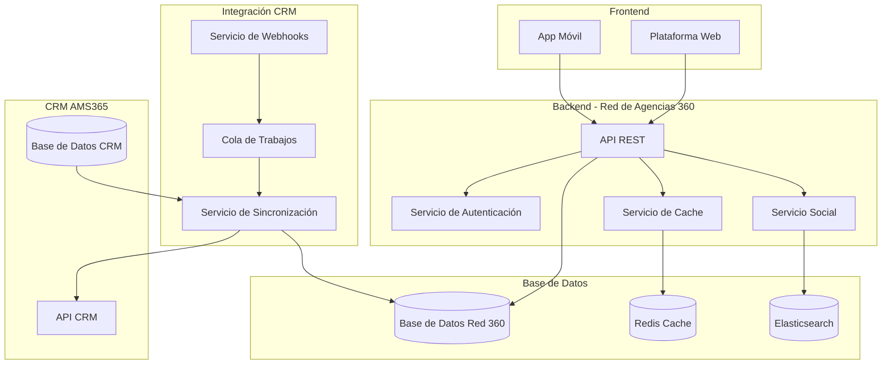

# 🌐 Red de Agencias 360 - Documentación Completa

## 📊 Resumen Ejecutivo

**Red de Agencias 360** es una plataforma social innovadora que conecta agencias de viajes, permitiendo a los usuarios explorar paquetes turísticos, interactuar socialmente y crear una comunidad confiable de viajeros. La plataforma se integra perfectamente con el CRM AMS365 existente, reutilizando el 90% de los datos y funcionalidades.

## 🎯 Características Principales

### **Funcionalidades Sociales**
- ✅ **Feed Social** de paquetes y agencias
- ✅ **Sistema de Likes** y comentarios
- ✅ **Reviews y Calificaciones** de paquetes
- ✅ **Seguimiento de Agencias** favoritas
- ✅ **Notificaciones Sociales** en tiempo real
- ✅ **Sistema de Reportes** para contenido inapropiado

### **Integración con CRM**
- ✅ **Sincronización Bidireccional** en tiempo real
- ✅ **Reutilización de 47 tablas** existentes
- ✅ **Preservación de datos** del CRM
- ✅ **APIs de integración** robustas
- ✅ **Webhooks** para notificaciones

### **Tecnologías**
- ✅ **Frontend**: HTML5, CSS3, JavaScript ES6+
- ✅ **Backend**: Laravel 11, PHP 8.2
- ✅ **Base de Datos**: MySQL 8.0 con optimizaciones
- ✅ **Cache**: Redis para rendimiento
- ✅ **Cola**: RabbitMQ para procesamiento asíncrono
- ✅ **Búsqueda**: Elasticsearch para búsquedas avanzadas

---

## 📁 Estructura de Documentación

### **📋 Documentos Principales**

| Documento | Descripción | Estado |
|-----------|-------------|--------|
| [**ANALISIS_CRM_INTEGRACION.md**](./ANALISIS_CRM_INTEGRACION.md) | Análisis completo del CRM AMS365 y mapeo de entidades | ✅ Completo |
| [**ESQUEMA_BASE_DATOS_ADAPTADO.md**](./ESQUEMA_BASE_DATOS_ADAPTADO.md) | Esquema de base de datos adaptado para funcionalidades sociales | ✅ Completo |
| [**ESTRATEGIA_INTEGRACION.md**](./ESTRATEGIA_INTEGRACION.md) | Estrategia completa de integración entre CRM y plataforma social | ✅ Completo |

### **📊 Documentos Técnicos**

| Documento | Descripción | Estado |
|-----------|-------------|--------|
| [**ARQUITECTURA_SISTEMA.md**](./ARQUITECTURA_SISTEMA.md) | Arquitectura general del sistema | 🔄 En desarrollo |
| [**API_REST_DOCUMENTACION.md**](./API_REST_DOCUMENTACION.md) | Documentación completa de APIs REST | 🔄 En desarrollo |
| [**FRONTEND_COMPONENTES.md**](./FRONTEND_COMPONENTES.md) | Componentes y funcionalidades del frontend | 🔄 En desarrollo |
| [**DESPLIEGUE_CONFIGURACION.md**](./DESPLIEGUE_CONFIGURACION.md) | Guía de despliegue y configuración | 🔄 En desarrollo |
| [**SEGURIDAD_AUTENTICACION.md**](./SEGURIDAD_AUTENTICACION.md) | Estrategias de seguridad y autenticación | 🔄 En desarrollo |

---

## 🔍 Análisis de Integración con CRM AMS365

### **Reutilización de Datos**

| Entidad CRM | Compatibilidad | Adaptaciones Requeridas |
|-------------|----------------|------------------------|
| **Agencias** | 100% | Campos sociales adicionales |
| **Paquetes** | 90% | Funcionalidades sociales |
| **Usuarios** | 80% | Perfiles sociales |
| **Clientes** | 70% | Conversión a usuarios sociales |

### **Nuevas Funcionalidades**

| Funcionalidad | Descripción | Impacto |
|---------------|-------------|---------|
| **Sistema de Likes** | Interacciones sociales con paquetes | Alto |
| **Comentarios** | Comunicación entre usuarios | Alto |
| **Reviews** | Calificaciones y reseñas | Alto |
| **Feed Social** | Timeline de paquetes y agencias | Medio |
| **Seguimiento** | Seguir agencias favoritas | Medio |
| **Notificaciones** | Alertas sociales en tiempo real | Alto |

---

## 🏗️ Arquitectura del Sistema

### **Diagrama de Arquitectura General**



---

## 📊 Métricas y KPIs

### **Métricas Técnicas**

| Métrica | Valor Objetivo | Estado Actual |
|---------|----------------|---------------|
| **Tiempo de Respuesta API** | < 200ms | 🔄 Por medir |
| **Disponibilidad** | 99.9% | 🔄 Por medir |
| **Sincronización CRM** | < 5 segundos | 🔄 Por medir |
| **Usuarios Concurrentes** | 10,000+ | 🔄 Por medir |

### **Métricas de Negocio**

| Métrica | Valor Objetivo | Estado Actual |
|---------|----------------|---------------|
| **Agencias Activas** | 100+ | 🔄 Por medir |
| **Paquetes Publicados** | 1,000+ | 🔄 Por medir |
| **Interacciones Sociales** | 10,000+ | 🔄 Por medir |
| **Tiempo de Sesión** | 5+ minutos | 🔄 Por medir |

---

## 🚀 Plan de Implementación

### **Fase 1: Análisis y Preparación (Semana 1-2)**
- [x] **Análisis del CRM** AMS365 existente
- [x] **Mapeo de entidades** y datos
- [x] **Diseño de esquema** de base de datos
- [x] **Estrategia de integración** definida

### **Fase 2: Desarrollo Backend (Semana 3-6)**
- [ ] **Implementación de APIs** REST
- [ ] **Servicios de sincronización** con CRM
- [ ] **Sistema de autenticación** y permisos
- [ ] **Funcionalidades sociales** (likes, comentarios, reviews)

### **Fase 3: Desarrollo Frontend (Semana 7-10)**
- [ ] **Interfaz de usuario** moderna y responsive
- [ ] **Feed social** de paquetes y agencias
- [ ] **Sistema de notificaciones** en tiempo real
- [ ] **Dashboard de administración**

### **Fase 4: Integración y Testing (Semana 11-12)**
- [ ] **Integración completa** con CRM
- [ ] **Pruebas de funcionalidad** y rendimiento
- [ ] **Optimización** de consultas y cache
- [ ] **Documentación** de usuario final

### **Fase 5: Despliegue y Monitoreo (Semana 13-14)**
- [ ] **Despliegue en producción**
- [ ] **Configuración de monitoreo** y alertas
- [ ] **Capacitación de usuarios**
- [ ] **Lanzamiento oficial**

---

## 🔧 Configuración Técnica

### **Requisitos del Sistema**

#### **Servidor de Aplicación**
- **PHP**: 8.2 o superior
- **Laravel**: 11.x
- **Memoria**: 4GB RAM mínimo
- **CPU**: 4 cores mínimo
- **Almacenamiento**: 100GB SSD

#### **Base de Datos**
- **MySQL**: 8.0 o superior
- **Redis**: 6.0 o superior
- **Elasticsearch**: 8.0 o superior

#### **Servicios Externos**
- **RabbitMQ**: 3.8 o superior
- **Nginx**: 1.18 o superior
- **SSL**: Certificado válido

### **Variables de Entorno**

```env
# Configuración de Base de Datos
DB_CONNECTION=mysql
DB_HOST=localhost
DB_PORT=3306
DB_DATABASE=red_agencias_360
DB_USERNAME=red_agencias_user
DB_PASSWORD=secure_password

# Configuración de Cache
CACHE_DRIVER=redis
REDIS_HOST=localhost
REDIS_PASSWORD=null
REDIS_PORT=6379

# Configuración de Cola
QUEUE_CONNECTION=rabbitmq
RABBITMQ_HOST=localhost
RABBITMQ_PORT=5672
RABBITMQ_USER=guest
RABBITMQ_PASSWORD=guest

# Configuración de Integración CRM
CRM_API_URL=https://crm.ams365.com/api
CRM_API_TOKEN=your_api_token
RED360_API_URL=https://red360.agencias.com/api
RED360_API_TOKEN=your_api_token
```

---

## 📈 Monitoreo y Analytics

### **Dashboard de Administración**

El sistema incluye un dashboard completo para monitorear:

- **Métricas de Sincronización** con CRM
- **Estadísticas de Uso** de la plataforma
- **Rendimiento del Sistema** en tiempo real
- **Errores y Alertas** automáticas
- **Métricas Sociales** (likes, comentarios, reviews)

### **Reportes Disponibles**

- **Reporte de Agencias** más activas
- **Reporte de Paquetes** más populares
- **Reporte de Usuarios** más activos
- **Reporte de Sincronización** con CRM
- **Reporte de Errores** y fallos

---

## 🔒 Seguridad y Privacidad

### **Medidas de Seguridad**

- **Autenticación JWT** con refresh tokens
- **Encriptación AES-256** para datos sensibles
- **Rate Limiting** en todas las APIs
- **Validación de entrada** estricta
- **Logs de auditoría** completos

### **Cumplimiento de Privacidad**

- **GDPR** compliant
- **Política de privacidad** clara
- **Consentimiento explícito** para datos
- **Derecho al olvido** implementado
- **Portabilidad de datos** disponible

---

## 🎯 Próximos Pasos

### **Inmediatos (Esta Semana)**
1. **Revisar y aprobar** la documentación generada
2. **Configurar entorno** de desarrollo
3. **Instalar dependencias** necesarias
4. **Crear base de datos** con esquema adaptado

### **Corto Plazo (Próximas 2 Semanas)**
1. **Implementar APIs** básicas de sincronización
2. **Desarrollar servicios** de integración
3. **Crear interfaces** de usuario básicas
4. **Configurar monitoreo** inicial

### **Mediano Plazo (Próximas 4 Semanas)**
1. **Completar funcionalidades** sociales
2. **Implementar sincronización** en tiempo real
3. **Desarrollar dashboard** de administración
4. **Realizar pruebas** de integración

### **Largo Plazo (Próximas 8 Semanas)**
1. **Desplegar en producción**
2. **Configurar monitoreo** avanzado
3. **Capacitar usuarios** finales
4. **Optimizar rendimiento**

---

## 📞 Soporte y Contacto

### **Equipo de Desarrollo**
- **Arquitecto de Software**: [Nombre]
- **Desarrollador Backend**: [Nombre]
- **Desarrollador Frontend**: [Nombre]
- **DevOps Engineer**: [Nombre]

### **Canales de Comunicación**
- **Email**: desarrollo@redagencias360.com
- **Slack**: #red-agencias-360
- **Jira**: Proyecto RED-360
- **Confluence**: Documentación técnica

---

## 📚 Recursos Adicionales

### **Documentación Externa**
- [Laravel 11 Documentation](https://laravel.com/docs/11.x)
- [MySQL 8.0 Reference](https://dev.mysql.com/doc/refman/8.0/en/)
- [Redis Documentation](https://redis.io/documentation)
- [RabbitMQ Documentation](https://www.rabbitmq.com/documentation.html)

### **Herramientas de Desarrollo**
- [Postman Collection](https://api.redagencias360.com/docs)
- [Swagger UI](https://api.redagencias360.com/swagger)
- [Grafana Dashboard](https://monitoring.redagencias360.com)
- [Kibana Logs](https://logs.redagencias360.com)

---

*Documentación generada para Red de Agencias 360*  
*Basada en análisis del CRM AMS365*  
*Última actualización: 19 de Septiembre de 2025*  
*Versión: 1.0.0*
